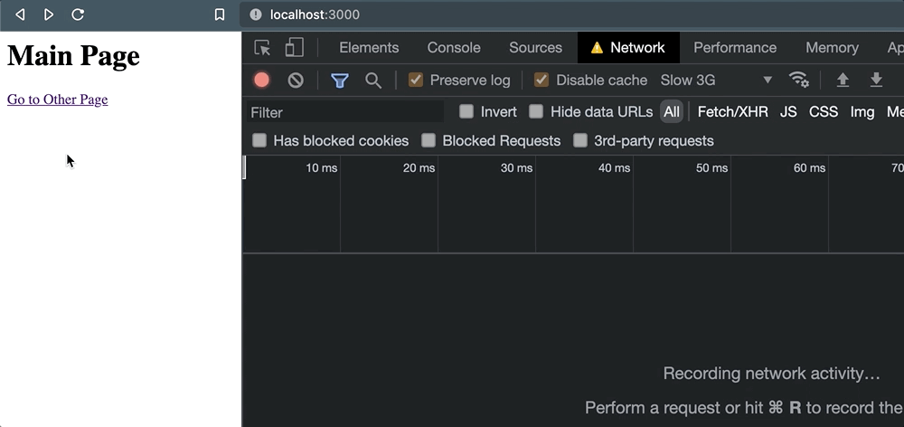

# 离开页面时，你知道如何可靠地发送一个 HTTP 请求吗？

## 目录

- [浏览器不能保证持续保持 HTTP 请求的打开状态](#浏览器不能保证持续保持-HTTP-请求的打开状态)
- [但是它们为什么会被取消呢？](#但是它们为什么会被取消呢)
- [所以我们有没有别的选择？](#所以我们有没有别的选择)
- [指示浏览器保持未完成的请求](#指示浏览器保持未完成的请求)
  - [使用 Fetch 的 keepalive 标志](#使用-Fetch-的-keepalive-标志)
  - [使用 Navigator.sendBeacon() 方法](#使用-NavigatorsendBeacon-方法)
  - [给 ping 属性荣誉提名](#给-ping-属性荣誉提名)
- [那么，究竟应该如何选择？](#那么究竟应该如何选择)
  - [以下情况可以选择 fetch() + keepalive:](#以下情况可以选择-fetch--keepalive)
  - [以下情况使用 sendBeacon() 或许更好：](#以下情况使用-sendBeacon-或许更好)
- [不要再踩我踩过的坑](#不要再踩我踩过的坑)
  - [参考资料](#参考资料)

&#x20;        在某些情况下，当用户跳转到其他页面或者提交一个表单的时候，我需要发送一个 HTTP 请求，用于把一些数据记录到日志中。思考如下场景——当一个链接被点击时，需要发送一些信息到外部服务器：

```javascript 
<a href="/some-other-page" id="link">Go to Page</a>

<script>
document.getElementById('link').addEventListener('click', (e) => {
  fetch("/log", {
    method: "POST",
    headers: {
      "Content-Type": "application/json"
    }, 
    body: JSON.stringify({
      some: "data"
    })
  });
});
</script>
```


&#x20;         这个示例并不复杂。链接的跳转行为仍然会正常的执行（我并没有使用 e.preventDefault() 去阻止），但是在这个行为发生之前，单击事件会触发一个 POST 请求。我们只需要它发送到我们正在访问的服务即可，而不需要等待这个请求返回。

&#x20;        乍一看你可能会觉得处理这个请求是同步的，请求发出后，在我们继续跳页面的同时，其他服务器会成功地处理这个请求。但事实上，情况并非总是如此。

## 浏览器不能保证持续保持 HTTP 请求的打开状态

&#x20;     当页面因为某些原因被终止时，浏览器是没法保证正在进行中的 HTTP 请求能够成功完成（了解更多\[1]关于页面的“终止”以及页面生命周期的其他状态）。这些请求的可信度取决于多个因素 —— 网络连接、程序性能甚至是外部服务器自身的配置。

因此，这种情况下发出的数据可靠性很糟，如果你的业务决策依赖这些日志数据，这可能会带来一个潜在的重大隐患。

&#x20;        为了说明这种场景的不可靠性，我编写了一个基于 Express 的简单应用，并使用以上代码实现了一个页面。当点击链接时，浏览器会导航到 /other，但此之前，会触发一个 POST 请求。

&#x20;       开始之前，我会将开发者工具的“网络”标签打开，使用“低速3G”连接速度。一旦页面加载完成，我就清除日志，事情看起来相当正常:

但是一旦我单击了链接，事情就不太对了。当页面导航发生的时候，POST 请求就被取消了。

&#x20;     这使得我们对外部服务实际上能够处理完这个请求没有足够的信心。为了验证这个行为，当我们以编程方式使用 `window.location` 导航时，相同的情况也会发生:

```javascript 
document.getElementById('link').addEventListener('click', (e) => {
+ e.preventDefault();

  // Request is queued, but cancelled as soon as navigation occurs. 
  fetch("/log", {
    method: "POST",
    headers: {
      "Content-Type": "application/json"
    }, 
    body: JSON.stringify({
      some: 'data'
    }),
  });

+ window.location = e.target.href;
});
```


**无论导航是如何或何时发生的，以及活动页面是如何终止的，那些未完成的请求都有被抛弃的风险。**

## 但是它们为什么会被取消呢？

&#x20;        问题的根源在于，默认情况下 XHR 请求（通过 fetch 或 XMLHttpRequest）是异步且非阻塞的。**一旦请求进入队列，请求的实际工作就会交给后台的浏览器级 API。**


> 页面浏览器开始卸载页面并对其内存清理时，该页面就进入终止状态。在此状态下，不会执行任何新任务\[3]，同时正在处理中的任务如果运行时间过长可能会被杀死。

简单来说，浏览器的设计是基于这样的假设：只要页面关闭时，后台队列中的任何进程都不需要再继续执行。

## 所以我们有没有别的选择？

&#x20;        似乎避免这个问题最直接的方法是尽可能地延迟用户操作，直到请求的响应返回。在过去，通过使用 `XMLHttpRequest` 支持的同步标志\[4]来实现。但这是错误的，因为**使用这种方式会完全的阻断主线程，从而造成一大堆的性能问题**——关于这个问题我曾写过一些东西\[5]——所以不要考虑这种方式了。事实上，平台也正在**移除这种方式（Chrome v80+ 已经将其移除\[6]）。**

&#x20;       即使你仍打算采用这种方式，也最好使用 Promise 并在其响应返回时执行 resolve。这样你就可以安全地执行该行为。对上面我们示例的代码进行修改:

```javascript 
document.getElementById('link').addEventListener('click', async (e) => {
  e.preventDefault();

  // Wait for response to come back...
  await fetch("/log", {
    method: "POST",
    headers: {
      "Content-Type": "application/json"
    }, 
    body: JSON.stringify({
      some: 'data'
    }),
  });

  // ...and THEN navigate away.
   window.location = e.target.href;
});

```


这样就可以完成工作了，但存在的缺点也不容忽视。

**首先，它会使期望的行为延迟发生，这会降低用户体验。** 收集分析数据当然会给商务(或许也会对潜在用户)带来收益，但为此收益让既有用户付出代价就不是一个好的选择了。更不用说，作为外部依赖，服务本身的任何延迟或其他性能问题都将暴露给用户。如果因为分析服务的超时导致了客户无法完成高价值的操作，那么所有人都将蒙受损失。

**其次，这种方法并不像听起来那样可靠，因为一些终止行为不能通过编程方式延迟。** 例如，`e.preventDefault()` 在延迟关闭浏览器标签时是不起作用的。所以，最好的情况下，这种方式可以涵盖一些用户行为的数据收集，但缺乏足够的可信度。

## 指示浏览器保持未完成的请求

值得高兴的是，**绝大多数浏览器都内置了保持未完成 HTTP 请求的能力，而且不需要牺牲用户体验。**

### 使用 Fetch 的 keepalive 标志

当使用`  fetch()  `方法时，如果把 `keeplive` 标志\[7]设置为 `true`，即便页**面被终止请求也会保持连接**。对我们最初的用例进行修改如下：

```javascript 
<a href="/some-other-page" id="link">Go to Page</a>

<script>
  document.getElementById('link').addEventListener('click', (e) => {
    fetch("/log", {
      method: "POST",
      headers: {
        "Content-Type": "application/json"
      }, 
      body: JSON.stringify({
        some: "data"
      }), 
       keepalive: true
     });
  });
</script>
```


当单击链接时，页面进行跳转，但是请求没有被取消。



事实上，我们是**留下了一个(unknown)状态，这只是因为活动页面不会等待接收任何类型的响应**。

只需要添加这样一行代码，使得修复这个问题看起来很简单，特别是当它被常见浏览器的 API 支持时。**但如果你想寻找一个更专业的接口方式，还有另外一种几乎相同受到浏览器支持的方法。**

### 使用 Navigator.sendBeacon() 方法

`sendbeacon()` 方法**专门用于发送单向请求**(`beacons`\[8])。一个基本的实现是这样的，**发送一个带有** `JSON` 字符串和一个 `Content-Type` 是 "`text/plain`" 的 `POST` 请求:

```javascript 
navigator.sendBeacon('/log', JSON.stringify({
  some: "data"
}));
```


但是这个 `API` 并不允许你设置自定义的 `headers`。所以，为了方便我们使用 "`application/json`" 格式发送数据，我们需要使用 `Blob` 做一点小的调整:

```javascript 
<a href="/some-other-page" id="link">Go to Page</a>

<script>
  document.getElementById('link').addEventListener('click', (e) => {
    const blob = new Blob([JSON.stringify({ some: "data" })], { type: 'application/json; charset=UTF-8' });
    navigator.sendBeacon('/log', blob));
  });
</script>
```


最后，我们可以得到相同的结果——**请求在页面跳转之后也可以完成**。但是，还有一些情况下可能会让它比 fetch() 更有优势: `beacons` 以**低优先级发送。**

为了演示说明，以下是 Network 选项卡中同时使用带 keepalive 的 fetch() 和 sendBeacon() 时的情况:


默认情况下，**fetch() 获得一个 “高” 优先级，而 beacon(上图中的 “ping” 类型) 具有 “最低” 优先级。对于那些对页面功能不是很重要的请求**，这是一件好事。直接引用 Beacon规范\[9]:

> 该规范定义了一个接口，该接口 \[…] 在确保此类**请求仍然得到处理并交付到目的地的情况下，最大限度地减少了其与其他时间敏感操作的资源竞争。**

换个说法就是，sendBeacon() 方法确保了那些程序中真正的关键过程和用户体验不会受到影响。

### 给 ping 属性荣誉提名

值得一提的是越来越多的浏览器开始支持 `ping`属性\[10]。当在链接上设置该属性时 **，链接被点击时会触发一个小型的 POST 请求：**

```javascript 
<a href="http://localhost:3000/other" ping="http://localhost:3000/log">
  Go to Other Page
</a>
```


这些请求 `headers` 里会带着链**接所在页面的地址（ping-from）以及链接 href 指向的地址（ping-to）:**

```javascript 
headers: {
   'ping-from': 'http://localhost:3000/',
  'ping-to': 'http://localhost:3000/other'
   'content-type': 'text/ping'
  // ...other headers
},
```


这在技术上很接近发送一个 `beacon`，但是有一些需要注意的限制：

**1. 它被严格的限制只能在超链接使用。** 你不能将它用于跟踪与其他交互相关的数据，比如按钮点击或表单提交。

**2. 大部分浏览器支持的很好，但不是所有\[11]。** 在撰写本文时，Firefox还没有默认启用这个功能。

\*\*3. 你****不能使用其发送自定义的数据****。\*\*如前面提到的，除了请求本身包含的 header 信息外，你最多在 header 中额外获得几个 ping- \*。

考虑以上所有因素，如果你只是要求发送简单的请求，并且不想编写任何自定义 JavaScript，那么 ping 是一个很好的工具。但如果你需要发送一些更有意义的东西，这就不是最好的选择。

## 那么，究竟应该如何选择？

**是使用 keep-alive 标志的 fetch，还是用 sendBeacon 来发送页面终止时的请求肯定需要权衡。以下建议或许可以帮助你在不同情况下做出正确的选择：**

### 以下情况可以选择 `fetch() + keepalive`:

- 你需要简单的发送自定义 headers 的请求
- 你需要使用 GET 而非 POST
- 你需要兼容老旧的浏览器（例如 IE），并已经有了一个 fetch 方法的 polyfill

### 以下情况使用 `sendBeacon`() 或许更好：

- 你只需要发送一个简单的服务请求，而不需要太多的定制化
- 你喜欢更简约更优雅的代码方式
- 你需要保证该请求不会和其他更重要的请求竞争资源

## 不要再踩我踩过的坑

我之所以会去深入探究页面终止时浏览器是如何处理进行中的请求，是因为一段时间以前，我的团队发现，当我们开始在表单提交时发送特定分析请求后，该类型的分析日志的收集率突然发生了变化。这一变化是突然而显著的——比之前下降了约30%。

通过深入研究这个问题产生的原因，找到了避免它的工具，从而挽救了局面。所以，如果可以的话，我希望我对这些小挑战的理解，能够帮助你们避免那些我们曾踩过的坑。让记日志变得更加愉快！

### 参考资料

\[1]了解更多: [*https://developers.google.com/web/updates/2018/07/page-lifecycle-api*](https://developers.google.com/web/updates/2018/07/page-lifecycle-api "https://developers.google.com/web/updates/2018/07/page-lifecycle-api")

\[2]这是谷歌对于这个特定生命周期状态的总结: [*https://developers.google.com/web/updates/2018/07/page-lifecycle-api#states*](https://developers.google.com/web/updates/2018/07/page-lifecycle-api#states "https://developers.google.com/web/updates/2018/07/page-lifecycle-api#states")

\[3]新任务: [*https://html.spec.whatwg.org/multipage/webappapis.html#queue-a-task*](https://html.spec.whatwg.org/multipage/webappapis.html#queue-a-task "https://html.spec.whatwg.org/multipage/webappapis.html#queue-a-task")

\[4]同步标志: [*https://xhr.spec.whatwg.org/#synchronous-flag*](https://xhr.spec.whatwg.org/#synchronous-flag "https://xhr.spec.whatwg.org/#synchronous-flag")

\[5]关于这个问题我曾写过一些东西: [*https://macarthur.me/posts/use-web-workers-for-your-event-listeners*](https://macarthur.me/posts/use-web-workers-for-your-event-listeners "https://macarthur.me/posts/use-web-workers-for-your-event-listeners")

\[6]已经将其移除: [*https://developers.google.com/web/updates/2019/12/chrome-80-deps-rems*](https://developers.google.com/web/updates/2019/12/chrome-80-deps-rems "https://developers.google.com/web/updates/2019/12/chrome-80-deps-rems")

\[7]keeplive 标志: [*https://fetch.spec.whatwg.org/#request-keepalive-flag*](https://fetch.spec.whatwg.org/#request-keepalive-flag "https://fetch.spec.whatwg.org/#request-keepalive-flag")

\[8]beacons: [*https://w3c.github.io/beacon/#sec-processing-model*](https://w3c.github.io/beacon/#sec-processing-model "https://w3c.github.io/beacon/#sec-processing-model")

\[9]Beacon规范: [*https://www.w3.org/TR/beacon/*](https://www.w3.org/TR/beacon/ "https://www.w3.org/TR/beacon/")

\[10]ping 属性: [*https://css-tricks.com/the-ping-attribute-on-anchor-links/*](https://css-tricks.com/the-ping-attribute-on-anchor-links/ "https://css-tricks.com/the-ping-attribute-on-anchor-links/")

\[11]但不是所有: [*https://caniuse.com/ping*](https://caniuse.com/ping "https://caniuse.com/ping")

\[12]参考原文: [*https://css-tricks.com/send-an-http-request-on-page-exit/*](https://css-tricks.com/send-an-http-request-on-page-exit/ "https://css-tricks.com/send-an-http-request-on-page-exit/")
