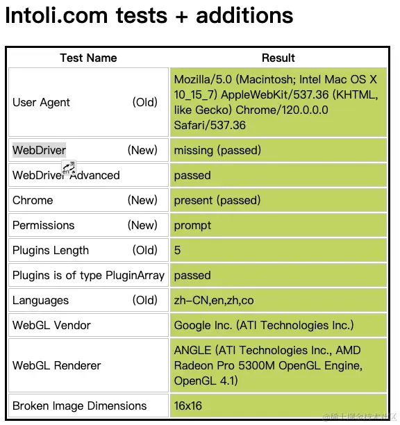
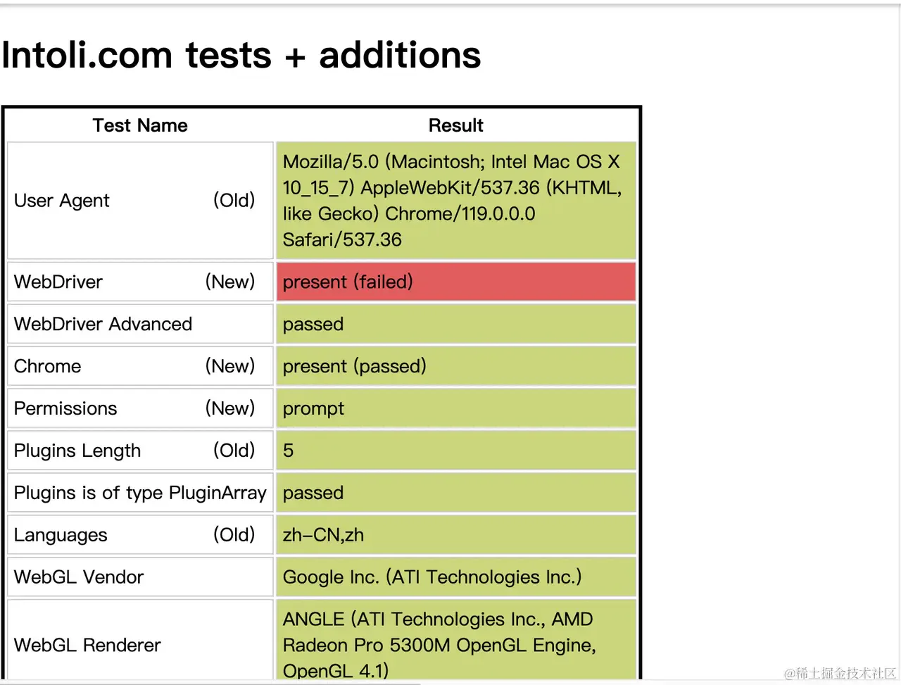

# 绕过机器检测

我们可以通过[检测机器人的网址](https://link.juejin.cn/?target=https://bot.sannysoft.com/ "检测机器人的网址")进行测试，左真实的用户右侧是puppeteer访问，可以明显的看出在右侧的[WebDriver](https://link.juejin.cn/?target=https://developer.mozilla.org/en-US/docs/Web/WebDriver "WebDriver")标记为红色；*Tips: 不同的浏览器可能表现不一致*





我们可以使用到插件[puppeteer-extra-plugin-stealth](https://link.juejin.cn/?target=https://github.com/berstend/puppeteer-extra/tree/master/packages/puppeteer-extra-plugin-stealth "puppeteer-extra-plugin-stealth"),它属于[puppeteer-extra](https://link.juejin.cn/?target=https://github.com/berstend/puppeteer-extra/tree/master "puppeteer-extra") 全家桶的一个，访问右图片就明显看到没有报错了。

```javascript 
// 绕过爬虫检测
const puppeteer = require("puppeteer-extra");
const StealthPlugin = require("puppeteer-extra-plugin-stealth");
puppeteer.use(StealthPlugin());
(async () => {
  const browser = await puppeteer.launch({
    headless: false,
  });
  const page = await browser.newPage();
  await page.goto("https://bot.sannysoft.com/");
  await browser.close();
})();

```
