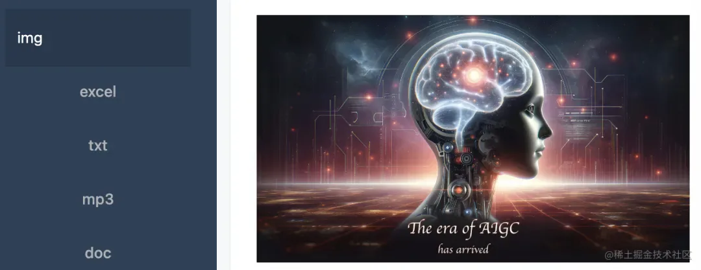
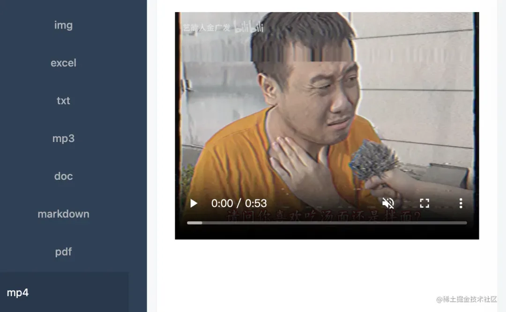
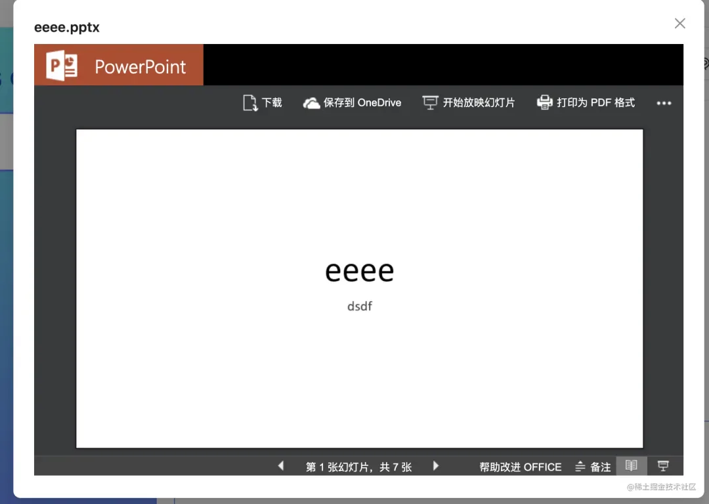

# img、docx、xlsx、ppt、pdf、md、txt、audio、video

## 目录

- [前言](#前言)
- [「⚠️ 补充： 我的需求是需要先将文件上传到后台，所以我拿到的是url地址去展示，对于markdown和txt的文件需要先用fetch获取，其他的展示则直接使用url链接就可以。」](#️-补充-我的需求是需要先将文件上传到后台所以我拿到的是url地址去展示对于markdown和txt的文件需要先用fetch获取其他的展示则直接使用url链接就可以)
  - [自有标签文件：png、jpg、jpeg、audio、video](#自有标签文件pngjpgjpegaudiovideo)
    - [图片：png、jpg、jpeg](#图片pngjpgjpeg)
    - [音频：audio](#音频audio)
    - [视频：video](#视频video)
  - [纯文字的文件： markdown & txt](#纯文字的文件-markdown--txt)
    - [markdown 文件](#markdown-文件)
    - [txt 文件预览展示](#txt-文件预览展示)
  - [office 类型的文件： docx、xlsx、ppt](#office-类型的文件-docxxlsxppt)
  - [embed 引入文件：pdf](#embed-引入文件pdf)
  - [iframe：引入外部完整的网站](#iframe引入外部完整的网站)

## 前言

> ❝
>
> 最近有接到一个需求，要求前端支持上传制定后缀文件，且支持页面预览，上传简单，那么预览该怎么实现呢，尤其是不同类型的文件预览方案，那么下面就我这个需求的实现，答案在下面 👇：
>
> ❞

\*\*「具体的预览需求：」\*\*预览需要支持的文件类型有： `png、jpg、jpeg、docx、xlsx、ppt、pdf、md、txt、audio、video`，另外对于不同文档还需要有定位的功能。例如：`pdf` 定位到页码，`txt`和`markdown`定位到文字并滚动到指定的位置，音视频定位到具体的时间等等。

***

## **「⚠️ 补充： 我的需求是需要先将文件上传到后台，所以我拿到的是**\*\*`url`****地址去展示，对于****`markdown`****和****`txt`****的文件需要先用****`fetch`****获取，其他的展示则直接使用****`url`\*\***链接就可以。」**

不同文件的实现方式不同，下面分类讲解，总共分为以下几类：

1. 自有标签文件：`png、jpg、jpeg、audio、video`
2. 纯文字的文件： `markdown & txt`
3. `office` 类型的文件： `docx、xlsx、ppt`
4. `embed` 引入文件：`pdf`
5. `iframe`：引入外部完整的网站

### 自有标签文件：`png、jpg、jpeg、audio、video`

> ❝
>
> 对于图片、音视频的预览，直接使用对应的标签即可，如下：

#### 图片：`png、jpg、jpeg`

**「示例代码：」**

```javascript 
;
```


**「预览效果如下：」**



#### 音频：`audio`

**「示例代码：」**

```javascript 
<audio 
  ref={audioRef} 
  controls 
  controlsList="nodownload" 
  style={{ width: '100%' }}
>  
  <track kind="captions" />  
  <source 
    src={url} 
    type="audio/mpeg" 
  />
</audio>
```


**「预览效果如下：」**


#### 视频：`video`

**「示例代码：」**

```javascript 
<video 
  ref={videoRef} 
  controls 
  muted 
  controlsList="nodownload" 
  style={{ width: '100%' }}
>  
  <track kind="captions" />  
  <source src={url} type="video/mp4" />
</video>
```


**「预览效果如下：」**



**「关于音视频的定位的完整代码：」**

```javascript 
import React, { useRef, useEffect } from 'react';

interface IProps {
  type: 'audio' | 'video';
  url: string;
  timeInSeconds: number;
}

function AudioAndVideo(props: IProps) {
  const { type, url, timeInSeconds } = props;
  const videoRef = useRef<HTMLVideoElement>(null);
  const audioRef = useRef<HTMLAudioElement>(null);

  useEffect(() => {
    // 音视频定位
    const secondsTime = timeInSeconds / 1000;
    if (type === 'audio' && audioRef.current) {
      audioRef.current.currentTime = secondsTime;
    }
    if (type === 'video' && videoRef.current) {
      videoRef.current.currentTime = secondsTime;
    }
  }, [type, timeInSeconds]);

  return (
    <div>
      {type === 'audio' ? (
        <audio ref={audioRef} controls controlsList="nodownload" style={{ width: '100%' }}>
          <track kind="captions" />
          <source src={url} type="audio/mpeg" />
        </audio>
      ) : (
        <video ref={videoRef} controls muted controlsList="nodownload" style={{ width: '100%' }}>
          <track kind="captions" />
          <source src={url} type="video/mp4" />
        </video>
      )}
    </div>
  );
}

export default AudioAndVideo;
```


### 纯文字的文件： `markdown & txt`

> ❝
>
> 对于`markdown、txt`类型的文件，如果拿到的是文件的`url`的话，则无法直接显示，需要请求到内容，再进行展示。
>
> ❞

#### `markdown` 文件

> ❝
>
> 在展示`markdown`文件时，需要满足字体高亮、代码高亮、如果有字体高亮，需要滚动到字体所在位置、如果有外部链接，需要新开tab页面再打开。

需要引入两个库：

`marked`：它的作用是将`markdown`文本转换（解析）为`HTML`。

`highlight`： 它允许开发者在网页上高亮显示代码。

**「字体高亮的代码实现：」**

> ❝
> 高亮的样式，可以在行间样式定义

```javascript 
const highlightAndMarkFirst = (text: string, highlightText: string) => {
    let firstMatchDone = false;
    const regex = new RegExp(`(${highlightText})`, 'gi');
    return text.replace(regex, (match) => {
      if (!firstMatchDone) {
        firstMatchDone = true;
        return `<span id='first-match' style="color: red;">${match}</span>`;
      }
      return `<span style="color: red;">${match}</span>`;
    });
  };
```


**代码高亮的代码实现：」**

> ❝
>
> 需要借助`hljs`这个库进行转换

```javascript 
marked.use({
    renderer: {
      code(code, infostring) {
        const validLang = !!(infostring && hljs.getLanguage(infostring));
        const highlighted = validLang
          ? hljs.highlight(code, { language: infostring, ignoreIllegals: true }).value
          : code;
        return `<pre><code class="hljs ${infostring}">${highlighted}</code></pre>`;
      } 
    },
  });

```


「链接跳转新tab页的代码实现:」

```javascript 
marked.use({
   renderer: {
      // 链接跳转
      link(href, title, text) {
        const isExternal = !href.startsWith('/') && !href.startsWith('#');
        if (isExternal) {
          return `<a href="${href}" title="${title}" target="_blank" rel="noopener noreferrer">${text}</a>`;
        }
        return `<a href="${href}" title="${title}">${text}</a>`;
      },
    },
});
```


**「滚动到高亮的位置的代码实现：」**

> ❝
>
> 需要配合上面的代码高亮的方法

```javascript 
const firstMatchElement = document.getElementById('first-match');
if (firstMatchElement) {
    firstMatchElement.scrollIntoView({ behavior: 'smooth', block: 'center' });
}
```


**完整的代码如下：」**

> ❝
>
> 入参的`docUrl` 是`markdown`文件的线上`ur`l地址，`searchText` 是需要高亮的内容。

```javascript 
import React, { useEffect, useState, useRef } from 'react';
import { marked } from 'marked';
import hljs from 'highlight.js';

const preStyle = {
  width: '100%',
  maxHeight: '64vh',
  minHeight: '64vh',
  overflow: 'auto',
};

// Markdown展示组件
function MarkdownViewer({ docUrl, searchText }: { docUrl: string; searchText: string }) {
  const [markdown, setMarkdown] = useState('');
  const markdownRef = useRef<HTMLDivElement | null>(null);

  const highlightAndMarkFirst = (text: string, highlightText: string) => {
    let firstMatchDone = false;
    const regex = new RegExp(`(${highlightText})`, 'gi');
    return text.replace(regex, (match) => {
      if (!firstMatchDone) {
        firstMatchDone = true;
        return `<span id='first-match' style="color: red;">${match}</span>`;
      }
      return `<span style="color: red;">${match}</span>`;
    });
  };

  useEffect(() => {
    // 如果没有搜索内容，直接加载原始Markdown文本
    fetch(docUrl)
      .then((response) => response.text())
      .then((text) => {
        const highlightedText = searchText ? highlightAndMarkFirst(text, searchText) : text;
        setMarkdown(highlightedText);
      })
      .catch((error) => console.error('加载Markdown文件失败：', error));
  }, [searchText, docUrl]);

  useEffect(() => {
    if (markdownRef.current) {
      // 支持代码高亮
      marked.use({
        renderer: {
          code(code, infostring) {
            const validLang = !!(infostring && hljs.getLanguage(infostring));
            const highlighted = validLang
              ? hljs.highlight(code, { language: infostring, ignoreIllegals: true }).value
              : code;
            return `<pre><code class="hljs ${infostring}">${highlighted}</code></pre>`;
          },
          // 链接跳转
          link(href, title, text) {
            const isExternal = !href.startsWith('/') && !href.startsWith('#');
            if (isExternal) {
              return `<a href="${href}" title="${title}" target="_blank" rel="noopener noreferrer">${text}</a>`;
            }
            return `<a href="${href}" title="${title}">${text}</a>`;
          },
        },
      });
      const htmlContent = marked.parse(markdown);
      markdownRef.current!.innerHTML = htmlContent as string;
      // 当markdown更新后，检查是否需要滚动到高亮位置
      const firstMatchElement = document.getElementById('first-match');
      if (firstMatchElement) {
        firstMatchElement.scrollIntoView({ behavior: 'smooth', block: 'center' });
      }
    }
  }, [markdown]);

  return (
    <div style={preStyle}>
      <div ref={markdownRef} />
    </div>
  );
}

export default MarkdownViewer;
```


**「预览效果如下：」**


#### `txt` 文件预览展示

> ❝
>
> 支持高亮和滚动到指定位置
>
> ❞

**「支持高亮的代码：」**

```javascript 
 function highlightText(text: string) {
    if (!searchText.trim()) return text;
    const regex = new RegExp(`(${searchText})`, 'gi');
    return text.replace(regex, `<span style="color: red">$1</span>`);
  }

```


「完整代码：」

```javascript 
import React, { useEffect, useState, useRef } from 'react';
import { preStyle } from './config';

function TextFileViewer({ docurl, searchText }: { docurl: string; searchText: string }) {
  const [paragraphs, setParagraphs] = useState<string[]>([]);
  const targetRef = useRef<HTMLDivElement | null>(null);

  function highlightText(text: string) {
    if (!searchText.trim()) return text;
    const regex = new RegExp(`(${searchText})`, 'gi');
    return text.replace(regex, `<span style="color: red">$1</span>`);
  }

  useEffect(() => {
    fetch(docurl)
      .then((response) => response.text())
      .then((text) => {
        const highlightedText = highlightText(text);
        const paras = highlightedText
          .split('\n')
          .map((para) => para.trim())
          .filter((para) => para);
        setParagraphs(paras);
      })
      .catch((error) => {
        console.error('加载文本文件出错:', error);
      });
    // eslint-disable-next-line react-hooks/exhaustive-deps
  }, [docurl, searchText]);

  useEffect(() => {
    //  处理高亮段落的滚动逻辑
    const timer = setTimeout(() => {
      if (targetRef.current) {
        targetRef.current.scrollIntoView({ behavior: 'smooth', block: 'center' });
      }
    }, 100);

    return () => clearTimeout(timer);
  }, [paragraphs]);

  return (
    <div style={preStyle}>
      {paragraphs.map((para: string, index: number) => {
        const paraKey = para + index;

        // 确定这个段落是否包含高亮文本
        const isTarget = para.includes(`>${searchText}<`);
        return (
          <p key={paraKey} ref={isTarget && !targetRef.current ? targetRef : null}>
            <div dangerouslySetInnerHTML={{ __html: para }} />
          </p>
        );
      })}
    </div>
  );
}

export default TextFileViewer;

```


**「预览效果如下：」**


***

### `office` 类型的文件： `docx、xlsx、ppt`

> `docx、xlsx、ppt` 文件的预览，用的是`office`的线上预览链接 + 我们文件的线上`url`即可。
>
> ❞

> ❝
>
> 关于定位：用这种方法我暂时尝试是无法定位页码的，所以定位的功能我采取的是后端将`office` 文件转成`pdf`，再进行定位，如果只是纯展示，忽略这个问题即可。

**「示例代码：」**

```javascript 
<iframe    
  src={https://view.officeapps.live.com/op/view.aspx?src=${url}}    
  width="100%"    
  height="500px"    
  frameBorder="0"
>
</iframe>
```


**「预览效果如下：」**



### `embed` 引入文件：`pdf`

> ❝
>
> 在`pdf`文档预览时，可以采用`embed`的方式，这个`httpsUrl`就是你的`pdf`文档的链接地址
>
> ❞

**「示例代码：」**

```javascript 
<embed src={`${httpsUrl}`} style={preStyle} key={`${httpsUrl}`} />;
```


关于定位，其实是地址上拼接的页码`sourcePage`，如下：

```javascript 
 const httpsUrl = sourcePage
        ? `${doc.url}#page=${sourcePage}`
        : doc.url;
        
<embed src={`${httpsUrl}`} style={preStyle} key={`${httpsUrl}`} />;    

```


**「预览效果如下：」**


***

### `iframe`：引入外部完整的网站

> ❝
> 除了上面的各种文件，我们还需要预览一些外部的网址，那就要用到`iframe`的方式

「示例代码：」

```javascript 
<iframe
    title="网址"
    width="100%"
    height="100%"
    src={doc.url}      
    allow="microphone;camera;midi;encrypted-media;"
/>
```


**「预览效果如下：」**


