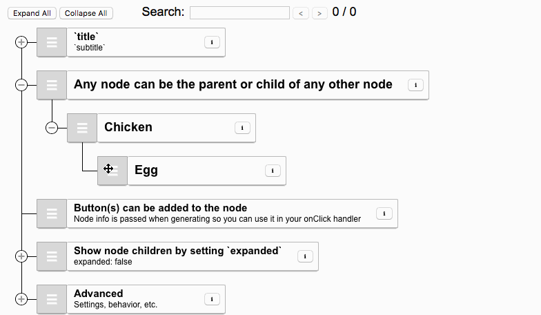

# 拖拽

## 目录

- [1. React Beautiful Dnd](#1-React-Beautiful-Dnd)
- [2. Sortable](#2-Sortable)
- [3. Dragula](#3-Dragula)
- [4. React DnD](#4-React-DnD)
- [5. Vue.Draggable](#5-VueDraggable)
- [6. interact.js](#6-interactjs)
- [7. React Draggable](#7-React-Draggable)
- [8. React Sortable Tree](#8-React-Sortable-Tree)

## 1. React Beautiful Dnd

react-beautiful-dnd 是一款美观且简单易用的 React 列表拖拽库。其动画效果自然，性能优秀，简洁而强大的 API，易于上手，与标准浏览器的互动性非常好。

Github（⭐️ 27.5k）：<https://github.com/atlassian/react-beautiful-dnd>

## 2. Sortable

Sortable 是一个 JavaScript 拖拽库，用于在现代浏览器和触摸设备上对拖放列表进行重新排序。支持 Meteor、AngularJS、React、Polymer、Vue、Ember、Knockout 和任何 CSS 库。

Github（⭐️ 25.3k）：<https://github.com/SortableJS/Sortable>

## 3. Dragula

Dragula 是一个 JavaScript 库，实现了网页上的拖放功能。提供 JavaScript、AngularJS 和 React 版本。

Github（⭐️ 21.3k）：<https://github.com/bevacqua/dragula>

## 4. React DnD

React DnD是 React 和 Redux 核心作者 Dan Abramov 创造的一组React 高阶组件，可帮助我们构建复杂的拖放界面，同时保持组件解耦。它可以在应用程序的不同部分之间通过拖动传输数据，并且组件会更改其外观和应用状态以响应拖放事件。

Github（⭐️ 18k）：<https://github.com/react-dnd/react-dnd>

## 5. Vue.Draggable

Vue.Draggable 是基于 Sortable.js 的 Vue 拖放组件。它允许拖放和视图模型数组同步，基于并提供 Sortable.js 的所有功能。该库适用于Vue 2，如果想在 Vue 3 中使用该库，可以访问：[https://github.com/SortableJS/vue.draggable.next。](https://github.com/SortableJS/vue.draggable.next。 "https://github.com/SortableJS/vue.draggable.next。")

Github（⭐️ 17.7k）：<https://github.com/SortableJS/Vue.Draggable>

## 6. interact.js

interact.js 是一个适用于现代浏览器的 JavaScript 拖放库，支持调整大小和多点触控手势，具有惯性和捕捉功能。为了尽可能多地提供控制，它尝试提供一个简单、灵活的API，该 API 提供移动元素所需的所有拖拽API。

Github（⭐️ 11k）：<https://github.com/taye/interact.js>

## 7. React Draggable

React-Draggable 库简单易用，将 CSS 中的`transform`应用于 React 组件，允许我们在 UI 中拖动组件。它有不同的 props 可以让你改变组件的行为，是创建直观、用户友好界面的绝佳选择。

Github（⭐️ 7.7k）：\*\*<https://github.com/react-grid-layout/react-draggable>

## 8. React Sortable Tree

React Sortable Tree 是一个用于对分层数据进行拖放式可排序表示的React组件。它支持单选多选，鼠标拖拽子集到新合集，模糊搜索等。

Github（⭐️ 4.5k）：<https://github.com/frontend-collective/react-sortable-tree>

[react-draggable](./react-draggable/index.md "react-draggable")

[案例](IT/前端专题/方案设计/方案设计三/拖拽/案例/案例.md "案例")
