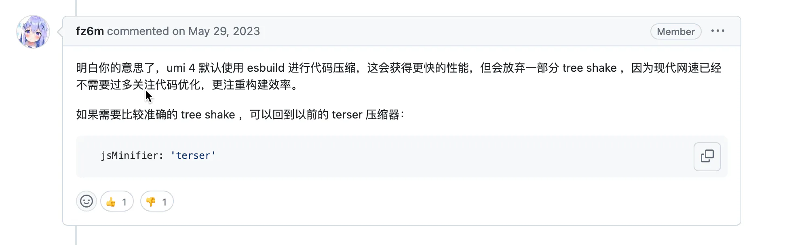
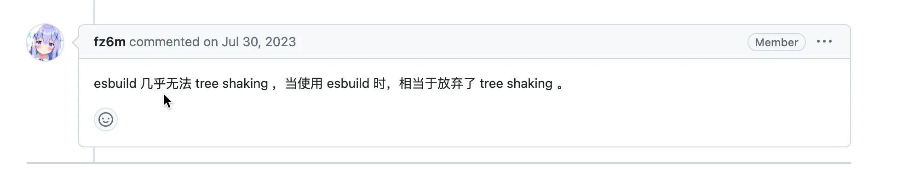

# 清理老项目

## 目录

- [背景](#背景)
- [现状](#现状)
- [思考](#思考)
  - [删除无用文件](#删除无用文件)
    - [实际过程中的问题](#实际过程中的问题)
  - [删除无用代码](#删除无用代码)
    - [实际使用过程中的问题](#实际使用过程中的问题)
    - [解读](#解读)
- [代码](#代码)

# 背景

接到一个任务；希望能治理一下项目工程；提升开发体验；能够持续的迭代下去。比如你搜索某个`api`；**你在项目全局搜索，发现有好多出引用了此**`api`；但是有好些是已经不用的；但是你又不敢删除；也很多重复代码相似的代码；才加入项目；而起是逻辑交互场景比较复杂但很重要的项目；且部分逻辑已经没人清楚了；即使熟悉逻辑的人手动梳理也得花非常大的时间；而且有没有成效也很难说

# 现状

- 项目历史悠久
- 体积庞大；经常文件就是1000行+；多的有上万行
- 由于人员变动；没有处理好模块分配；代码风格等参差不齐；
- 处于风险考虑；好些功能都在原有上面的基础上增加；没用的又不敢删；也没有重构

大多数老项目应该都是如此；

# 思考

刚接到这任务；才刚刚加入差旅；想靠梳理代码处理是不可能了；就算熟悉了；难度也很大，想着能处理一点是一点。

- 从静态资源入后；打包都是从主入口出发；找到所有引用的文件；全部文件 — 引用的文件 就是无用的文件

## 删除无用文件

```javascript 
const fs = require('fs')
import { glob } from 'glob'
const path = require('path')
const shelljs = require('shelljs')
const ignores = [
    '**/node_modules/**',
    '**/.umi/**',
    '**/.umi-production/**',
    '**/.umi-test/**',
    'coverage/**',
    'dist/**',
    'config/**',
    'public/**',
    'mock/**',
];

class CleanUnusedFile {
    constructor (options) {
        this.opts = options
    }
    apply (compiler) {
        let _this = this
        compiler.hooks.afterEmit.tapAsync('clean-unused-file', function (compilation, done) {
            _this.findUnusedFiles(compilation, _this.opts)
            done()
        })
    }

    getDependFiles (compilation) {
        return new Promise((resolve) => {
            const dependedFiles = [...compilation.fileDependencies].reduce(
                (acc, usedFilepath) => {
                    if (!~usedFilepath.indexOf('node_modules')) {   // 按位非：返回数值的反码。其本质是操作数的负值减1
                    // if (usedFilepath.indexOf('node_modules') === -1) {
                        acc.push(usedFilepath)
                    }
                    return acc
                },
                []
            )
            resolve(dependedFiles)
        })
    }
    async getAllFiles (pattern,exclude=[]) {
        const files = await glob(pattern, {
            nodir: true, // Do not match directories, only files
            ignore:[...ignores,...exclude],
        })
        const out = files.map(item => path.resolve(item))
        return out
    }

    exportResultToJSON(exportPath, unusedExports) {
        const data = {
            unusedExports,
        };
        fs.mkdir(path.dirname(exportPath), { recursive: true }, err => {
            if (err) throw err;
            fs.writeFile(exportPath, JSON.stringify(data, null, 2), err => {
                if (err) throw err;
                console.info(path.resolve(exportPath) + " is generated.");
            });
        });
    }
    async findUnusedFiles (compilation, config = {}) {
        const { root = './src', clean = false, output = './unused-files.json',exclude } = config
        const pattern = root + '/**/*'
        try {
            const allChunks = await this.getDependFiles(compilation)
            const allFiles = await this.getAllFiles(pattern,exclude)
            let unUsed = allFiles
                .filter(item => !~allChunks.indexOf(item))
            if(!unUsed?.length){
                console.log(`no unusedfile length`)
            }
            if (typeof output === 'string') {
                console.log(`unusedfile length：${unUsed.length}`)
                fs.stat(output, err => {
                    if (err == null || err.code === "ENOENT") {
                        if(err == null) fs.unlinkSync(output);
                        return this.exportResultToJSON(output, unUsed);
                    }
                });
            }
            if (clean) {
                unUsed.forEach(file => {
                    shelljs.rm(file)
                })
            }
            return unUsed
        } catch (err) {
            throw (err)
        }
    }
}

module.exports = CleanUnusedFile
```


```javascript 
config.plugin('CleanUnusedFile').use(CleanUnusedFile,[{
    exclude:['**/assets/sss.svg']
}])
```


### 实际过程中的问题

删除代码，且是不太熟悉项目的代码；**需要谨慎；建议拉分支；或者 记录纯净的commit 提交**；方便回溯

- ts 项目；在这个过程中；ts类型文件是不参与的；所以如果你**没有排除掉类型文件**等..;你又使用了自动删除；类型文件会被删除的；但是项目可以正常启动打包；
- 配置文件；一般我们会找src下面的代码；但是src下面如果有**配置类型的文件**；他没有被src下面其他的文件使用；从主入口往下分析是找不到这个文件的；也会被删除；这个发现了还好；没发现项目会挂掉；但是这样的文件一般情况下不会很多

## 删除无用代码

在完成上面步骤之后；我觉还不够；之前知道tree shaking 能把 **未使用到的代码不打包**进去；但是没有说在**源码中找**出来；

实际体验中发现：





`tree shaking` 在网速越来越快的情况下；已经不是那么重要了；

在过程中调研了一些插件；都没有达到我的理想情况；包括umi提供的一个配置方法deacode；在探索过程中主要是以下几点；

- 直接导出未使用&#x20;

```javascript 
export function testDeadCode(str){
  return 'testDeadCode'
}
```


- 假分支

```javascript 
if(false){
    testTrim('1241');
} else {
    testTrim1('2412')
}

// testTrim 实际永远不会用到；

```


- 深度分析

```javascript 
import { a,b } from '../../utils/lib';
console.log({a});
function test(){
    console.log(b);
}
function test1(){
    test();
}

// test1 没用到 ==》 test 就没用到 ==〉 b也没有用到；
```


在不改动代码的情况下；我觉得上面3中情况已经够用了；

```javascript 
import path from "path";
import fs from "fs";
import fg from "fast-glob";
const getDirName = path.dirname;
export const ignores = [
    '**/node_modules/**',
    '**/.umi/**',
    '**/.umi-production/**',
    '**/.umi-test/**',
    'coverage/**',
    'dist/**',
    'config/**',
    'public/**',
    'mock/**',
];
function convertToUnixPath(path) {
    return path.replace(/\\+/g, "/");
}
function outputUnusedExportMap(compilation, chunk, module, includedFileMap, unusedExportMap, isWebpack5) {
    if (!module.resource) return;
    let providedExports;
    if (isWebpack5) {
        providedExports = compilation.chunkGraph.moduleGraph.getProvidedExports(module);
    } else {
        providedExports = module.providedExports || module.buildMeta.providedExports;
    }

    let usedExports;
    if (isWebpack5) {
        usedExports = compilation.chunkGraph.moduleGraph.getUsedExports(module, chunk.runtime);
    } else {
        usedExports = module.usedExports;
    }
    const path = convertToUnixPath(module.resource);
    if (!/^((?!(node_modules)).)*$/.test(path)) return;
    if (!/^((?!(\.umi)).)*$/.test(path)) return;
    let usedExportsArr = [];
    if (usedExports instanceof Set) {
        usedExportsArr = Array.from(usedExports);
    } else {
        usedExportsArr = usedExports;
    }
    if (
        usedExports !== true &&
        providedExports !== true &&
        includedFileMap[path]
    ) {
        if (usedExports === false) {
            unusedExportMap[path] = providedExports;
        } else if (providedExports instanceof Array) {
            const unusedExports = providedExports.filter(x => usedExportsArr instanceof Array && !usedExportsArr.includes(x));
            if (unusedExports.length > 0) {
                unusedExportMap[path] = unusedExports;
            }
        }
    }
}

function getUsedExportMap(includedFileMap, compilation, isWebpack5) {
    const unusedExportMap = {};
    compilation.chunks.forEach(function (chunk) {
        if (isWebpack5) {
            const chunkModules = compilation.chunkGraph.getChunkModules(chunk)
            chunkModules.forEach(module => {
                outputUnusedExportMap(compilation, chunk, module, includedFileMap, unusedExportMap, isWebpack5);
            });
        } else {
            for (const module of chunk.modulesIterable) {
                outputUnusedExportMap(compilation, chunk, module, includedFileMap, unusedExportMap, isWebpack5);
            }
        }
    });
    return unusedExportMap;
}

function exportResultToJSON(exportPath, unusedExports) {
    const data = {
        unusedExports,
    };
    fs.mkdir(getDirName(exportPath), { recursive: true }, err => {
        if (err) throw err;
        fs.writeFile(exportPath, JSON.stringify(data, null, 2), err => {
            if (err) throw err;
            console.info(path.resolve(exportPath) + " is generated.");
        });
    });
}
function getPattern({ context, patterns, exclude }) {
    return patterns.map((pattern) => {
        return fg.sync(pattern, {
            ignore: [...ignores, ...exclude],
            cwd: context,
            absolute: true,
        });
    }).flat();
    return fg.sync(patterns
        .map(pattern => path.resolve(context, pattern))
        .concat(exclude.map(pattern => `!${path.resolve(context, pattern)}`))
        .map(convertToUnixPath));
}
function logUnusedExportMap(unusedExportMap) {
    if (Object.keys(unusedExportMap).length > 0) {
        let numberOfUnusedExport = 0;
        Object.keys(unusedExportMap).forEach(modulePath => {
            const unusedExports = unusedExportMap[modulePath];
            numberOfUnusedExport += unusedExports.length;
        });
        console.log(`unused code length: ${numberOfUnusedExport}`);
    } else {
        console.log('no unused code ~~');
    }
}

function convertFilesToDict(assets) {
    return assets.filter(Boolean).reduce((acc, file) => {
            const unixFile = convertToUnixPath(file);
            acc[unixFile] = true;
            return acc;
        }, {});
}


class CleanUnusedCode {
    constructor(options = {}) {
        this.options = options;
    }
    apply(compiler) {
        compiler.hooks.afterEmit.tapAsync("CleanUnusedCode", (compilation, callback) => {
            const options = Object.assign(
                {
                    patterns: ["src/**/*.(js|ts|jsx|tsx)"],
                    exclude: [...ignores],
                    context: compiler.context,  // /Users/zhengchao/workSpace/umi4
                    exportPath: 'unused-codes.json',
                },
                this.options,
            );
            this.detectDeadCode(compilation,options)
            callback()
        });
    }
    detectDeadCode(compilation, options){
        const isWebpack5 = compilation.chunkGraph ? true : false;
        const includedFiles = getPattern(options);
        const eliminatefiles = convertFilesToDict(includedFiles)
        let unusedExportMap = getUsedExportMap(eliminatefiles, compilation, isWebpack5);
        logUnusedExportMap(unusedExportMap);
        const exportPath = options.exportPath
        if (exportPath) {
            try {
                fs.stat(exportPath, err => {
                    if (err == null) {
                        fs.unlinkSync(exportPath);
                        return exportResultToJSON(exportPath, unusedExportMap);
                    }
                    if (err.code === "ENOENT") {
                        return exportResultToJSON(exportPath, unusedExportMap, );
                    }
                });
            } catch (error) {
                console.error("export result to json error: ", error);
            }
        }
    }
}
module.exports = CleanUnusedCode;

```


#### 实际使用过程中的问题

在实际使用探索中遇到的问题；

- umi中的用法；这几个缺一不可；在react和umi 中实验过 ；使用webpack 的项目应该都可以；

```javascript 
去掉 package.json 的 "sideEffects": false,
{
    devtool:false,
    chainWebpack:config=>{
        config.optimization.usedExports(true);
        config.optimization.providedExports(true);
        config.optimization.innerGraph(true);
        config.mode('development');
        return config
    }
}
```


- 他这个导出；和导入的做减法；不准确；

```javascript 
// 示例方法，没有实际意义
export function testTrim(str: string) {
  return str.trim();
}

export function testDeadCode(str){
  testTrim()
  return 'testDeadCode'
}
// testTrim 在其他地方没用用到；但是在本地 testDeadCode 方法用到了；但是被算到了 unused export 里面
```


#### 解读

```javascript 
/**
 * 获取当前模块的 `export`
 *
 * true => only the runtime knows if it is provided
 * string[] => it is provided
 * null => it was not determined if it is provided
 */
const providedExports = compilation.chunkGraph.moduleGraph.getProvidedExports(module);

/**
 * 从 `chunk.runtime` 获取当前模块的 `export` 使用情况
 *
 * false => 模块 export 全部都未使用
 * true => 模块 export 全部都被使用
 * SortableSet<string> => 模块 export 部分被使用
 * empty SortableSet<string> => 模块被使用，但没有 export
 * null => unknown
 */
const usedExports = compilation.chunkGraph.moduleGraph.getUsedExports(module, chunk.runtime);
```


# 代码

[Demo.zip](./assets/file/Demo_f3PeA6pjTV.zip " Demo.zip")

[在源码中去除dead code\_副本](<./在源码中去除dead code_副本/index.md> "在源码中去除dead code_副本")

[找到所有未被引用的文件\_副本](./找到所有未被引用的文件_副本/index.md "找到所有未被引用的文件_副本")
