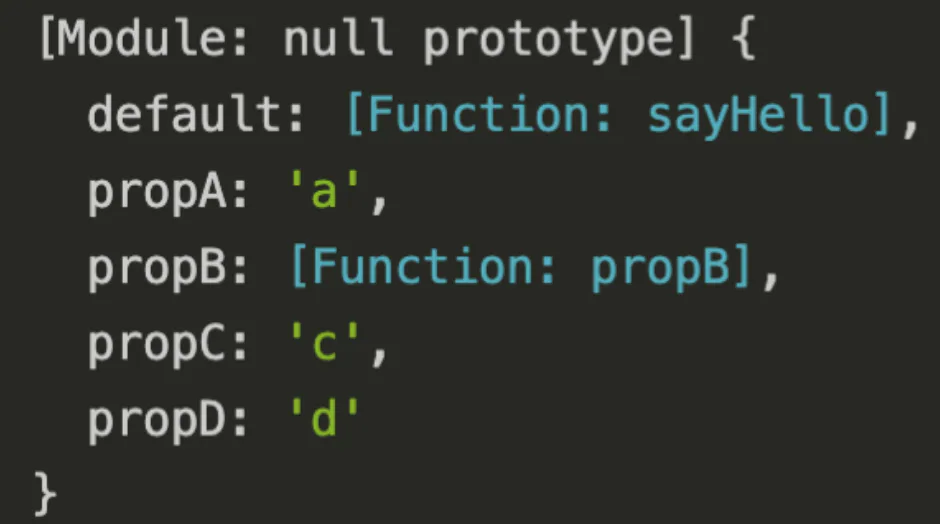

# ES Module

## 目录

- [导入导出](#导入导出)
  - [普通导入、导出](#普通导入导出)
  - [默认导入、导出](#默认导入导出)
  - [默认导入、导出](#默认导入导出)
  - [全部导入](#全部导入)
  - [重命名导入](#重命名导入)
  - [重定向导出](#重定向导出)
    - [注意：](#注意)
  - [只运行模块](#只运行模块)
- [export 导出](#export-导出)
- [import 导入](#import-导入)
  - [循环引入](#循环引入)
  - [提升](#提升)
  - [动态导入](#动态导入)
- [结语](#结语)

尽管名为CommonJS，但并不Comomn（通用），它的影响范围还是仅仅在于服务端。前端开发更常用的是ES Module。

ES Module使用import命令来做导入，使用export来做导出，语法相对比较复杂，熟悉可以先跳过这一部分

# 导入导出

## 普通导入、导出

```javascript 
// index.mjs
import {propA, propB,propC, propD} from './a.mjs'

// a.mjs
const propA = 'a';
let propB = () => {console.log('b')};
var propC = 'c';

export { propA, propB, propC };
export const propD = 'd'
```


使用export导出可以写成一个对象合集，也可以是一个单独的变量 **，需要和import导入的变量名字一一对应**

## 默认导入、导出

```javascript 
// 导入函数
import anyName from './a.mjs'
export default function () {
    console.log(123)
}

// 导入对象
import anyName from './a.mjs'
export default {
  name:'niannian';
  location:'guangdong'
}

// 导入常量
import anyName from './a.mjs'
export default 1
```


使用export default语法可以实现默认导出，可以是一个函数、一个对象，或者仅一个常量。**默认的意思是，使用import导入时可以使用任意名称，**

## 默认导入、导出

```javascript 

// index.mjs
 import anyName, { propA, propB, propC, propD } from './a.mjs' 
console.log(anyName,propA,propB,propC,propD)

// a.mjs
const propA = 'a';
let propB = () => {console.log('b')};
var propC = 'c';
// 普通导出
export { propA, propB, propC };
export const propD = 'd'
// 默认导出
export default function sayHello() {
    console.log('hello')
}
```


## 全部导入

```javascript 
// index.mjs
 import * as resName from './a.mjs' 
console.log(resName)

// a.mjs
const propA = 'a';
let propB = () => {console.log('b')};
var propC = 'c';
// 普通导出
export { propA, propB, propC };
export const propD = 'd'
// 默认导出
export default function sayHello() {
    console.log('hello')
}
```


结果如下



## 重命名导入

```javascript 
// index.mjs
 import {  propA  as renameA,   propB as renameB, propC as renameC , propD as renameD } from './a.mjs' 
const propA = 'a';
let propB = () => {console.log('b')};
var propC = 'c';

// a.mjs
export { propA, propB, propC };
export const propD = 'd'
```


## 重定向导出

```javascript 
export * from './a.mjs' // 第一种
export { propA, propB, propC } from './a.mjs' // 第二种
export { propA as renameA, propB as renameB, propC as renameC } from './a.mjs' //第三种
export { default as price } from './a.mij'; //第四种

```


- 第一种方式：**重定向导出****所有导出属性****， 但是不包括****模块的默认导出****。**
- 第二种方式：以**相同的属性名**再次导出。
- 第三种方式：从模块中导入propA，**重命名**为renameA导出
- 第四种方式：重**定向模块的默认导出**

### 注意：

```javascript 
// 重定向导出  竟然不能再本页面（当前页面）使用； 
export {
  hireFormToQueryFloor,
  selfUseFormToQueryFloor,
  registerFloorQueryToForm,
  registerFloorFormToQuery,
} from './formQueryTransformFloor.util';
import { componyInfoToquery } from './formQueryTransformFloor.util';
```


## 只运行模块

```javascript 
import './a.mjs' 
```


# export 导出

**ES Module导出的是一份值的引用，CommonJS则是一份值的拷贝**。也就是说，**CommonJS是把暴露的对象拷贝一份，放在新的一块内存中，每次直接在新的内存中取值，所以对变量修改没有办法同步；**而ES Module则是**指向同一块内存，模块实际导出的是这块内存的地址，每当用到时根据地址找到对应的内存空间，这样就实现了所谓的“动态绑定”。**

可以看下面这个例子，使用ES Module导出一个变量1和一个给变量加1的方法

```javascript 
// b.mjs
export let count = 1;
export function add() {
  count++;
}
export function get() {
  return count;
}

// a.mjs
import { count, add, get } from './b.mjs';
console.log(count);    // 1
add();
console.log(count);    // 2
console.log(get());    // 2

```


可以看到，调用add后，导出的数字同步增加了。

但使用CommonJS实现这个逻辑：

```javascript 
// a.js
let count = 1;
module.exports = {
  count,
  add() {
    count++;
  },
  get() {
    return count;
  }
};

// index.js
const { count, add, get } = require('./a.js');
console.log(count);    // 1
add();
console.log(count);    // 1
console.log(get());    // 2

```


可以看到，在调用add对变量count增加后，导出count没有改变，因为CommonJS基于缓存实现，**入口模块中拿到的是放在新内存中的一份拷贝，调用add修改的是模块a中这块内存，新内存没有被修改到，所以还是原始值**，只有将其改写成方法才能获取最新值。

# import 导入

ES module会根据import关系构建一棵依赖树，遍历到树的叶子模块后，然后根据依赖关系，反向找到父模块，将export/import指向同一地址。

### 循环引入

&#x20;      和CommonJS一样，发生循环引用时并不会导致死循环，但两者的处理方式大有不同。如果阅读了上文，应该还**记得CommonJS对循环引用的处理基于他的缓存，即：将导出值拷贝一份，放在一块新的内存，用到的时候直接读取这块内存。**

&#x20;     但ES module导出的是一个索引——内存地址，没有办法这样处理。**它依赖的是“模块地图”和“模块记录**”，模块地图在下面会解释，**而模块记录是好比每个模块的“身份证”，记录着一些关键信息——这个模块导出值的的内存地址，加载状态，在其他模块导入时，会做一个“连接”——根据模块记录，把导入的变量指向同一块内存，这样就是实现了动态绑定，**

来看下面这个例子，和之前的demo逻辑一样：入口模块引用a模块，a模块引用b模块，b模块又引用a模块，这种ab模块相互引用就形成了循环

```javascript 
// index.mjs
import * as a from './a.mjs'
console.log('入口模块引用a模块：',a)

// a.mjs
let a = "原始值-a模块内变量"
export { a }
import * as b from "./b.mjs"
console.log("a模块引用b模块：", b)
a = "修改值-a模块内变量"

// b.mjs
let b = "原始值-b模块内变量"
export { b }
import * as a from "./a.mjs"
console.log("b模块引用a模块：", a)
b = "修改值-b模块内变量"
```


运行代码，结果如下。


## **提升**

值得一提的是，**import语句有提升的效果，实际执行可以看作这样：**

```javascript 
// index.mjs
import * as a from './a.mjs'
console.log('入口模块引用a模块：',a)

// a.mjs
import * as b from "./b.mjs"
let a = "原始值-a模块内变量"
export { a }
console.log("a模块引用b模块：", b)
a = "修改值-a模块内变量"

// b.mjs
import * as a from "./a.mjs"
let b = "原始值-b模块内变量"
export { b }
console.log("b模块引用a模块：", a)
b = "修改值-b模块内变量"
```


可以看到，在b模块中引用a模块时，得到的值是uninitialized，接下来一步步分析代码的执行。

**可以另建一个新的config 文件；配置你要在import 之前的代码；然后导入；解决提升问题**

&#x20;     **在代码执行前，首先要进行预处理，这一步会根据import和export来构建模块地图（Module Map）**，它类似于一颗树，树中的每一个“节点”就是一个模块记录，这个**记录上会标注导出变量的内存地址，将导入的变量和导出的变量连接**，即把他们指向同一块内存地址。不**过此时这些内存都是空的，也就是看到的uninitialized。**

接下来就是代码的一行行执行，i**mport和export语句都是只能放在代码的顶层，也就是说不能写在函数或者if代码块中。**

1. 【入口模块】首先进入入口模块，在模块地图中把入口模块的模块记录标记为“获取中”（Fetching），表示已经进入，但没执行完毕，
2. import \* as a from './a.mjs' 执行，进入a模块，此时模块地图中a的模块记录标记为“获取中”
3. 【a模块】import \* as b from './b.mjs' 执行，进入b模块，此时模块地图中b的模块记录标记为“获取中”，
4. 【b模块】import \* as a from './a.mjs' 执行，检查模块地图，模块a已经是Fetching态，不再进去，
5. let b = '原始值-b模块内变量' 模块记录中，**存储b的内存块初始化**，
6. console.log('b模块引用a模块：', a) 根据模块记录到指向的内存中取值，是{ a:}
7. b = '修改值-b模块内变量' 模块记录中，存储b的内存块值修改
8. 【a模块】let a = '原始值-a模块内变量' 模块记录中，存储a的内存块初始化，
9. console.log('a模块引用b模块：', b) 根据模块记录到指向的内存中取值，是{ b: '修改值-b模块内变量' }
10. a = '修改值-a模块内变量' 模块记录中，存储a的内存块值修改
11. 【入口模块】console.log('入口模块引用a模块：',a) 根据模块记录，到指向的内存中取值，是{ a: '修改值-a模块内变量' }

总结一下：和上面一样，循环引用要解决的无非是两个问题，保证不进入死循环以及输出什么值。ES Module来处理循环\*\*使用一张模块间的依赖地图来解决死循环问题，标记进入过的模块为“获取中”，所以循环引用时不会再次进入；\*\***使用模块记录，标注要去哪块内存中取值，将导入导出做连接，解决了要输出什么值。**

## 动态导入

```javascript 
// 方法一：
import('/modules/my-module.js')
  .then((module) => {
    // Do something with the module.
    });

// 方法二：
let module = await import('/modules/my-module.js');

// 方法三：动态导入默认接口
(async () => {
  if (somethingIsTrue) {
    const { default: myDefault, foo, bar } = await import('/modules/my-module.js');
  }
})();
```


# 结语

1. CommonJS和ES Module都对循环引入做了处理，不会进入死循环，但方式不同：
   - CommonJS借助模块缓存，**遇到require函数会先检查是否有缓存，已经有的则不会进入执行，在模块缓存中还记录着导出的变量的拷贝值；**
   - ES Module借助**模块地图，已经进入过的模块标注为获取中**，遇到import语句会去检查这个地图，已经标注为获取中的则不会进入，地图中的每一个**节点是一个模块记录，上面有导出变量的内存地址**，导入时会做一个连接——即指向同一块内存。
2. CommonJS的export和module.export指向同一块内存，但由于最后导出的是module.export，所以不能直接给export赋值，会导致指向丢失。
3. 查找模块时，核心模块和文件模块的查找都比较简单，对于react/vue这种第三方模块，会从当前目录下的node\_module文件下开始，递归往上查找，找到该包后，根据package.json的main字段找到入口文件。

[script标签esm模块化](./script标签esm模块化/index.md "script标签esm模块化")
