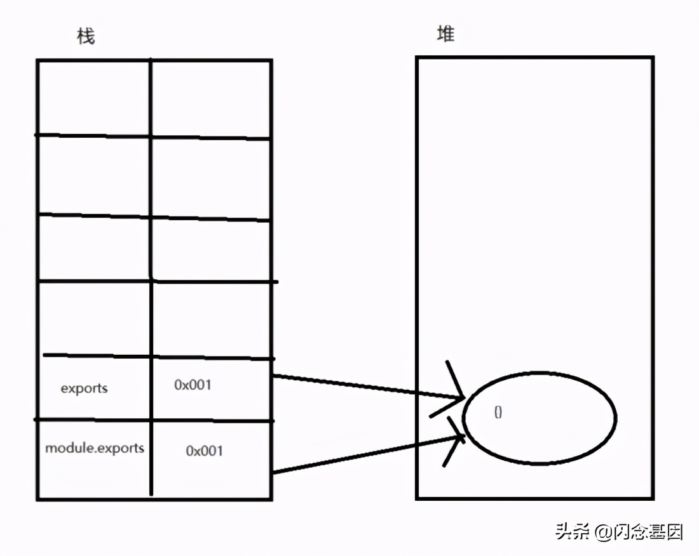
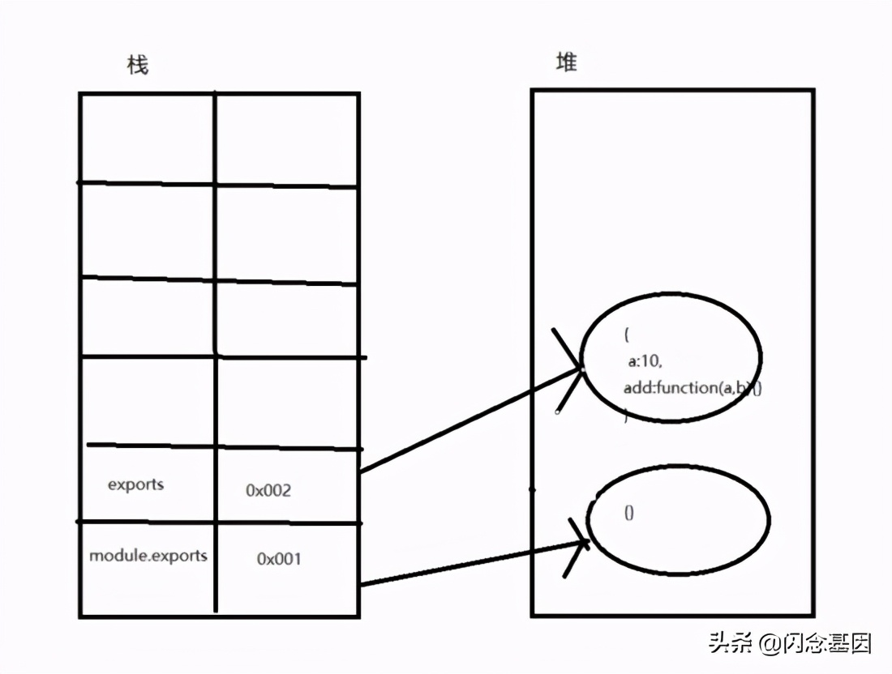

# commonjs

## 目录

- [一、特点 ](#一特点-)
- [二、应用环境 ](#二应用环境-)
- [三、global的用法 ](#三global的用法-)
  - [方式1：把变量挂载到global模块下【看完忘掉即可】 ](#方式1把变量挂载到global模块下看完忘掉即可-)
  - [方式2：使用module.exports导出成员 ](#方式2使用moduleexports导出成员-)
    - [1、使用module.exports单个导出 ](#1使用moduleexports单个导出-)
    - [2、使用module.exports直接导出一个对象 ](#2使用moduleexports直接导出一个对象-)
    - [3、使用exports代替module.exports来导出成员 ](#3使用exports代替moduleexports来导出成员-)
- [四、module.exports、exports和require为什么可以直接使用？ ](#四moduleexportsexports和require为什么可以直接使用-)
- [五、module.exports和exports ](#五moduleexports和exports-)
- [六、require() ](#六require-)
  - [require-ensure](#require-ensure)
- [七、require加载文件的方式（后缀名默认是js） ](#七require加载文件的方式后缀名默认是js-)
- [八、模块的加载机制 ](#八模块的加载机制-)
  - [循环引入](#循环引入)
  - [多次引入](#多次引入)
- [别名导入](#别名导入)
- [解构导入](#解构导入)

# 一、特点&#x20;

经过前面讨论，已经知道无模块化时项目中存在的问题。CommonJS的特点就是解决这些问题即：

1. 每**个文件都是一个单独的模块，有自己的作用域，声明的变量不是全局变量(除非在模块内声明的变量挂载到global上)**
2. 每个文件中的成员都是私有的，对外不可见
3. A模块依赖B模块时，在A模块内部使用require函数引入B模块即可，模块之间依赖关系更加清晰
4. 模块的加载有缓存机制，当加载完一次后，后续再加载就会读取缓存中的内容
5. .模块的加载顺序是按照代码的书写顺序来加载

# 二、应用环境&#x20;

       **应用在Node.js中。CommonJS的加载机制是同步的**，在Node环境中模块文件是存在本地硬盘中，所以加载起来比较快，不用考虑异步模式。

# 三、global的用法&#x20;

&#x20;已经知到CommonJS规范下，每个文件就是一个模块，都有私有作用域，那如何才能让外部访问某个模块中的内容呢？

方式1：把模块中的成员挂载到global全局对象中 【非常不推荐】

方式2：使**用模块的成员module.exports或者exports导出成员**

&#x20;最后在外部使用require函数引入所需模块

## 方式1：把变量挂载到global模块下【看完忘掉即可】&#x20;

```javascript 
 //module-b.js 
var a = 10; global.a = a;
//module-a.js 
require("./module-b.js"); 
console.log(a); //10
```


## 方式2：使用module.exports导出成员&#x20;

### 1、使用module.exports单个导出&#x20;

```javascript 
 //module-b.js 
const a = 10; 
const add = function(a, b) {     return a + b; } 
module.exports.a = a; 
module.exports.add = add;
//module-a.js 
const moduleB = require("./module-b.js"); 
console.log(moduleB.a); //10 
console.log(moduleB.add(1, 1)); //2
```


### 2、使用module.exports直接导出一个对象&#x20;

```javascript 
 //module-b.js 
const a = 10; 
const add = function(a, b) {     return a + b; } 
module.exports={a,add};
//module-a.js
const moduleB = require("./module-b.js");  
console.log(moduleB.a); //10
console.log(moduleB.add(1, 1)); //2
```


### 3、使用exports代替module.exports来导出成员&#x20;

```javascript 
 //module-b.js 
const a = 10; 
const add = function(a, b) {     return a + b; } 
exports.a=a;
exports.add=add; 
//使用exports时 不可使用下面这种方式导出成员 
exports={a,add}
//module-a.js 
const moduleB = require("./module-b.js");  
console.log(moduleB.a); //10 
console.log(moduleB.add(1, 1)); //2
由代码可见，在使用module.exports和exports导出成员时略有不同，具体是为什么呢？稍后作出解释
```


# 四、module.exports、exports和require为什么可以直接使用？&#x20;

   从我们平时写代码的经验来看，在一个文件中可以使用的成员由以下几种情况：

1、全局成员

2、在文件内部声明了该成员

    但我们所了解的代码运行环境中的全局成员只有一个，像window和global这种，那大概率不是全局成员。而且我们在模块内部并未声明这三个变量，那为何能直接使用呢？

\*\*其实在node运行环境中，每个模块都是运行在一个函数中，正是因为这个函数的存在，才让每个模块有了私有作用域 \*\*

```javascript 
(function (exports, require, module, __filename, __dirname) {   // HERE IS YOUR CODE });
```


\*\*通过代码来证明一下这个函数的存在 \*\*既然我们写的代码都在函数内部，那我们应该通过 **arguments**能获取到这个函数的参数

```javascript 
//module-a.js 
console.log('模块中的第一句代码'); 
console.log(arguments.length)  //运行结果 模块中的第一句代码 5
arguments.length的值是5，那八成就是这个样子了。但感觉说服力不强，继续看...

//module-a.js 
console.log('模块中的第一句代码'); 
console.log(arguments.callee.toString())  //运行结果 模块中的第一句代码 
function (exports, require, module, __filename, __dirname) {     
    console.log('模块中的第一句代码');     
    console.log(arguments.callee.toString()) 
}
```


终于露出了庐山真面目，为什么可以直接用，应该一目了然了！（可以尝试打印一下这个五个参数中都是什么内容）

# 五、module.exports和exports&#x20;

通过打印module成员，

**可以看到exports是module下的一个对象。module的exports属性表示当前模块对外输出的桥梁，module.exports指向的成员都会被暴露出去**

以上示例中的写法都是把模块内的成员挂载到module.exports中暴露出去的

```javascript 
const a = 10; 
const add = function(a, b) {     return a + b; } 
module.exports.a = a; 
module.exports.add = add; 或者使用 
module.exports={a,add}

exports又如何导出的呢？

//module-a.js 
console.log(module.exports) 
console.log(exports) //输出结果 {} {}
两个成员都是对象，那会不会是同一个东西呢？

//module-a.js 
console.log(module.exports) 
console.log(exports) 
console.log(module.exports===exports) //输出结果 {} {} true

 可见两个成员完全相等，则指向的堆内存的地址是同一个， 所以使用exports导出模块内的成员也是理所应当的了。
 所以模块最外部函数应该是有这么一句代码的

 (function (exports, require, module, __filename, __dirname) {     exports=module.exports={}; //指向同一个内存地址   // HERE IS YOUR CODE });
                      
 既然exports和module.exports是指向的是同一个内存，按说用法是一样的，为什么上边使用exports导出成员时，特意说明不可以使用exports直接导出一个对象呢？不妨试一下：
 
// module-b.js 
const a = 10; 
const add = function(a, b) {     return a + b; }  
// module.exports = { a, add }; 
exports = { a, add};
const moduleB = require("./module-b.js"); 

  console.log(moduleB)  //{} 
 console.log(moduleB.a) //undefined
```


实验得出，通过exports直接导出一个对象时在外部并拿不到导出的数据，为什么呢？看一下module.exports和exports在内存中的情况

当加载该模块时，执行完exports=module.exports={}后的内存情况



当执行完exports={a,add}时的内存情况



**当exports={a, add}时，exports在内存中和module.exports指向的就不是同一个内存地址了，**

说白了抱不了module.exports的大腿了，

        \*\* 咱们上面说过，模块导出成员是通过module.exports导出的。exports和module.exports不是同一个内存时，exports自然无法导出成员了。\*\*

```javascript 
 既然如此那就把导出的成员老老实实挂载到exports下吧。整洋气一些，module.exports和exports同时使用
//module-b.js 
const a = 10; 
const add = function(a, b) {     return a + b; }  
module.exports = add; 
exports.a = a;
//module-a.js 
const moduleB = require("./module-b.js"); 
 console.log(moduleB)//Function 
console.log(moduleB.a)//undefined
纳尼？？？把导出的成员挂载到exports下了为何引用的时候还是undefined？？？
```


注意：在使用exports.a=a前 使用了module.exports=add了，这时候使用exports为什么导不出成员，大家应该都明白了【原因同上】

为了避免在导出成员时，有这样或那样的问题，建议在模块中全部使用module.exports吧&#x20;

两者指向同一块内存，虽然两者指向同一块内存，但最后被导出的是module.exports，所以不能直接赋值给exports。

# 六、require()&#x20;

通过上面一系列的代码案例可以看出，**require的作用是加载所依赖的文件。说白了就是执行了所加载模块的最外层的函数。**

```javascript 
 //module-b.js 
const a = 10; 
console.log('module-b中打印', a) 
module.exports = { a };
//module-a.js 
const moduleB = require("./module-b.js"); 
console.log(moduleB);
执行module-a.js的结果：  module-b中打印 10 { a: 10 }
```


module-b.js中的console.log执行了。**可见require函数确实令模块最外部的函数执行了****。** 由require执行完后有个参数来接受返回值看出，

**模块最外部的函数执行完后是有返回值的，那么模块最外部的函数应该是这个样子：**

```javascript 
(function (exports, require, module, __filename, __dirname) {   
   exports = module.exports = {}; //指向同一个内存地址    
  // HERE IS YOUR CODE   
   return module.exports;//把module.exports返回出去，同时module.exports下挂载的成员也返回出去了  
});
```


CommonJS的**引入****特点是值的拷贝****，简单来说就是把导出值复制一份，放到一块新的内存中。**

## [require-ensure](https://www.cnblogs.com/qdcnbj/p/10043137.html "require-ensure")

require-ensure 

- 说明: require.ensure在需要的时候才下载依赖的模块，当参数指定的模块都下载下来了（下载下来的模块还没执行），便执行参数指定的回调函数。require.ensure会创建一个chunk，且可以指定该chunk的名称，如果这个chunk名已经存在了，则将本次依赖的模块合并到已经存在的chunk中，最后这个chunk在webpack构建的时候会单独生成一个文件。
- 语法:require.ensure(dependencies: String\[], callback: function(\[require]), \[chunkName: String])
- dependencies: 依赖的模块数组
- callback: 回调函数，该函数调用时会传一个require参数
- chunkName: 模块名，用于构建时生成文件时命名使用
- 注意点：requi.ensure的模块只会被下载下来，不会被执行，只有在回调函数使用require(模块名)后，这个模块才会被执行。

这里有三个参数:

第一个参数是个数组，标明依赖的模块，这些会提前加载，

第二个是回调函数，在这个回调函数里面的require的文件会被单独打包成一个chunk,不会和主文件打包在一起，这样就生成了两个chunk,

第一次加载时只加载主文件，当点击时就会加载单独打包的chunk。这里的坑是，我想自己设置个名字叫oth,但是打包后仍然是webpack自动配置的名字，并且路径也不对，这让我郁闷好久啊，官方文档直说配置个名字就可以单独打包成自己写的名字了，根本没说还需要配置什么，终于找了好久终于在网上看到有人说还需要配置chunkFilename,和publicPath,好吧去看这俩的文档解释，才发现在介绍publicPath时提到了按需加载，并且说的不是很直接，意思就是按需加载单独打包出来的chunk是以publicPath会基准来存放的。好吧，另外还要配置chunkFilename:\[name].js这样才会最终生成正确的路径和名字

# 七、require加载文件的方式（后缀名默认是js）&#x20;

1. 对于核心模块，node将其已经编译成二进制代码，直接书写标识符fs、http就可以

&#x20;（1）通过相对路径加载模块，以"./"或"../"开头。比如：require("./module-b")是加载同级目录下的module-b.js

&#x20;（2）通过绝对路径加载模块，以"/"开头，这时候会去磁盘盘符根目录或者网站根目录去找此模块。比如：require("/module-b"),此时 会去根目录去找module-b.js

&#x20;（3）直接通过模块名加载,比如：require("math")，这是加载

**提供node内置的核心模块或者node\_modules目录中安装的模块。当加 载的是node\_modules中的模块时，查找规则如下**

```javascript 
//文件所在目录  

E:/Work/Module/CommonJs/module-a.js 

const math = require("math"); 
```


查找规则：【假设每次在对应的目录下都没找到math模块】&#x20;

1、先去CommonJS目录下的node\_modules中去查找math模块&#x20;

2、再去Module文件夹下的node\_modules中去查找math模块&#x20;

3、再去Work文件夹下node\_modules中去查找math模块&#x20;

4、再去E盘下的node\_modules中去查找math模块&#x20;

最顶级目录还找不到的话则报错...

**简单的说就是一层层的往上找；直到根目录**

# 八、模块的加载机制&#x20;

> 拷贝输出的值；并缓存；

CommonJS模块的加载机制是，

**引入的值是输出的值的拷贝，一旦模块内的值导出后，在外部如何改变都不会影响模块内部，** ​**同样模块内部对这个值如何改变也不会影响模块外部，犹如“嫁出去的女儿，泼出去的水”（但是对地址引用则不一样；都是只想堆里同一块地址）**

### 循环引入

接下来进入正题，CommonJS如何处理循环引入。

首先来看一个例子：入口文件引用了a模块，a模块引用了b模块，b模块却又引用了a模块。可以思考一下会输出什么.

```javascript 
//index.js
var a = require('./a')
console.log('入口模块引用a模块：',a)

// a.js
exports.a = '原始值-a模块内变量'
var b = require('./b')
console.log('a模块引用b模块：',b)
exports.a = '修改值-a模块内变量'

// b.js
exports.b ='原始值-b模块内变量'
var a = require('./a')
console.log('b模块引用a模块',a)
exports.b = '修改值-b模块内变量'
```


输出结果如下：


这种AB模块间的互相引用，本应是个死循环，但是实际并没有，因为CommonJS做了特殊处理—**—模块缓存。**

依旧使用断点调试，可以看到变量require上有一个属性`cache`，这就是模块缓存


循环引用无非是要解决两个问题，**怎么避免死循环以及输出的值是什么**。CommonJS通过模块缓存来解决：**每一个模块****都先加入缓存再执行****，每次遇到require都先检查缓存，这样就不会出现死循环；借助缓存，输出的值也很简单就能找到了。**

> 📌我的理解：模块外无法直接修改模块内的值；但是可以调用模块内的方法；修改模块内的值；多次require 也不会多次执行外层函数

### 多次引入

同样由于缓存，一个模块不会被多次执行，来看下面这个例子：入口模块引用了a、b两个模块，a、b这两个模块又分别引用了c模块，此时并不存在循环引用，但是c模块被引用了两次。

```javascript 
//index.js
var a = require('./a')
var b= require('./b')

// a.js
module.exports.a = '原始值-a模块内变量'
console.log('a模块执行')
var c = require('./c')

// b.js
module.exports.b = '原始值-b模块内变量'
console.log('b模块执行')
var c = require('./c')

// c.js
module.exports.c = '原始值-c模块内变量'
console.log('c模块执行')
```


执行结果如下：


可以看到，c模块只被执行了一次，**当第二次引用c模块时，发现已经有缓存，则直接读取，而不会再去执行一次**

# 别名导入

```javascript 
const { Event: Sync } = require('../modules/sync')
```


# 解构导入

```javascript 
const { mainOn, mainHandle, NAMES: { mainWindow: ipcMainWindowNames } } = require('@common/ipc')
```
