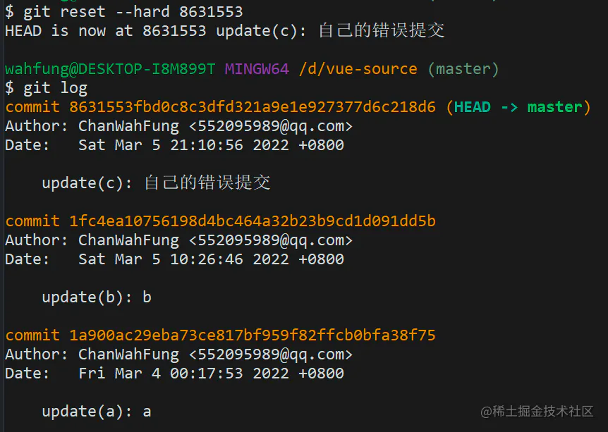

# stash  restore

## 目录

- [git restore](#git-restore)
  - [--staged ](#--staged-)
  - [撤销缓存区；更改文件](#撤销缓存区更改文件)
- [git stash ](#git-stash-)
  - [保存](#保存)
  - [应用](#应用)
  - [查看](#查看)
  - [删除](#删除)

# git restore

## --staged&#x20;

撤销缓存区；但是不更改文件

- 如果文件已经被添加到暂存区 （git add 过了） 可以用 git restore  --staged file 将暂存区的文件撤销  但是不更改文件
- 注意 撤销到缓存区的 文件；但是不更改本地文件； 可以理解为 撤销git add&#x20;

## 撤销缓存区；更改文件

- Git restore file 不仅撤销了暂存区；还撤销了本地文件的修改

# git stash&#x20;

## 保存

```javascript 

# 保存当前未commit的代码
git stash

# 保存当前未commit的代码并添加备注
git stash save "备注的内容"


```


## 应用

```javascript 
# 应用某个存储,但不会把存储从存储列表中删除   git stash apply stash@{$num} 
git stash apply :   #默认使用第一个存储,即stash@{0}，
   

```


## 查看

```javascript 
# 显示做了哪些改动，默认show第一个存储  git stash show stash@{1}
git stash show ：
    
# 显示第一个存储的改动的具体内容   git stash show  stash@{$num}  -p
git stash show -p :

# 列出stash的所有记录
git stash list

```


## 删除

```javascript 
# 应用最近一次的stash，随后删除该记录  git stash pop stash@{1}
git stash pop

# 删除stash的所有记录
git stash clear

# 删除最近的一次stash   git stash drop stash@{1}
git stash drop


```


drop


