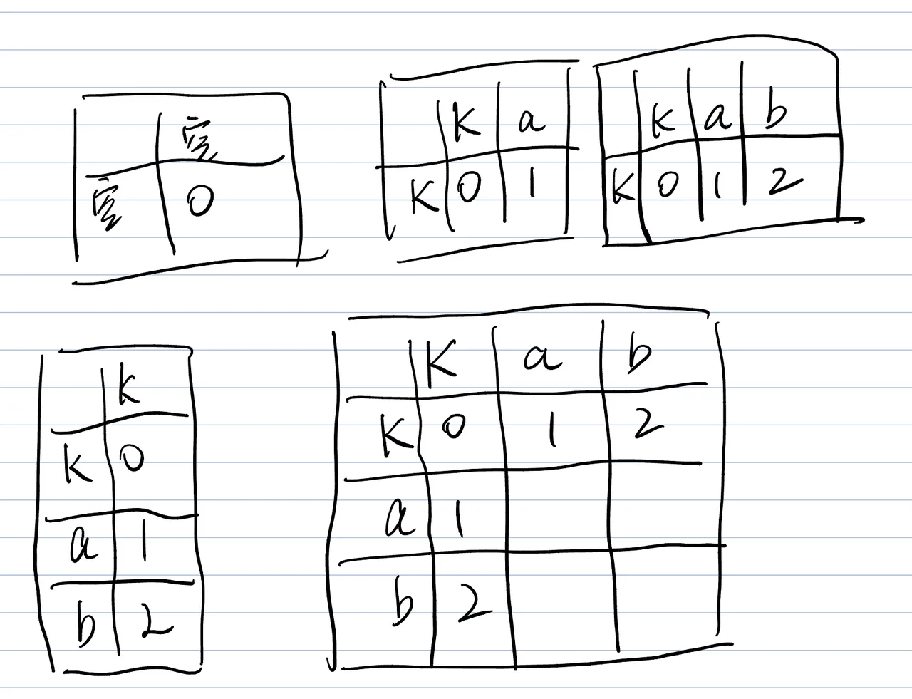
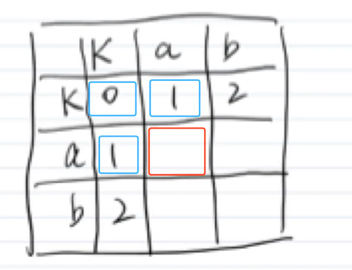
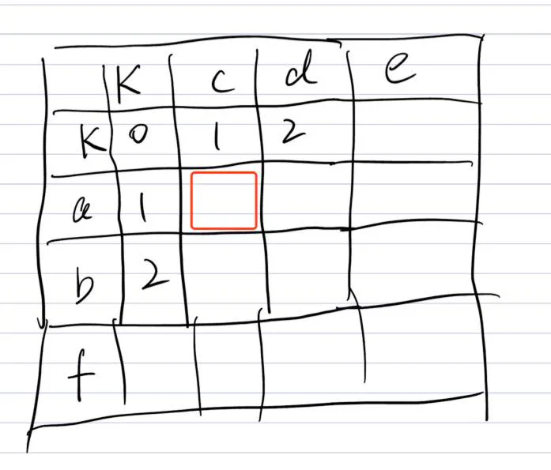
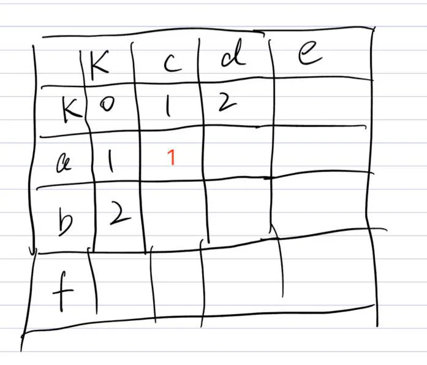
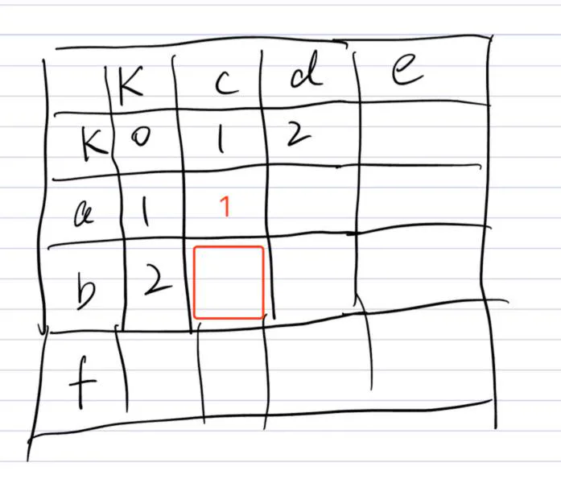
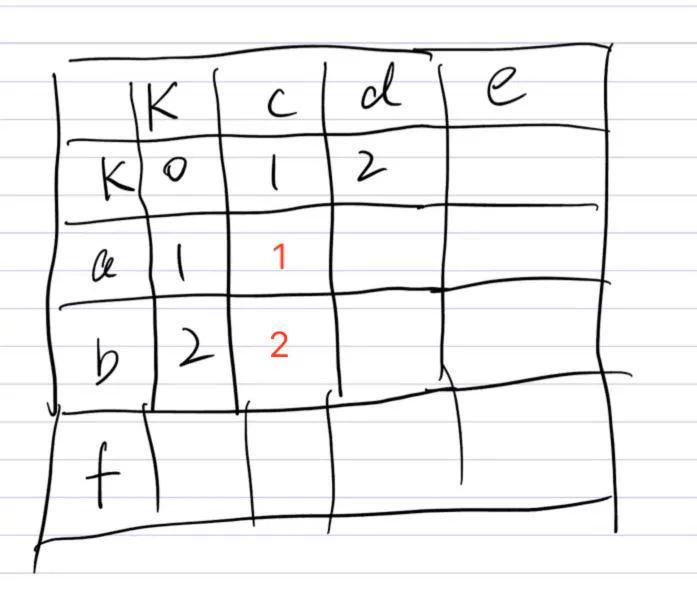
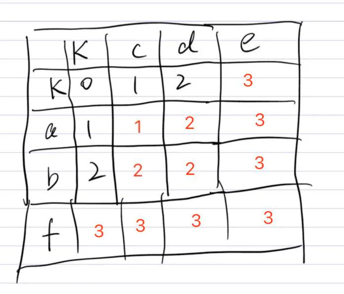
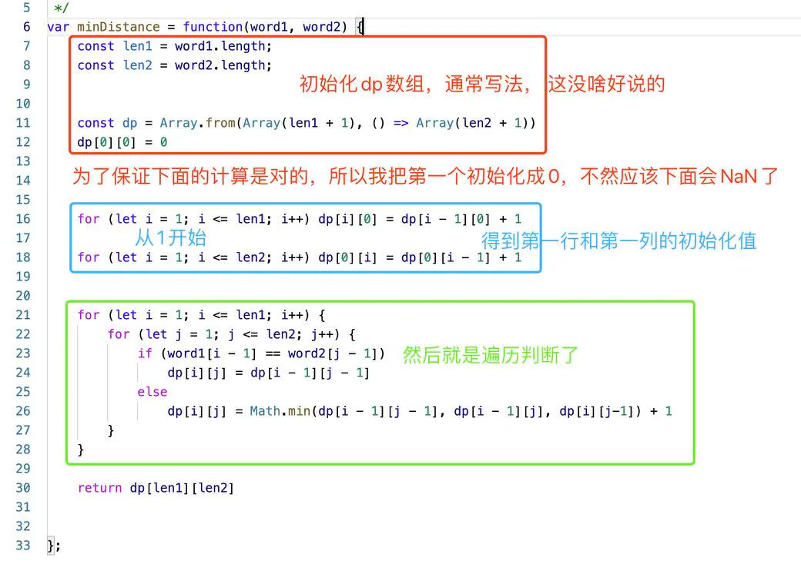

# 最短编辑距离

## 目录

- [1.基础情况举例](#1基础情况举例)
- [2. DP 的概念](#2-DP-的概念)
- [3. 复杂情况举例](#3-复杂情况举例)
- [4. 完整代码](#4-完整代码)

## 1.基础情况举例

我们先了解一些基本的东西，

假设 A 是字符串1，B 是字符串2，

那么，如果 A: ""，B: ""，两个字符串是相等的，我们不需要任何操作，这个能理解吧。

那如果给A添加一个字母A："a"，B: ""，

A 比 B 多了一个字母 a，所以要进行一次删除操作。

操作次数就是1，对吧。

同理，A：ab，B：“”，那次数就是 2。

反过来也是一样的，A：“”，B：“ab”，次数也是 2。

因为对于A来说，要新增两个字母。

所以我们能得到下面这样的二维数组。应该能看懂吧。

> PS：大写字母 K 代表空字符串，懒得写那么多笔画了



## 2. DP 的概念

在此之前，防止有些人不了解 DP，我先说一些基础概念。



对于红色的框，它的值，是根据蓝色框里的值得出来的。

红色框的值，应该是（三个蓝色框里的最小值 + 1）。

原理是，如果到蓝色框需要n个步骤，那么进一步到红色框，肯定只需要 n+1 个步骤。

## 3. 复杂情况举例

前面的图呢，由于字母都是一样的，我们现在看一下字母不同的情况。



不考虑任何图里的数字，就单独看红色格子，

```ruby 
word1: a
word2: c

```


把 a 变为 c，我们只需要经过一次替换操作。所以操作次数是 1。



再看下一个位置。



相当于是，

```ruby 
word1: ab
word2: c

```


这里还是一样的，a 替换成 c 以后，后面还多一个 b，所以要经过一次删除操作。

所以是1次替换，1次删除，所以结果是 2。



其他格子也是同样的推理，我就不赘述了，结果如下图。



然后你会发现，就是我前面说的那个规律， &#x20;
红色框的值，应该是（三个蓝色框里的最小值 + 1）。

所以，

```ruby 
dp[i][j] = Math.min(
    dp[i - 1][j - 1],
    dp[i -1][j],
    dp[i][j - 1]
)
```


这就是dp的基本逻辑了。

然后这个题里面，还有一个特殊情况。
那就是“两个位置的字母是相等”的情况。

由于相等的时候，什么操作都不用做，
dp\[i]\[j] 直接就是 dp\[i - 1]\[j -1] 也就是左上角的格子的值。

整个这个题的逻辑，就差不多出来了。

最后上代码，



## 4. 完整代码

```javascript 
/**
 * @param {string} word1
 * @param {string} word2
 * @return {number}
 */
var minDistance = function(word1, word2) {
    const len1 = word1.length;
    const len2 = word2.length;
    const dp = Array.from(Array(len1 + 1), () => Array(len2 + 1))
    dp[0][0] = 0

    for (let i = 1; i <= len1; i++) dp[i][0] = dp[i - 1][0] + 1

    for (let i = 1; i <= len2; i++) dp[0][i] = dp[0][i - 1] + 1

    for (let i = 1; i <= len1; i++) {
        for (let j = 1; j <= len2; j++) {
            if (word1[i - 1] == word2[j - 1]) 
                dp[i][j] = dp[i - 1][j - 1]
            else
                dp[i][j] = Math.min(dp[i - 1][j - 1], dp[i - 1][j], dp[i][j-1]) + 1
        }
    }

    return dp[len1][len2]
};

```
