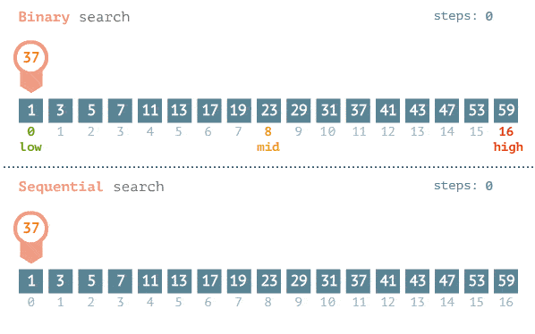

# 如何在排序后的数组中找到某个值？

## 目录

- [2、如何在排序后的数组中找到某个值？](#2如何在排序后的数组中找到某个值)
  - [执行](#执行)

# **2、如何在排序后的数组中找到某个值？**

对数组进行排序后，让我们使用排序后的数组。

假设我们有一个有序数组，我们想检查这个数组中是否存在某个值。那么我们应该怎么做呢？

我们可以遍历数组以确定该值是否存在于数组中，但是这种方法效率太低。

对于排序数组，我们有一个更有效的方法，就是二分查找。

执行二分搜索的基本步骤是：

1. 以整个数组的中间元素作为搜索键开始。
2. 如果搜索键的值等于项目，则返回搜索键的索引。
3. 或者搜索键的值小于区间中间的项，则将区间缩小到下半部分。
4. 否则，将其缩小到上半部分。
5. 从第二点开始反复检查，直到找到值或区间为空。

例如，这是一个排序数组：

```javascript 
[15, 24, 30, 48, 49, 64, 86, 90, 100, 121, 130]

```


如果我们要检查这个数组中是否存在 48：


## **执行**

```javascript 
function binarySearch(arr, x) {
  // left index of the current interval
  let l = 0;

  // right index of the current interval
  let r = arr.length - 1;

  // middle index of the current interval
  let mid;

  while (r >= l) {
    mid = l + Math.floor((r - l) / 2);

    // If the element is present at the middle
    // itself
    if (arr[mid] == x) {
      return mid;
    }

    // If element is smaller than mid, then
    // it can only be present in left subarray
    if (arr[mid] > x) {
      r = mid - 1;
    }

    // Else the element can only be present
    // in right subarray
    if (arr[mid] < x) {
      l = mid + 1;
    }
  }

  // We reach here when element is not
  // present in array
  return -1;
}

```


**用法：**


**比较**

二分搜索比正常的线性搜索更快。



但是，你只能在排序数组上使用二分搜索!
