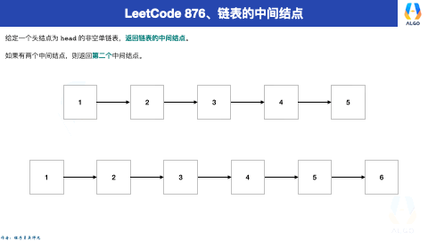

# 链表的中间结点

## 目录

- [一、题目描述](#一题目描述)
- [二、题目解析](#二题目解析)
- [三、参考代码](#三参考代码)

## 一、题目描述

给定一个头结点为 `head` 的非空单链表，返回链表的中间结点。

如果有两个中间结点，则返回第二个中间结点。

示例 1：

```typescript 
输入：[1,2,3,4,5]
输出：此列表中的结点 3 (序列化形式：[3,4,5])
返回的结点值为 3 。 (测评系统对该结点序列化表述是 [3,4,5])。
注意，我们返回了一个 ListNode 类型的对象 ans，这样：
ans.val = 3, ans.next.val = 4, ans.next.next.val = 5, 以及 ans.next.next.next = NULL.

```


示例 2：

```typescript 
输入：[1,2,3,4,5,6]
输出：此列表中的结点 4 (序列化形式：[4,5,6])
由于该列表有两个中间结点，值分别为 3 和 4，我们返回第二个结点。

```


提示：

- 给定链表的结点数介于 `1` 和 `100` 之间。

## 二、题目解析

我个人认为这道题目是最好理解快慢指针这个知识点了。

废话不多说，直接先来看动画演示！



根据这个动画，不难理解整体的思路如下：

1、设置两个指针，一开始都指向链表的头节点；

2、接下来，让这两个指针向前移动；

3、如果可以移动，那么就会让快指针每次移动两步，慢指针每次移动一步；

4、而快指针可以移动两步的前提就是当前节点不为空，同时下一节点也不为空，这样才能保证 fast.next 有值、fast.next.next 有值

5、最后，slow 指向的就是中间节点。

## 三、参考代码

快慢指针

定义快慢指针，快指针一次走两步，慢指针一次走一步，结束条件是fast存在并且下一个节点存在。 &#x20;
这样偶数长度的链表，slow刚好落在2个中间元素的右侧。

```typescript 
var middleNode = function(head) {
    let slow = head
    let fast = head

    while (fast && fast.next) {
        fast = fast.next.next
        slow = slow.next
    }
    return slow

};

```
