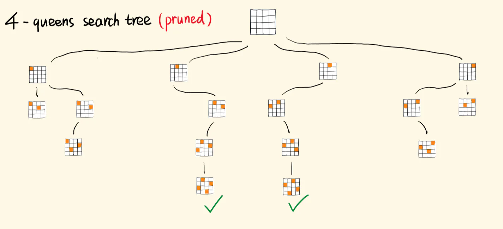

# &#x20;N 皇后(递归回溯)

## 目录

- [我起初的思路](#我起初的思路)
- [回溯的套路（可硬记）：](#回溯的套路可硬记)
- [思路修正](#思路修正)
  - [优化后的代码](#优化后的代码)

#### 我起初的思路

以 4 皇后为例，我画出一个搜索树，初始时棋盘的格子都是`"."`。


每一行，选一个格子置为"Q"，一行行往下选，第一行有四种选择。
在选下一行的皇后时，为了避免列的冲突，有三种选择。
继续选下去，可能会遇到对角线冲突，继续选下去没有意义，得不出合法的解。需要回溯。

## 回溯的套路（可硬记）：

- 遍历枚举出所有可能的选择。
- 依次尝试这些选择：作出一种选择，并往下递归。
- 如果这个选择产生不出正确的解，要撤销这个选择（将当前的 "Q" 恢复为 "."），回到之前的状态，并作出下一个可用的选择。

**选择、探索、撤销选择。识别出死胡同，就回溯，尝试下一个点，不做无效的搜索。**

## 思路修正

- 我在枚举选择时，规避了行和列的冲突，前面画的搜索树已经是修剪后的。
- 但我还是想复杂了，对角线冲突和行列冲突一起作为约束就好，直接进行充分剪枝。
- 即遍历之前的行，如果当前的格子和之前的皇后们 同列或同对角线，则跳过该点（这需要优化，后面会讲）



- 你看上图左边两个叶子节点，下一行怎么放都冲突，可选的选项都被剪完了，
- 当所有可选的选择迭代完，当前递归分支就结束，撤销最后的选择，回到上一层，切入另一个分支。
- 当填完第四行，如上图的绿钩，生成了一个解，加入解集，并返回（这里不返回也行，因为已经做了充分的剪枝，不返回就会走一遍迭代，递归也结束），开始回溯，继续寻找完整解。

回溯的三要点

- **选择，决定了搜索空间，决定了搜索空间有哪些节点。**
- **约束，用来剪枝，避免进入无效的分支。**
- 目标，决定了什么时候捕获有效的解，**提前结束递归，开始回溯。**

```typescript 
 /* 判断当前点是否与已找到的点
    * 不同行(由于是逐行递归的，因此当前行的点肯定与已找到的点不同行，此处无需判断)
   * 不同列(即:已找到的点的列不等于当前点的列)
    * 不同对角线(即：已找到的点的列与行之和/差不等于当前点的列与行之和/差) 
   */ 
const solveNQueens = (n) => {
  const board = new Array(n);
  for (let i = 0; i < n; i++) {     // 棋盘的初始化
    board[i] = new Array(n).fill('.');
  }
  const res = [];
  const isValid = (row, col) => {  
    for (let i = 0; i < row; i++) { // 之前的行
      for (let j = 0; j < n; j++) { // 所有的列
         if (board[i][j] == 'Q' &&   // 发现了皇后，并且和自己同列/对角线
          (j == col || i + j === row + col || i - j === row - col)) { 
          return false;             // 不是合法的选择
        }
      }
    }
    return true;
  };
  const helper = (row) => {   // 放置当前行的皇后
    if (row == n) {           // 递归的出口，超出了最后一行
      const stringsBoard = board.slice(); // 拷贝一份board
      for (let i = 0; i < n; i++) {
        stringsBoard[i] = stringsBoard[i].join(''); // 将每一行拼成字符串
      }
      res.push(stringsBoard); // 推入res数组
      return;
    }
    for (let col = 0; col < n; col++) { // 枚举出所有选择
      if (isValid(row, col)) {          // 剪掉无效的选择
        board[row][col] = "Q";          // 作出选择，放置皇后
        helper(row + 1);                // 继续选择，往下递归
        board[row][col] = '.';          // 撤销当前选择
      }
    }
  };
  helper(0);  // 从第0行开始放置
  return res;
};
```


还可以优化
本题必须记录之前放置皇后的位置，才能结合约束条件去做剪枝。
我每次都调用 isValid 遍历一遍前面的格子，效率是不优的。
**最好是用三个数组或 Set 去记录出现过皇后的列们、正对角线们、反对角线们，用空间换取时间。**

### 优化后的代码

```typescript 
const solveNQueens = (n) => {
  const board = new Array(n);
  for (let i = 0; i < n; i++) {
    board[i] = new Array(n).fill('.');
  }

  const cols = new Set();  // 列集，记录出现过皇后的列
  const diag1 = new Set(); // 正对角线集
  const diag2 = new Set(); // 反对角线集
  const res = [];

  const helper = (row) => {
    if (row == n) {
      const stringsBoard = board.slice();
      for (let i = 0; i < n; i++) {
        stringsBoard[i] = stringsBoard[i].join('');
      }
      res.push(stringsBoard);
      return;
    }
    for (let col = 0; col < n; col++) {
      // 如果当前点的所在的列，所在的对角线都没有皇后，即可选择，否则，跳过
      if (!cols.has(col) && !diag1.has(row + col) && !diag2.has(row - col)) { 
        board[row][col] = 'Q';  // 放置皇后
        cols.add(col);          // 记录放了皇后的列
        diag2.add(row - col);   // 记录放了皇后的正对角线
        diag1.add(row + col);   // 记录放了皇后的负对角线
        helper(row + 1);
        board[row][col] = '.';  // 撤销该点的皇后
        cols.delete(col);       // 对应的记录也删一下
        diag2.delete(row - col);
        diag1.delete(row + col);
      }
    }
  };
  helper(0);
  return res;
};

```
