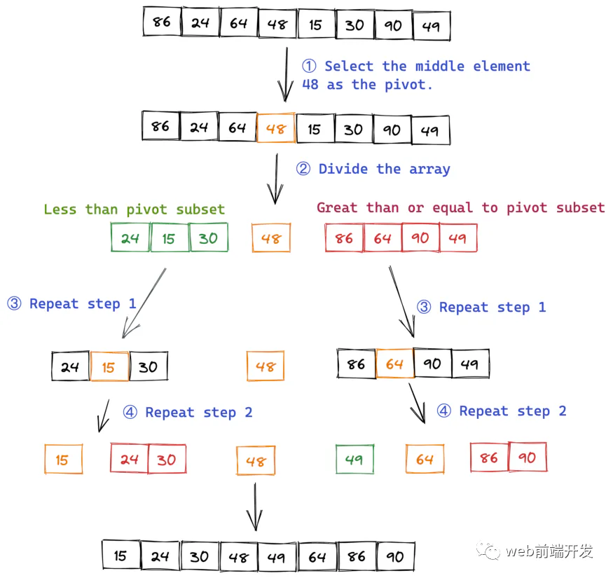

# 数组进行排序

## 目录

- [如何对数组进行排序？](#如何对数组进行排序)
  - [执行](#执行)

# **如何对数组进行排序？**

排序算法是计算机科学中最古老、最基本的主题之一。大约有十几种常见的排序算法。

当然，我们不必完全掌握这些排序算法。**如果我们需要先选择一个排序算法来学习，那么我认为应该是快速排序。**

为什么？因为：

- 快速排序本身被广泛使用。
- JavaScript 中 Array 的 sort 方法**是通过 V8 引擎中的快速排序实现的。**

（准确的说，当数组元素少于10个时，V8使用插入排序算法，当数组元素多于10个时，使用快速排序算法。）

“快速排序”的思路很简单，整个排序过程只需要三个步骤：

1. 选择数组中的一个元素作为“枢轴”。我们可以选择任何元素作为枢轴，但中间的元素更直观。
2. 所有小于枢轴的元素都被移动到枢轴的左侧；所有大于或等于枢轴的元素都被移动到枢轴的右侧。
3. 对于枢轴左右的两个子集，重复第一步和第二步，直到所有子集中只剩下一个元素。

例如，我们有一个需要排序的数组：

```javascript 
let arr = [86, 24, 64, 48, 15, 30, 90, 49]

```




## **执行**

首先，定义一个参数为数组的快速排序函数。然后，检查数组中的元素个数，如果小于等于 1，则返回。接下来，选择枢轴，将其与原始数组分开，并定义两个空数组来存储两个子集。然后，开始遍历数组，小于主元的元素放入左子集中，大于主元的元素放入右子集中。最后，通过使用递归重复这个过程，得到排序后的数组。

```javascript 

var quickSort = function(arr) {
　　if (arr.length <= 1) { return arr; }
　　var pivotIndex = Math.floor(arr.length / 2);
　　var pivot = arr.splice(pivotIndex, 1)[0];
　　var left = [];
　　var right = [];
　　for (var i = 0; i < arr.length; i++){
　　　　if (arr[i] < pivot) {
　　　　　　left.push(arr[i]);
　　　　} else {
　　　　　　right.push(arr[i]);
　　　　}
　　}
　　return quickSort(left).concat([pivot], quickSort(right));
};

```
