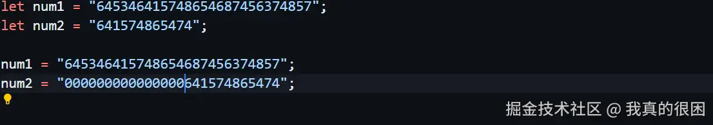
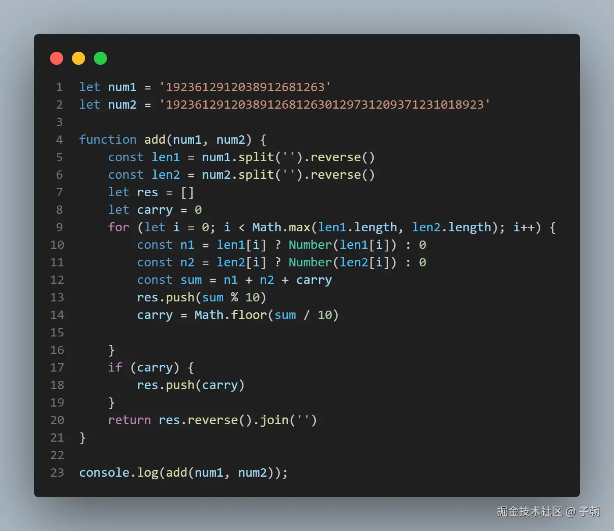

# 大数字相加

## 目录

- [解答：](#解答)

大家都知道在`js`中数字的最大值不能超过`2^53`，但是某些情况下可能不得不去进行一些操作导致数字大于这个值，请问在这种情况下该怎么将他们相加（不允许使用`bigInt`类型）

##### 解答：

这道题能做的前提是给出的参数必须是字符串类型，否则哪怕就是读取也会出错。之后的解题思路是先把短的数字补0，直到和长数字一样长，这样做的目的是为了方便后续的遍历。



之后就是从尾到头遍历两个字符串 **，并相加，把结果拼成字符串并返回。** 需要注意的是返回前检查进位是否还有数字，有的话需要加上去，我当时就忘了，多亏面试官提醒

```javascript 
function addLargeNumbers(num1, num2) {
  let carry = 0; // 进位
  let result = ""; // 结果字符串

  // 获取最长的字符串长度
  const maxLength = Math.max(num1.length, num2.length);

  // 补零，确保两个数字字符串长度相同
  num1 = num1.padStart(maxLength, "0");
  num2 = num2.padStart(maxLength, "0");

  // 从最低位开始逐位相加
  for (let i = maxLength - 1; i >= 0; i--) {
    let sum = parseInt(num1[i], 10) + parseInt(num2[i], 10) + carry;
    carry = Math.floor(sum / 10); // 更新进位
    result = (sum % 10) + result; // 添加到结果字符串
  }

  // 如果最后还有进位，需要添加到结果字符串开头
  if (carry > 0) {
    result = carry + result;
  }

  return result;
}


```



