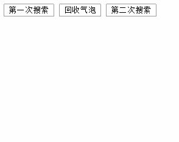

# 享元模式

## 目录

- [定义](#定义)
- [案例](#案例)
  - [无模式](#无模式)
  - [享元模式](#享元模式)
- [对象池](#对象池)

享元，就是**共享元素**的意思。

先来看一个生活中的案例：

假如你是个开网店的老板，进了50款男装和50款女装。为了赶上双十一能有更好的销量，你想花点钱雇模特来穿上你的衣服拍成广告照片。这时问题来了：

你到底是雇佣100个模特穿这100款衣服呢？

还是只雇一男一女2个模特，分别穿50款衣服呢？

得，这不是什么脑筋急转弯。正常人的选择肯定是男女2个人，而不是100人。

为啥啊？那不是废话吗？我花100个人的钱，这开销得多大啊！

ok，这其实就是个享元模式的真实案例。

# 定义

***

享元模式，就是将对象划分为**内部状态和外部状态**，从而**减少共享对象数量的一种模式**。

***

# 案例

很抽象是吧。好吧，那咱还是说人话来解释。

我们再看下这个雇模特的例子。别笑，我们做一下分析。

按理说，一款衣服配一个人，最为简单直观，一个萝卜一个坑，但这花销实在太大了。为了省钱，就要找出可以共享的元素来。

一共有衣服和人两个元素，每款衣服都是不一样的，所以衣服这个元素肯定是无法被共享的；由此得出被共享的元素是人，也就是只需男女两人即可。

那么我们就说，这个**享元模式的内部状态就是人的性别**，而外部状态**就是衣服款式**。从代码角度讲，我们最低限度是造出男女两个对象出来，这个是无法再省了。

再回过头看看享元模式的解释，是不是已经明白了？

下面我们用代码模拟一下。

## 无模式

无模式的模特穿衣：

```javascript 
<!DOCTYPE html>
<html>
<head lang="en">
    <meta charset="UTF-8">
    <title>无模式</title>
</head>
<body>


</body>
</html>
<script>
    //雇佣模特
    var HireModel = function(sex,clothes){
        this.sex = sex;
        this.clothes = clothes;
    };


    HireModel.prototype.wearClothes = function(){
        var div = document.createElement('div');
        var str = this.sex+"穿了"+this.clothes;
        var text = document.createTextNode(str);
        div.appendChild(text);
        document.body.appendChild(div);
    };
    /*******通过运行时间测试性能**********/
    var start = new Date().getTime();//起始时间
    for(var i=0;i<50000;i++){
        var model = new HireModel('male','第'+i+'款');
        model.wearClothes();
    }
    var end = new Date().getTime();//结束时间
    console.log(end-start);
</script>
```


## 享元模式

享元模式的模特穿衣：

```javascript 
<!DOCTYPE html>
<html>
<head lang="en">
    <meta charset="UTF-8">
    <title>享元模式</title>
</head>
<body>


</body>
</html>
<script>
    //雇佣模特
    var HireModel = function(sex){
        //内部状态是性别
        this.sex = sex;
    };
    HireModel.prototype.wearClothes = function(clothes){
        var div = document.createElement('div');
        var str = this.sex+"穿了"+clothes;
        var text = document.createTextNode(str);
        div.appendChild(text);
        document.body.appendChild(div);
    };
    //工厂模式，负责造出男女两个模特
    var ModelFactory = (function(){
        var cacheObj = {};
        return {
            create:function(sex){
                //根据sex分组
                if(cacheObj[sex]){
                    return cacheObj[sex];
                }else{
                    cacheObj[sex] = new HireModel(sex);
                    return cacheObj[sex];
                }
            }
        };
    })();
    //模特管理
    var ModelManager = (function(){
        //容器存储：1.共享对象 2.外部状态
        var vessel = {};
        return {
            add:function(sex,clothes,id){
                //造出共享元素:模特
                var model = ModelFactory.create(sex);
                //以id为键存储所有状态
                vessel[id] = {
                    model:model,
                    clothes:clothes
                };
            },
            wear:function(){
                for(var key in vessel){
                    //调用雇佣模特类中的穿衣服方法。
                    vessel[key]['model'].wearClothes(vessel[key]['clothes']);
                }
            }
        };
    })();
    /*******通过运行时间测试性能**********/
    var start = new Date().getTime();//起始时间
    for(var i=0;i<50000;i++){
        ModelManager.add('male','第'+i+'款',i);
    }
    var end = new Date().getTime();//结束时间
    console.log(end-start);
    ModelManager.wear();
</script>
```


我们将内部状态划分出来后，就可以将原类进行瘦身了。

原类中的方法如果要用到外部状态，都变为了参数；而真实的外部状态被分离出来后，被打到了专门一个管理器下，由这个管理器统一调度使用。

**管理器定义了一个容器，专门存储所有的外部状态；而可以被共享的元素，就用工厂方法造出，其实这也是个一对多的模型。**

这样处理会增加一些复杂度，多维护了一个工厂方法和调度管理类，但经过测试我们发现，在5万数量级的压力测试下，享元模式的实际运行时间比无模式下要短的好多。

这里有个坑容易掉进去。

我们用了享元模式后会有一种错觉，仿佛无论循环多少次，因自始至终都是创建了2个对象，所以内存消耗总是非常小的，都应该秒出才对，但大家实际测试会发现，当数量级调整到5百万时，却又非常的慢，这是为啥？

这里大家要注意一下。我们通过工厂模式，确实只造出来2个对象是没错，但我们在ModelManager这个类中，实际是开辟了一大块内存来存储所有的外部状态。为啥是一大块呢？

5百万数量级对应的，就是5百万个外部状态，相应需要容纳5百万个对象的存储空间，这对内存来说肯定是巨大的开支，这在有模式还是无模式下负担都很重。

那享元模式的提升效率体现在哪里？

知道我为啥在wearClothes()方法加了dom操作吗？

因为dom操作都是非常耗时的。同样的dom操作在运行时与前者相比，因为共享2个对象，享元模式肯定要快的多，这才是其优势体现。

# 对象池

当然咯，我们在实际工作中都应该极力避免频繁的dom操作，能共享的dom就不要创建第二次；进一步说，**能共享的对象就不要创建第二次，由此我们引出了对象池的概念。**

对象池是享元模式的一个变种。与传统的享元相比，它并没有什么内部和外部状态的划分，只是共享。所以相对简单的多，使用场景也更广泛。

对象池很容易理解，比如百度地图上标记地名的小气泡。

如果搜索我们公司附近时，页面出现了2个气泡；这时我再缩小搜索范围，页面就出现了5个气泡。**在第二次搜索时，并不会把第一次创建的2个气泡删除，而是放进了对象池，第二次搜索时只需创建3个气泡即可**。我们下面试着模拟一下。

```javascript 
<!DOCTYPE html>
<html>
<head lang="en">
    <meta charset="UTF-8">
    <title>享元模式-对象池</title>
</head>
<body>
<button onclick="firstSearch()">第一次搜索</button>
<button onclick="recoverTip()">回收气泡</button>
<button onclick="secondSearch()">第二次搜索</button>
</body>
</html>
<script>
    var domFactory = (function(){
        var pool = [];
        return {
            create:function(){
                if(pool.length == 0){
                    var div = document.createElement('div');
                    document.body.appendChild(div);
                    return div;
                }else{
                    //从对象池取出一个dom
                    return pool.shift();
                }
            },
            recover:function(dom){
                //将dom推入对象池
                pool.push(dom);
            }
        };
    })();

    var arr = [];
    //第一次搜索的两个气泡
    function firstSearch(){
        var tipArr = ['A','B'];
        for(var i=0;i<tipArr.length;i++){
            var tip = domFactory.create();
            tip.innerHTML = tipArr[i];
            document.body.appendChild(tip);
            arr.push(tip);
        }
    }

    //把搜索过的dom节点回收到对象池
    function recoverTip(){
        for(var i=0;i<arr.length;i++){
            domFactory.recover(arr[i]);
        }
    }
    //第二次搜索的5个气泡
    function secondSearch(){
        var tipArr2 = ['A','B','C','D','E'];
        for(var i=0;i<tipArr2.length;i++){
            var newtip = domFactory.create();
            newtip.innerHTML = tipArr2[i];
            document.body.appendChild(newtip);
        }
    }

</script>

```


运行效果：



从此例中可以看出，如果我不点击回收按钮，就会重新创建新的5个气泡；而点了回收，就会从上次搜索的基础上添加3个气泡，极大的节省了开销。

**享元模式是为解决性能问题而生的模式**。与单例模式相比，在复用角度上思想是一致的。但二者不同点也非常多，大家需要多玩味比较一下，千万别混为一谈。

[享元模式在 前端开发实际场景下的](<./享元模式在 前端开发实际场景下的/index.md> "享元模式在 前端开发实际场景下的")
