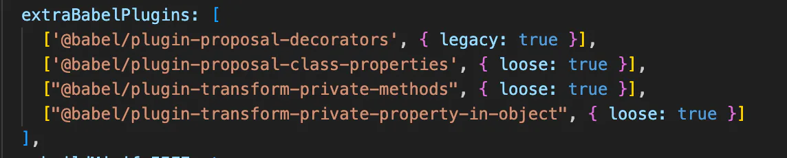
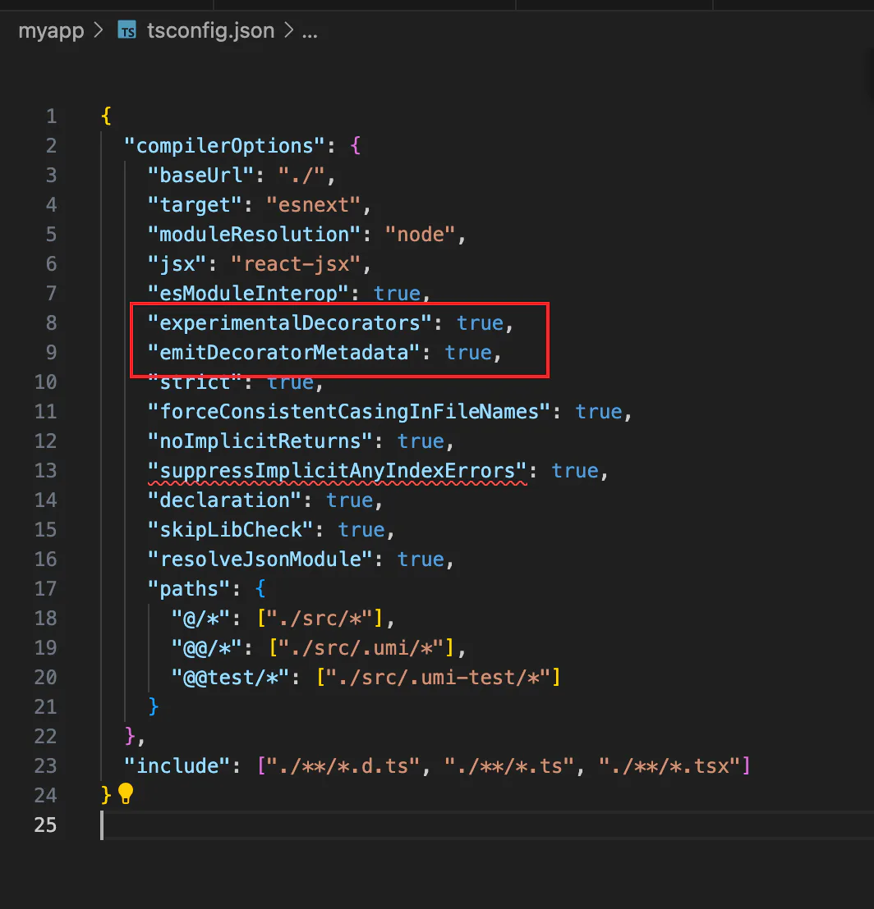

# umi和装饰器

## 目录

- [mobx集成失败](#mobx集成失败)

> 占不支持stage3的提案

[   https://github.com/umijs/umi/discussions/12425](https://github.com/umijs/umi/discussions/12425 "   https://github.com/umijs/umi/discussions/12425")

# mobx集成失败

[集成](<../../../../../前端框架/React/状态管理/mobx/集成/index.md> "集成")
