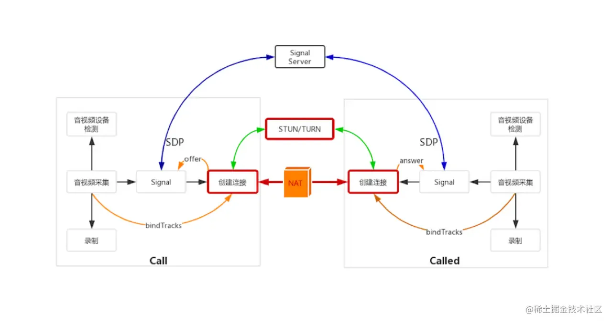
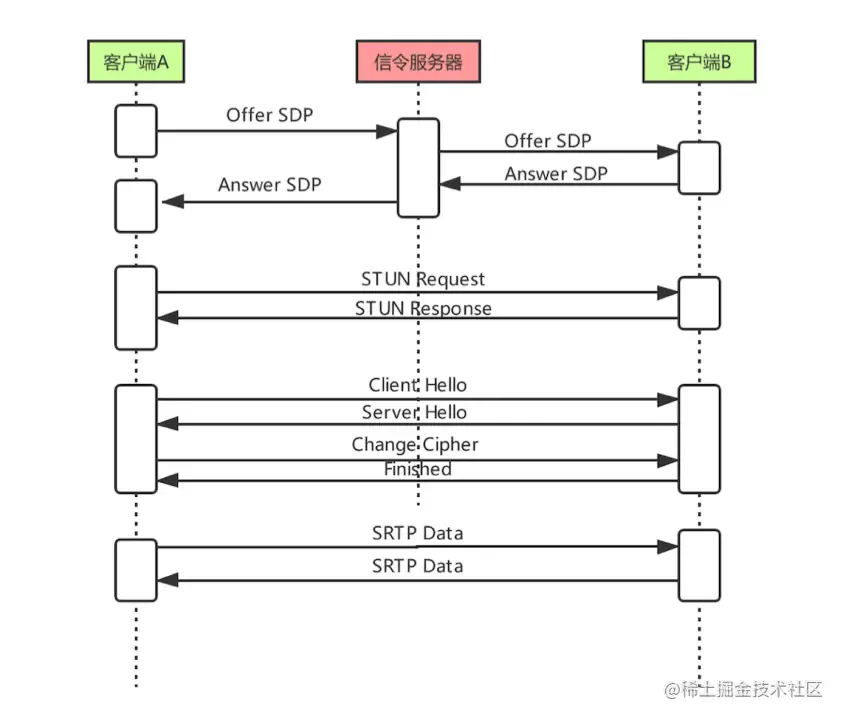
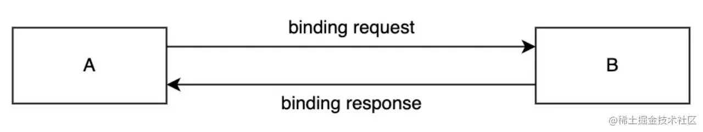
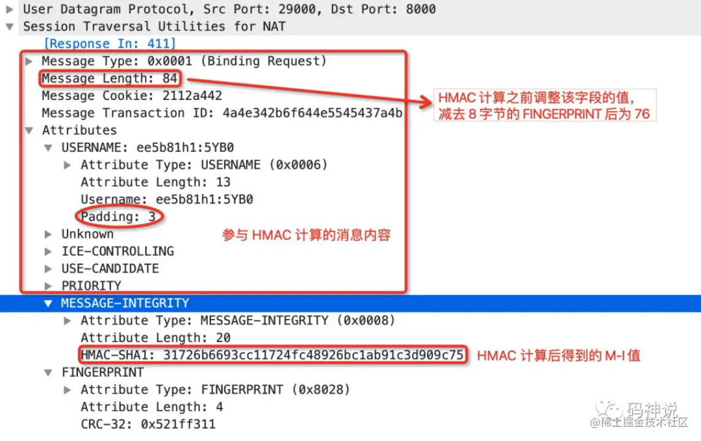
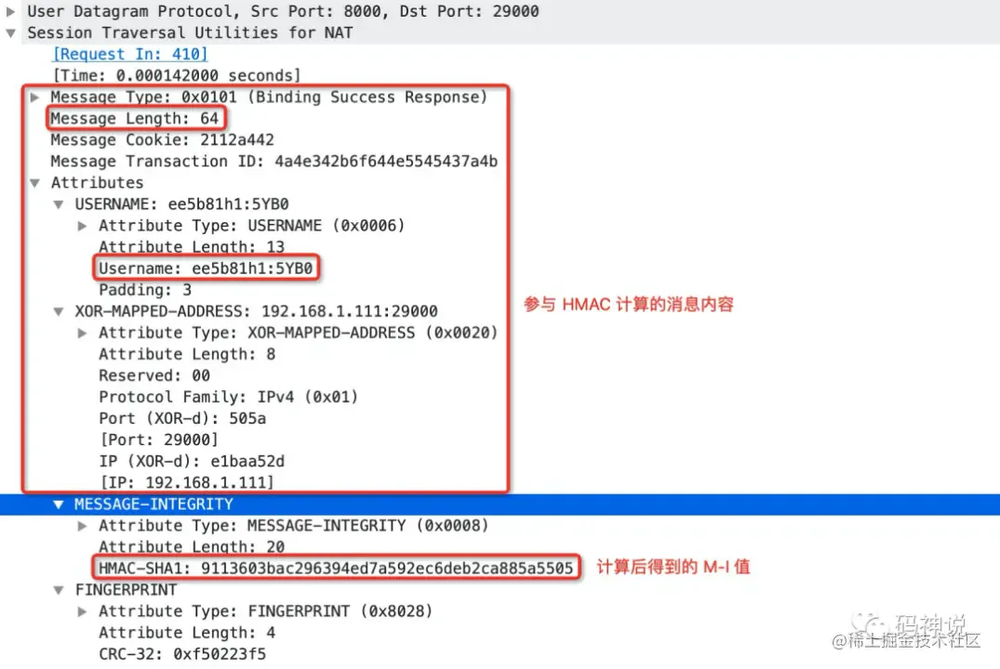
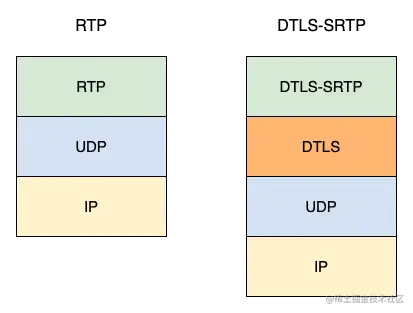
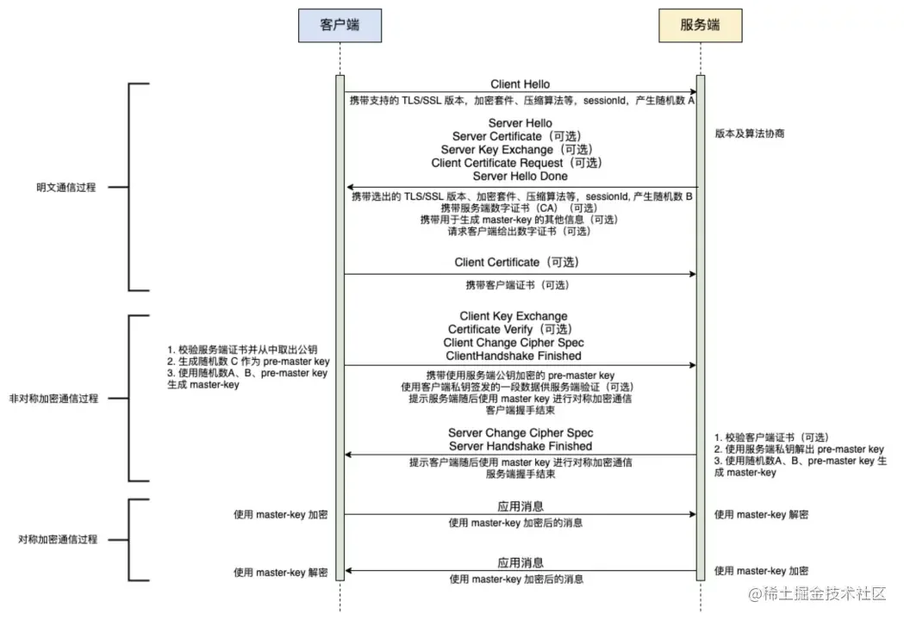

# WebRTC安全机制

## 目录

- [前提知识](#前提知识)
  - [对称加密](#对称加密)
  - [非对称加密](#非对称加密)
  - [数字签名](#数字签名)
  - [数字证书](#数字证书)
  - [WebRTC基本知识](#WebRTC基本知识)
- [WebRTC一对一通信流程](#WebRTC一对一通信流程)
  - [WebRTC安全机制流程](#WebRTC安全机制流程)
  - [交换SDP信息——安全描述](#交换SDP信息安全描述)
  - [使用STUN协议进行身份认证](#使用STUN协议进行身份认证)
  - [DTLS协商](#DTLS协商)

## 前提知识

### 对称加密

对称加密就是加密和解密使用相同密钥的加密算法，这种加密算法的安全取决于密钥。

### 非对称加密

非对称加密就是加密和解密使用了不同的密钥，分别称为公钥和私钥。一般我们通过公钥加密，私钥解密。

例如，A和B进行通信，双方各持有一对公私钥，先交换各自的公钥，然后A通过B的公钥对数据进行加密，B通过自己的私钥进行解密。同理B想要发送消息给A，先通过A的公钥进行加密，A通过自己的私钥进行解密。

相比对称加密技术，它的优点是不用担心密钥在通信过程中被他人窃取；缺点是解密速度慢，消耗更多的 CPU 资源。

### 数字签名

又称公钥数字签名，发送者 A 将报文摘要（报文通过 SHA-1 等哈希算法生成摘要）**通过私钥加密生成签名**，**与明文报文一起**发给接收者 B，**接收者 B 通过公钥解密**得到的**摘要和明文**通过哈希算法得到的摘要相比，比较这两份报文摘要是否相等可以验证报文是否被篡改。

### 数字证书

数字证书是由**一些公认可信的证书颁发机构签发的，不易伪造**，包括如下内容：

- 证书序列号
- 证书签名算法
- 证书颁发者
- 有效期
- 公开密钥
- 证书签发机构的数字签名

数字证书可以用**来确认接收方所持有的公钥是发送方的公钥**。接收方\*\*通过`CA`\*\***证书的公钥解开数字证书**，得到发送方的公钥。

### WebRTC基本知识

**RTP协议**

实时互动直播系统采用的是UDP协议进行传输，但一般在传递数据流的时候，我们并不直接将音视频数据流交给UDP传输，而是先给音视频数据加个RTP头，在交给UDP进行传输

**RTCP协议**

让各端知道他们自己的网络质量是怎样的

两个重要的报文：RR（Reciever Report）和 SR(Sender Report)。通过这两个报文的交换，各端就知道自己的网络质量到底如何了

**SDP信息**

SDP（Session Description Protocal）是用文本描述的各端（PC 端、Mac 端、Android 端、iOS 端等）的能力。这里的能力指的是各端所支持的音频编解码器是什么，这些编解码器设定的参数是什么，使用的传输协议是什么，以及包括的音视频媒体是什么等等，通过交换 SDP 信息，进行媒体协商，对其取交集，得到最后的编解码规则，传输协议等。

**ICE Candidate （ICE 候选者）**

它表示 WebRTC 与远端通信时使用的协议、IP 地址和端口，端对端的建立主要的工作是 Candidate 的收集。

## WebRTC一对一通信流程

首先我们想知道`WebRTC`的安全机制，我们得先来了解一下WebRTC他是怎样进行通信的，下面我们来看看他的通信流程



这幅图从大的方面可以分为 4 部分，即两个 WebRTC 终端（上图中的两个大方框）、一个 Signal（信令）服务器和一个 STUN/TURN 服务器。

`WebRTC` 终端：负责音视频采集、编解码、NAT 穿越、音视频数据传输。

`Signal` 服务器：负责信令处理，如加入房间、离开房间、媒体协商消息的传递等。

`STUN/TURN 服务`器：负责获取 `WebRTC` 终端在公网的 IP 地址，以及 NAT 穿越失败后的数据中转。

- 一方在加入房间之前会先检测下音视频设备，然后进行音视频的采集，获取到音视频流后会向信令服务器发送加入房间信号
- 当另一方也加入房间时，第一个用户就会收到另一个用户加入房间了，这个时候第一个用户会创建媒体链接对象 RTCPeerconnection，在进行音视频数据传输之前会进行媒体协商，也就是交换 SDP 信息，这个就是确定出双方的音视频编解码规则，传输协议等
- 然后就是收集 candidate，获取 ip 这些进行 Nat 穿越，打洞成功后就可以传输数据了

**以上就是webRTC的通信流程，那么webRTC在这个过程中是怎么保证传输数据的安全的呢？**

一般我们为了保证通信安全，可以对传输的数据进行加密，通常我们会选择非对称加密。

假如说 A 和 B 两个人进行通信，使用非对称加密，这里其实会有一个漏洞，即 A 与 B 交换公钥时，并没有进行任何防护。黑客完全可以用各种手段在 A 与 B 交换公钥时获取到这些公钥，这样他们就可以轻而易举地将传输的音视频数据进行解密了。

但是在`WebRTC`中呢，我们不用担心，**通过 ****`DTLS`**** 协议就可以有效地解决 A 与 B 之间交换公钥时可能被窃取的问题。**

**解决双方通信交换公钥问题后，并不能保证通信安全，比如说A与B进行通信，但此时B是冒充的**

场景：在会议系统或在线教育的小班课中，此时会议中有多人进行互动，如果黑客进入了会议中，他只需听别人说话，自己不发言，这样就将关键的信息窃取走了。所以现在的问题又来了，我们该如何辨别对方的身份是否合法呢？
这个时候我们的 `STUN` 协议就闪亮登场了，我们通过 `STUN` 协议进行身份认证，后续我们将他的具体认证流程，这里先大致有个印象

### WebRTC安全机制流程



上述流程大致为：

1. 通过媒体协商交换`SDP`信息，在 `SDP` 中记录了用户的用户名、密码、指纹
2. `STUN`协议进行身份认证，确认用户是否为合法用户
3. 进行`DTLS`协商，交换公钥证书以及协商密码相关的信息，同时还要通过 fingerprint 对证书进行验证，确认其没有在传输中被篡改。
4. 将`RTP`协议升级为`SRTP`协议进行加密传输

### 交换SDP信息——安全描述


上图是接收到的SDP信息中的安全描述部分，我们可以看到上面包含了用户的用户名 、密码、证书指纹

> 指纹：也就是用来判断**公钥证书在传递过程中有没有被篡改，进行证书完整性判断，通过**使用哈希算法对证书内容进行计算获取指纹。

**他是如何进行完整性判断的呢？**

- 首先，假设A和B进行通信
- A 从 CA 机构申请数字证书，通过哈希算法生成指纹 A
- 通过自己的私钥对指纹加密，生成数字签名
- 然后将签名附加在数字证书上和公钥发送给B
- B通过CA机构的公钥解开签过名数字证书，拿到里面的数字签名和数字证书
- B通过相应的哈希算法计算出数字证书的指纹1
- B通过公钥解开数字签名，拿到解密后的指纹2
- 比较两个指纹，如果相等，证明证书，没有被篡改

安全描述的作用：

- 进行网络连通性检测时，对用户身份进行认证；
- 收发数据时，对用户身份的认证，以免受到对方的攻击。

### 使用STUN协议进行身份认证

STUN协议作用

- 获取公网 IP 和端口
- 在 TURN 协议中发送 Allocation 指令，得到 TURN 服务器的地址
- 身份认证

接下来我们来看看他是如何进行身份认证的

它主要是通过 `HMAC` 来实现，`HMAC` 是哈希运算消息认证码，我们可以通过他进行消息完整性认证和信源身份认证，而我们对双方进行身份认证判断他是不是合法用户其实就是信源身份认证的过程。

信源身份认证主要是因为通信双方共享了认证的密钥，接收方验证发送过来的消息，判断计算的 HMAC 值和发送过来的消息中的 HMAC 值是否一致，从而确定发送方的身份合法性。

HMAC运算利用hash算法，以一个消息M和一个密钥K作为输入，生成一个定长的消息摘要作为输出。



上图是STUN协议的发送和接收流程

接下来我们来看看他的请求内容是什么



我们可以看到这个请求其中有一个属性`MESSAGE-INTEGRITY`,这里面存放了HMAC计算得到的值，他使用SHA1进行哈希，所有输出的消息摘要为20字节

**那么这个值是如何计算的呢？**

我们知道hash算法，以一个消息M和一个密钥K作为输入，生成一个定长的消息摘要作为输出。 所以我们只要找到消息和密钥是什么就可以了

发送方将`MESSAGE-INTEGRITY`属性之前的消息作为消息M，将对方的密码作为密钥K,然后通过hash算法，就计算得到了我们的 HMAC 值

> 这里我们可能会有一个疑问，我们是怎么获取到对方的密码的呢？
>
> 很简单，我们在进行 STUN 协议身份验证之前，进行了 SDP 信息交换，其中对方的密码包含在了 SDP 信息里面，我们就可以轻而易举的拿到密码了

**那么接收方是如何进行验证的呢？**

计算流程对应的伪代码如下：

```javascript 
// 去掉 8 字节大小的 Fingerprint 属性，
// 然后将消息序列化为字节，得到 stun_binary，
// 注意，不要去掉 MessageIntegrity 属性。
stun_msg = (header, 
  attributes[Username, MessageIntegrity, 
    Fingerprint])
// 将序列化后的消息去掉最后 24 字节的 M-I 属性，
// 得到更新后的 stun_binary。
stun_binary = 
  stun_msg.remove(Fingerprint).marshal_binary()
stun_binary = 
  stun_binary[0 : len(stun_binary) - 24]
// 生成 HMAC key。
key = password
// 计算 HMAC，得到 20 字节的 M-I 值。
h = hmac.new(hash.sha1, key);
h.update(stun_binary);
mi = h.Sum(null);
// 比较 mi 是否和消息携带的 M-I 值一致。
memcmp(
  stun_msg.attributes.MessageIntegrity.value, 
  mi, 20)

```


简单概括就是接受方序列化消息后去掉 MI 属性作为消息，将其通过自己的密码作为密钥进行HAMC，得到 M-I 值。比较这个计算出来的MI值与 binding-request 的 MI 值是否一致，如果一致的话就认为 A 是合法用户。
为什么能够证明A的身份？
这里 B 的密码其实就充当了双方的密钥，B要确认他是真的在和 A 通信，如果对方真的是 A 的话，那么她就会有 B 的密码，那他通过 hash 加密的 HMAC 值就会和 B 这边验证计算出来的 HMAC 值一致
同理，B发送响应的 binding-request，A验证他是不是真的在和 B 通信，下图是响应的消息



### DTLS协商

我们在进行了身份认证后，现在能够确定我们是真的在和对方进行通信

我们知道在进行非对称加密的时候，存在的漏洞是公钥的问题，他是真的是对方的公钥，他是否在传递过程中被黑客进行了篡改

我们是如何进行解决这个问题的呢？有两点

- 通过SDP信息中的指纹，也就是 fingerprint 属性去验证他是否在传递过程中被黑客进行了篡改
- 通过 DTLS 协议交换双方的公钥证书，来保证他真的是对方的公钥

下面我们来看看 DTLS 协议是什么？

**在提到 DTLS 协议，你可能会想到 HTTPS 中的 TLS 进行安全加密**，为什么在 WebRTC 中是使用 DTLS 进行协商，HTTPS 基于 TCP 协议，而 WebRTC 基于 UDP 协议。 因此 WebRTC 对数据的保护无法直接使用 TLS 协议。但 TLS 协议在数据安全方面做得确实非常完善，所以人们就想到是否可以将 TLS 协议移植到 UDP 协议上呢？ 因此 DTLS 就应运而生了。

**DTLS 就是运行在 UDP 协议之上的简化版本的 TLS**

在 WebRTC 中，通过引入 DTLS 对 RTP 进行加密，使得媒体通信变得安全。通过 DTLS 协商出加密密钥之后，RTP 也需要升级为 SRTP，通过密钥加密后进行通信。协议栈如下图所示：



握手过程如下图：



主要就是客户端向服务端发送 `ClientHello` 消息，服务端收到请求后，回 `ServerHello` 消息，并将自己的证书发送给客户端，同时请求客户端证书。客户端收到证书后，将自己的证书发给服务端，并让服务端确认加密算法。

**然后进行非对称加密，这个过程我们的目的是干嘛的呢？** 为了得到最后真正进行音视频数据传输加密的密钥，这个过程通过SRTP协议实现

> 我们知道webRTC通过`RTP`进行数据传输，但他对其中传输的数据并没有加密，如果通过抓包工具，如 `Wireshark`，将音视频数据抓取到后，通过该工具就可以直接将音视频流播放出来，这是非常恐怖的事情

在进行非对称加密通信过程之前，我们已经确定了公钥没有在传输过程中进行篡改，而且他确定是对方的公钥，这个时候非对称加密就是安全的，我们通过安全的非对称加密得到安全的密钥。

最后，我们再通过得到的密钥对数据进行加密，然后进行传输，这个既高效又安全。
