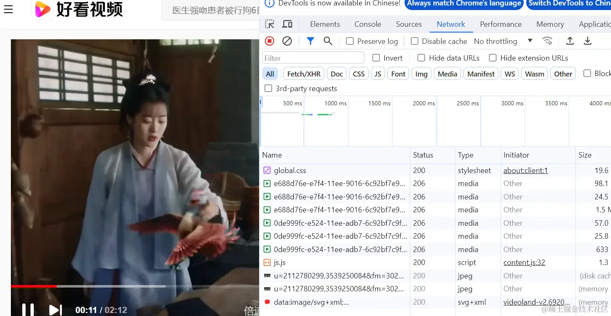

# ffmpeg

## 目录

- [安装 ffmpeg](#安装-ffmpeg)
  - [安装包下载](#安装包下载)

FFmpeg 是一个开源的、跨平台的多媒体框架，它可以用来录制、转换和流式传输音频和视频。它包括了一系列的库和工具，用于处理多媒体内容，比如 libavcodec（一个编解码库），libavformat（一个音视频容器格式库），libavutil（一个实用库），以及 ffmpeg 命令行工具本身。

FFmpeg 被广泛用于各种应用中，包括视频转换、视频编辑、视频压缩、直播流处理等。它支持多种音视频编解码器和容器格式，因此能够处理几乎所有类型的音视频文件。由于其功能强大和灵活性，FFmpeg 成为了许多视频相关软件和服务的底层技术基础。

很多网页都是用 `ffmpeg` 来进行视频切片，比如一个视频很大，如果通过一个连接去请求整个视频的话，那势必会导致加载时间过长，严重阻碍了用户观感

所以很多视频网站都会通过视频切片的方式来优化用户观感，就是一部分一部分地去加载出来，这样有利于用户的体验

## 安装 ffmpeg

### 安装包下载

首先到 ffmpeg 的安装网页：[www.gyan.dev/ffmpeg/buil…](https://link.juejin.cn/?target=https://www.gyan.dev/ffmpeg/builds/ "www.gyan.dev/ffmpeg/buil…")
