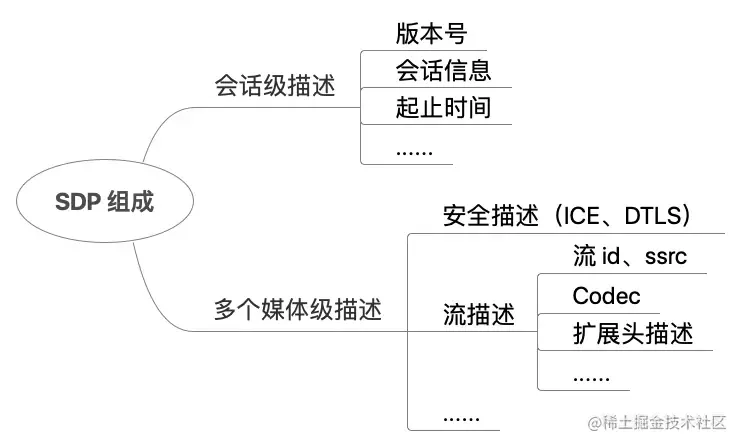
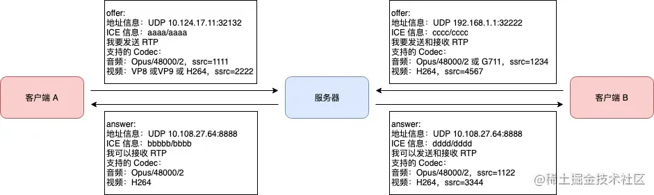

# SDP

## 目录

- [简介](#简介)
- [SDP 应用](#SDP-应用)
- [SDP 格式](#SDP-格式)
  - [SDP 整体结构](#SDP-整体结构)
  - [SDP 中字段的含义](#SDP-中字段的含义)
- [SDP 协商过程](#SDP-协商过程)
- [SDP 样例](#SDP-样例)
- [总结](#总结)
- [参考文档](#参考文档)

[   https://juejin.cn/post/6990235971228794893?searchId=202407101643051F423E2CE91EC42625D2](https://juejin.cn/post/6990235971228794893?searchId=202407101643051F423E2CE91EC42625D2 "   https://juejin.cn/post/6990235971228794893?searchId=202407101643051F423E2CE91EC42625D2")

# 简介

在网络多媒体通话场景下，会议的参与者往往是用 `SDP` 协议来传递、协商媒体详细信息、网络地址和其他元数据。`SDP` 协议的全称是 session description protocol，含义是会话描述协议，它不是一种传输协议，而是由 ITEF 组织下的 MMusic 工作组设计的**一种会话描述格式。**

# SDP 应用

`SDP` 最常用于 `RTC` 实时通话的协商过程，在 `WebRTC` 中，通信双方在连接阶段使用 `SDP` 来**协商后续传输过程中**使用的**音视频编解码器(codec)、主机候选地址、网络传输协议等。**

在实际的应用过程中，通信双方可以使用 HTTP、WebSocket、DataChannel 等传输协议来相互传送 SDP 内容，这个过程称作 offer/answer 交换，也就是发起方发送 offer，接收方收到 offer 后回复一个 answer。

例如在下图的服务端架构中，客户端将 offer 发送给信令服务器，信令服务器转发给媒体服务器，媒体服务器将 offer 和自身的能力进行比较后得到 answer，信令服务器再将 answer转发给客户端，随后客户端和媒体服务器就可以进行 RTP 通信。


# SDP 格式

SDP 协议的设计可以参考 [rfc4566](https://link.juejin.cn?target=https://datatracker.ietf.org/doc/html/rfc4566 "rfc4566") 文档。它是一种具有特殊约定格式的纯文本描述文档，也就是它的内容都是由 UTF-8 编码的文本，有点类似于 JSON/XML。一个 SDP 会话描述包括若干行 type=value 形式的文本，其中 type 是一个区分大小写的字母，例如 v、m 等，value 是一个结构化的文本，格式不固定。通常 value 由若干分割符隔开的字段组成或者是一个字符串, 整个协议文本区分大小写。"=" 两侧不允许有空格存在。

## SDP 整体结构

SDP 由一个会话级描述（session level description）和多个媒体级描述（media level description）组成。会话级描述的作用域是整个会话，在 SDP 中，从 "v=" 行开始到第一个 "m=" 行之前都是属于会话级描述的内容。媒体级描述对某个媒体流的内容进行描述，例如某个音频流或者某个视频流，从某个 "m=" 行开始到下个 "m=" 行之前是属于一个媒体级描述的内容。如下图所示：



会话级描述主要描述了 SDP 的版本号、session 信息、是否启用端口复用等。每一个媒体级描述都描述了某种媒体的信息，包括所支持的 Codec、传输的时候使用的 SSRC、支持的 RTP 扩展头等。在会话级描述和媒体级描述可能会出现相同的内容，当这种情况出现时，以媒体级描述的内容为准。

## SDP 中字段的含义

SDP 中有的字段是必须的，有的字段是可选的，可选的字段在如下的示例中都使用 `*` 进行标记。 SDP 中 type 出现的顺序是固定的，按照如下顺序进行排列，这样可以增强解析器错误检测的能力，另外也可以简化解析器的实现。

```javascript 
# 1. 会话级别的描述（及其字段）
v=  (protocol version)
o=  (originator and session identifier)
s=  (session name)
i=* (session information)
u=* (URI of description)
e=* (email address)
p=* (phone number)
c=* (connection information -- not required if included in all media)
b=* (zero or more bandwidth information lines)
# 2. 一个或多个时间描述（字段参见下文）
z=* (time zone adjustments)
k=* (encryption key)
a=* (zero or more session attribute lines)
# 3. 零个或多个媒体级别的描述（字段参见下文）

# 时间描述的字段有这些
t=  (time the session is active)
r=* (zero or more repeat times)

# 媒体级别的描述字段有这些
m=  (media name and transport address)
i=* (media title)
c=* (connection information -- optional if included at session level)
b=* (zero or more bandwidth information lines)
k=* (encryption key)
a=* (zero or more media attribute lines)

```


```javascript 
好的，这段代码是SDP协议格式的一个示例，下面是该代码的详细解释：

1. `v=` 表示会话的协议版本号。
2. `o=` 表示会话的拥有者或创建者，以及会话标识符。
3. `s=` 表示会话的名称。
4. `i=` 表示会话的附加信息。
5. `u=` 表示描述的URI（可选）。
6. `e=` 表示电子邮件地址（可选）。
7. `p=` 表示电话号码（可选）。
8. `c=` 表示连接信息，如果在所有媒体描述中都包含，则可以省略。
9. `b=` 表示零个或多个带宽信息行。

以上是会话级别描述。

时间描述的字段：
- `z=` 表示时区调整（可选）。
- `k=` 表示加密密钥（可选）。
- `a=` 表示零个或多个会话属性行。

时间描述的字段：
- `t=` 表示会话的有效时间。
- `r=` 表示零个或多个重复时间。

媒体级别的描述字段：
- `m=` 表示媒体的名称和传输地址。
- `i=` 表示媒体的标题（可选）。
- `c=` 表示连接信息，如果在会话级别已包含，则为可选。
- `b=` 表示零个或多个带宽信息行。
- `k=` 表示加密密钥（可选）。
- `a=` 表示零个或多个媒体属性行。

以上是媒体级别描述。

总结来说，SDP内容包含多媒体会话的所有信息，包括可以使用什么媒体，使用什么网络协议传输，各种媒体格式的详细信息，是否存在受保护的会话信息（加密密钥）等。
```


可以看到 `type` 都是**单个小写字母，它们是不可扩展的，**如果 `SDP`** 解析器不能解析某个 type 则必须忽略**，"a=" 是 SDP 的主要扩展手段，来针对某中特定类型的媒体或应用做扩展。

有一个很好的网站：[**webrtchacks.com/sdp-anatomy…**](https://link.juejin.cn?target=https://webrtchacks.com/sdp-anatomy/ "webrtchacks.com/sdp-anatomy…")可用于学习 SDP，这个网站里面鼠标移动到 SDP 某一行时，就会显示这一行 SDP 的具体含义。在这里简单介绍一下 SDP 协议中常用的 type 以及对应的含义。

1. v: protocol version

```javascript 
v=0

```


v 的含义是 SDP 协议的版本号，目前 v 都是 0。

1. o: originator and session identifier

```javascript 
o=<username> <session-id> <session-version> <nettype> <addrtype> <unicast-address>

```


会话所有者有关的参数，包括用户名、session 信息，地址信息等。 （Owner/creator and session identifier）。

- username: 会话发起者的名称。如果不提供则用"-"表示，用户名不能包含空格；
- session-id: 主叫方的会话标识符；
- session-version: 会话版本号，一般为 0；
- nettype: 网络类型，目前仅使用 IN 来表示 Internet 网络类型；
- addrtype: 地址类型，可以是 IPV4 和 IPV6 两种地址类型；
- unicast-address：会话发起者的 IP 地址。

1. s: session name

```javascript 
s=<session name>

```


本次会话的标题或会话的名称（Session name）。

1. t: time the session is active

```javascript 
t=<start-time> <stop-time>

```


会话的起始时间和结束时间（`Time session starts and stops`），如果没有规定这两个时间的话，都写为 0 即可。

1. m: media name

```javascript 
m=<media> <port>/<number of ports> <proto> <fmt> ...

```


媒体行，描述了发送方所支持的媒体类型等信息（Media information）。

- media：媒体类型，可以为 "audio"、"video"、"text"、"application"、"message"，表示音频类型、视频类型、文本类型、应用类型、消息类型等，以后也可能扩展其他类型；
- port/number of ports： 流传输端口号。表示在对应的本地端口上发送流；
- proto：流传输协议。举例说明：
  - RTP/SAVPF 表示用 UDP 传输 RTP 包；
  - TCP/RTP/SAVPF 表示用 TCP 传输 RTP 包；
  - UDP/TLS/RTP/SAVPF 表示用 UDP 来传输 RTP 包，并且使用 TLS 加密；
  - 最后的 SAVPF 还有其他几种值：AVP, SAVP, AVPF, SAVPF。
    - AVP 意为 AV profile
    - S 意为 secure
    - F 意为 feedback

fmt 表示媒体格式描述，它可能是一串数字，代表多个媒体，这个字段的含义与 proto 字段的类型相关。在后面，可以使用"a=rtpmap:"、"a=fmtp:"、"a=rtcp-fb" 等扩展字段来对 fmt 进行说明。

1. c: connection data

```javascript 
c=<nettype> <addrtype> <connection-address>

```


一个会话描述必须在每个媒体层都包含“c=”字段或者在会话层包含一个“c=”字段。如果这两个层都出现的话，则媒体层出现的“c=”会覆盖会话层出现的“c=”字段的值。

- nettype: 是一个文本字符串，目前只定义了“IN”，表示“Internet”，未来会定义其他值。
- addrtype: 目前只定义了 IP4 和 IP6。
- connection-address: 标志连接的地址。取决于 addrtype 字段的不同，在 connection-address 之后可能也会跟随其他的字段。

1. b: bandwidth

```javascript 
b=<bwtype>:<bandwidth>

```


这个字段的意思是本会话或者媒体所需占用的带宽。 bwtype 可以为 "CT" 或者 "AS"，给出了 bandwidth（单位 kbps）数字所代表的含义：

- CT：表示会话所占的所有的带宽的大小。当用于 RTP 会话时，表示所有的 RTP 会话所占用的带宽。
- AS：这个带宽类型是针对特定应用的。通常，这表示某应用所占用的最大带宽。当用于 RTP 会话时，表示单一 RTP 会话所占用的带宽.

可以理解为 CT 代表的是整个通话过程的带宽，AS 代表的是某个流的带宽。

1. Encryption Keys ("k=")

```javascript 
k=<method>

k=<method>:<encryption key>

```


如果在一个安全的信道上传输 SDP 消息，那么 SDP 之中也可以携带密钥，携带的方式就是采用字段 "k="。当然这种方式目前已经不推荐了。

字段 "k=" 可以是全局的，也可以是放在某个 "m=" 中的，分别代表应用于所有的媒体流，或者单独应用于某条媒体流。定义格式有如下几种：

- k=clear:

在这种方法中，密钥是没有经过任何转换的。除非传输通道是绝对安全的，否则不应当使用这种方法。

- k=base64:

在这种方法中，密钥经过 base64 的编码。除非保证传输通道绝对安全，否则不应当使用这种方法。

- k=uri:

在这种方法中，给出一个 URI。通过这个 URI，可以获得密钥，访问 URI 的过程中可能还需要认证。

- k=prompt

在这种方法中，没有给出密钥。但是加上这个字段后，当用户加入会话时会提示其输入密钥。这种方式目前也不推荐。

1. a: attributes

```javascript 
      a=<attribute>

      a=<attribute>:<value>

```


a 表示的是属性。a 字段是扩展 SDP 的主要方式，有会话层属性和媒体层属性。会话层的属性应用于所有的媒体流，媒体层的属性只应用于当前的媒体流。

属性有两种方式：

- 特性属性，a= 表示，例如："a=recvonly"
- 值属性，以a=:表示，例如"a=ice-ufrag:khLS"

常用的属性列表如下:

| 属性             | 含义                                                                                                                              | 例子                                                                                                                                                                                                                                                                                                                                                                                            |
| -------------- | ------------------------------------------------------------------------------------------------------------------------------- | --------------------------------------------------------------------------------------------------------------------------------------------------------------------------------------------------------------------------------------------------------------------------------------------------------------------------------------------------------------------------------------------- |
| a=rtpmap:      | RTP/AVP(Audio Video Profile) list                                                                                               | [m=audio 54278 RTP/SAVPF 111 103 104 0 8 106 105 13 126](https://link.juejin.cn?target=https://webrtchacks.com/wp-content/themes/parament/custom-pages/sdp/7.html "m=audio 54278 RTP/SAVPF 111 103 104 0 8 106 105 13 126")[a=rtpmap:111 opus/48000/2](https://link.juejin.cn?target=https://webrtchacks.com/wp-content/themes/parament/custom-pages/sdp/28.html "a=rtpmap:111 opus/48000/2") |
| a=fmtp:        | Format transport                                                                                                                | [a=fmtp:111 minptime=10](https://link.juejin.cn?target=https://webrtchacks.com/wp-content/themes/parament/custom-pages/sdp/29.html "a=fmtp:111 minptime=10")                                                                                                                                                                                                                                  |
| a=rtcp:        | Explicit RTCP port (and address)                                                                                                | [a=rtcp:54278 IN IP4 180.6.6.6](https://link.juejin.cn?target=https://webrtchacks.com/wp-content/themes/parament/custom-pages/sdp/9.html "a=rtcp:54278 IN IP4 180.6.6.6")                                                                                                                                                                                                                     |
| a=mid:         | Media identification grouping                                                                                                   | [a=mid:audio](https://link.juejin.cn?target=https://webrtchacks.com/wp-content/themes/parament/custom-pages/sdp/23.html "a=mid:audio")                                                                                                                                                                                                                                                        |
| a=ssrc:        | "ssrc" indicates a property (known as a"source-level attribute") of a media source (RTP stream) within an RTP session           | [a=ssrc:189858836 msid:GUKF430Khp9jEQiPrdYe0LbTAALiNAKAIfl2 ea392930-e126-4573-bea3-bfba519b4d59](https://link.juejin.cn?target=https://webrtchacks.com/wp-content/themes/parament/custom-pages/sdp/40.html "a=ssrc:189858836 msid:GUKF430Khp9jEQiPrdYe0LbTAALiNAKAIfl2 ea392930-e126-4573-bea3-bfba519b4d59")                                                                                |
| a=ssrc-group:  | Ssrc identification grouping                                                                                                    | a=ssrc-group:SIMULCAST 32040 32142  &#xA;a=ssrc:32040 imageattr:96 \[x=1280,y=720]  &#xA;a=ssrc:32142 imageattr:96 \[x=640,y=480]                                                                                                                                                                                                                                                             |
| a=ice-ufrag:   | a=ice-pwd: The "ice-ufrag" and "ice-pwd" attributes convey the username fragment and password used by ICE for message integrity | [a=ice-ufrag:kwlYyWNjhC9JBe/V](https://link.juejin.cn?target=https://webrtchacks.com/wp-content/themes/parament/custom-pages/sdp/54.html "a=ice-ufrag:kwlYyWNjhC9JBe/V")[a=ice-pwd:AU/SQPupllyS0SDG/eRWDCfA](https://link.juejin.cn?target=https://webrtchacks.com/wp-content/themes/parament/custom-pages/sdp/19.html "a=ice-pwd:AU/SQPupllyS0SDG/eRWDCfA")                                  |
| a=ice-pwd:     |                                                                                                                                 |                                                                                                                                                                                                                                                                                                                                                                                               |
| a=fingerprint: | A certificate fingerprint is a secure one-way hash of the DER (distinguished encoding rules) form of the certificate.           | [a=fingerprint:sha-256 D1:2C:BE:AD:C4:F6:64:5C:25:16:11:9C:AF:E7:0F:73:79:36:4E:9C:1E:15:54:39:0C:06:8B:ED:96:86:00:39](https://link.juejin.cn?target=https://webrtchacks.com/wp-content/themes/parament/custom-pages/sdp/21.html "a=fingerprint:sha-256 D1:2C:BE:AD:C4:F6:64:5C:25:16:11:9C:AF:E7:0F:73:79:36:4E:9C:1E:15:54:39:0C:06:8B:ED:96:86:00:39")                                    |
| a=candidate:   | It contains a transport address for a candidate that can be used for connectivity checks.                                       | [a=candidate:4022866446 1 udp 2113937151 192.168.0.197 36768 typ host generation 0](https://link.juejin.cn?target=https://webrtchacks.com/wp-content/themes/parament/custom-pages/sdp/10.html "a=candidate:4022866446 1 udp 2113937151 192.168.0.197 36768 typ host generation 0")                                                                                                            |
| a=ptime:       | Length of time in milliseconds for each packet                                                                                  | a=ptime:20                                                                                                                                                                                                                                                                                                                                                                                    |
| a=recvonly     | Receive only mode                                                                                                               | a=recvonly                                                                                                                                                                                                                                                                                                                                                                                    |
| a=sendrecv     | Send and receive mode                                                                                                           | a=sendrecv                                                                                                                                                                                                                                                                                                                                                                                    |
| a=sendonly     | Send only mode                                                                                                                  | a=sendonly                                                                                                                                                                                                                                                                                                                                                                                    |
| a=sdplang:     | Language for the session description                                                                                            |                                                                                                                                                                                                                                                                                                                                                                                               |
| a=framerate:   | Maximum video frame rate in frames per second                                                                                   | a=framerate:15                                                                                                                                                                                                                                                                                                                                                                                |
| a=inactive     | Inactive mode                                                                                                                   | a=inactive                                                                                                                                                                                                                                                                                                                                                                                    |

# SDP 协商过程

SDP 协商过程对应的 RFC 文档是 [rfc3264](https://link.juejin.cn?target=https://datatracker.ietf.org/doc/html/rfc3264 "rfc3264")。在 WebRTC 通信过程中，连接的两端通过 offer/answer 交换过程来互相进行 SDP 协商，发起方发送 offer 给接收方，其中包含了发起方的媒体能力和其他信息（包括 ICE、DTLS fingerprint，SSRC 等），接收方收到 offer 后和自己支持的能力进行比较取出交集，回复 answer 给发起方，其中包含了协商之后的媒体能力和其他信息（ICE、DTLS fingerprint，SSRC 等），要注意这个过程中**只有媒体能力是协商的，也就是发起方和接收方共同支持的媒体能力**，例如支持的编解码格式，以及是否支持 RTX、FEC、TCC 等 QoS 功能，而 ICE、DTLS、SSRC 的信息是直接给出通知对方，是连接双方各自的信息。在 offer/answer 交换完成之后，双方就可以使用这些共同支持的媒体能力进行通信。

协商的过程如下图所示：



A 向服务器发送 offer 携带自己的 SDP 信息，包括：

1. 地址信息是 UDP 10.124.17.11:32132，A 通过这个地址来和服务端进行媒体通信；
2. ICE 信息，服务器通过 ICE 信息来验证客户端 A 的身份；
3. 在接下来的媒体通信过程，客户端 A 只发不收 RTP；
4. A 音频支持 48kHz 的双声道 Opus 编解码，使用 SSRC=1111 来发送；
5. A 视频支持 VP8 或者 VP9 或者 H264 编解码，使用 SSRC=2222 来发送； 服务器在收到 A 的 offer 后，回复给 A 一个 answer，这是双方协商出来的媒体能力：
6. 地址信息是 UDP 10.108.27.64:8888，服务器通过这个地址来和 A 进行媒体通信；
7. ICE 信息，A 通过 ICE 信息来验证服务器的身份；
8. 在接下来的媒体通信过程，服务器对于 A 来说只收不发 RTP；
9. 协商出来的音频能力是 48kHz 的双声道 Opus 编解码；
10. 协商出来的视频能力是 H264 编解码。 B 向服务器发送 offer 携带自己的 SDP 信息，包括：
11. 地址信息是 UDP 192.168.1.1:32222，B 通过这个地址来和服务端进行媒体通信；
12. ICE 信息，服务器通过 ICE 信息来验证客户端 B 的身份；
13. 在接下来的媒体通信过程，客户端 A 需要收发 RTP；
14. B 音频支持 48kHz 的双声道 Opus 编解码或者 G711 编解码，使用 SSRC=1234 来进行发送；
15. B 视频支持 H264，使用 SSRC=4567 来进行发送； 服务器在收到 B 的 offer 后，回复给 B 一个 answer，这是双方协商出来的媒体能力：
16. 地址信息是 UDP 10.108.27.64:8888，服务器通过这个地址来和 B 进行媒体通信；
17. ICE 信息，B 通过 ICE 信息来验证服务器的身份；
18. 在接下来的媒体通信过程，服务器对于 B 来说可以收发 RTP；
19. 协商出来的音频能力是 Opus 编解码、48KHz，双声道，使用 SSRC=1122 进行发送；
20. 协商出来的视频能力是 H264 编解码，使用 SSRC=3344 可以发送。 从以上两个 offer/answer 交换过程中可以看出，上图中的媒体服务器音频支持 Opus 编解码，但不支持 G711 编解码；视频支持 H264 编解码，但不支持 VP8、VP9 编解码。

# SDP 样例

在介绍完 SDP 的文本结构和 SDP 的协商过程中后，这里我们举一个实际传输的 SDP 内容来帮助理解。实际工程中，客户端和服务端都会支持好几种音视频媒体编解码，并且可能支持好几种能力，例如 FEC、NACK、TCC 等等，所以实际工程中的 SDP 都会非常长。为了方便阅读，下文将直接在 SDP 中每一行上方的注释中解释其含义。这个 SDP 中包括了 audio 和 video 两种流，video 的内容有部分也在 audio 中出现过，因此不再重复解释。

```javascript 
// SDP 版本信息

v=0

// session 信息

// o=<username> <session-id> <session-version> <nettype> <addrtype> <unicast-address>

o=- 1873022542326151139 2 IN IP4 127.0.0.1

// s=<session name>

s=-

// t=<start-time> <stop-time>，如果不规定开始和结束时间，两个都填 0 即可

t=0 0

// 使用 "a=" 来扩展的 bundle 属性，其含义是 audio 和 video 使用同一个端口发送/接收，具体可以参考下方的 RFC 文档：

// https://tools.ietf.org/html/draft-ietf-mmusic-sdp-bundle-negotiation-54

a=group:BUNDLE audio video

// 列出当前SDP中所有的 media stream id，以空格分割

// WMS 的含义是这里面的 media stream id 适配 webrtc 的 media stream

// 参考 RFC 文档: https://datatracker.ietf.org/doc/html/draft-ietf-mmusic-msid-01#section-3

a=msid-semantic: WMS 34b34ced3c5623ea4213vx3

// m=<media> <port> <proto> <fmt> ...

// port=10 无实际含义，真正通信使用的端口由 ICE Candidate 指定

// proto=UDP/TLS/RTP/SAVP 表示用 UDP 来传输 RTP 包，并使用 DTLS 加密

// 后面的一串数字是 fmt，表示所有 codec 的 payloadtype

m=audio 10 UDP/TLS/RTP/SAVPF 111 114 115 116 123 124 125

// c=<nettype> <addrtype> <connection-address>

c=IN IP4 0.0.0.0

// a=rtcp:<port> [nettype addrtype connection-address]

a=rtcp:10 IN IP4 0.0.0.0

// ICE 信息，参考 RFC 文档: https://tools.ietf.org/html/rfc5245#section-15.4

a=ice-ufrag:aZ/b

a=ice-pwd:3tFwvgPAA2PK3pPWoJjVz4FJ

a=ice-options:trickle renomination

// DTLS 信息，参考 RFC 文档: https://tools.ietf.org/html/rfc4572#section-5

a=fingerprint:sha-256 5F:78:37:05:D7:83:46:05:F7:3F:17:35:2A:7E:81:D3:2D:26:71:87:8B:9F:57:02:53:30:E3:3E:B6:3E:49:D5

// a=setup:<role>

// role可选active/passive/actpass/holdconn，

// 分别表示端点将发起一个传出连接、端点将接受传入连接、

// 端点愿意接受传入连接或启动传出连接、端点暂时不想建立连接

// 参考 rfc: https://tools.ietf.org/html/rfc4145#section-4

a=setup:actpass

// a=mid:<token>

// 这个 token 在 a=group 那一行中也有出现，

// 也就是说这里描述的媒体正是需要被 bundle 的

// 参考 rfc: https://tools.ietf.org/html/rfc5888#section-6

a=mid:audio

// 以下是这个媒体支持的所有 RTP 扩展头，

// 参考rfc: https://tools.ietf.org/html/rfc8285

// a=extmap:<value>["/"<direction>] <URI> <extensionattributes>

// value=ID

// direction 可选 sendonly/recvonly/sendrecv/inactive，默认值 sendrecv

// URI 就是这个扩展头的 URI，通信双方可以通过 URI 标明扩展头的含义让双方都能理解

// 这里表示 ID=1 的扩展头是 audio level 扩展头，表示 RTP 包中会携带音频包音量大小

// 参考 https://tools.ietf.org/html/rfc6464#section-4

a=extmap:1 urn:ietf:params:rtp-hdrext:ssrc-audio-level

// rtp stream 信息，参考 rfc: https://tools.ietf.org/html/draft-ietf-avtext-rid-09

a=extmap:13 urn:ietf:params:rtp-hdrext:sdes:rtp-stream-id

// 流的方向，sendrecv 表示可以收也可以发

// 参考 rfc:https://tools.ietf.org/html/rfc3264

a=sendrecv

// 这一行表示 rtcp 和 rtp 复用一个端口，

// 参考 rfc:https://tools.ietf.org/html/rfc5761 

// 和 rfc:https://tools.ietf.org/html/rfc8035

a=rtcp-mux

// a=rtpmap:<payload type> <encoding name>/<clock rate> [/<encoding parameters>]

// opus codec 的 payload,

// 表明 fmt=111 就是用来传输 opus 数据的

// 参考 rfc: https://datatracker.ietf.org/doc/html/rfc7587

a=rtpmap:111 opus/48000/2

// a=rtcp-fb:<payload type> [...]

// 表示支持的 rtcp 反馈报文类型

// 这个反馈报文是 tcc 带宽探测用的

// 参考 https://tools.ietf.org/html/draft-holmer-rmcat-transport-wide-cc-extensions-01

a=rtcp-fb:111 transport-cc

// nack，表示 fmt=111 支持 nack 重传包

a=rtcp-fb:111 nack

// a=fmtp 用来描述 codec 的一些特性，例如这里表示期望的 opus 最小打包时间是 10ms，并且使用 inbandfec

a=fmtp:111 minptime=10;useinbandfec=1

// 指明了音频 RTX 包的 payloadtype

// 参考 rfc:https://tools.ietf.org/html/rfc4588#section-8.6

a=rtpmap:114 rtx/48000/2

// apt 表示 fmt=114 的 RTX 包是用来重传 fmt=111 音频的

a=fmtp:114 apt=111

// 指明了 rsfec 包的 payloadtype

a=rtpmap:123 rsfec/48000/2

// 指明了 red 包的 payloadtype

// 参考 https://tools.ietf.org/html/rfc2198

a=rtpmap:124 red/48000/2

// 指明了音频 RTX 包的 payloadtype

a=rtpmap:125 rtx/48000/2

// apt 表示 fmt=125 的 RTX 包是用来重传 fmt=124 的 red 包的

a=fmtp:125 apt=124

// ssrc-group 指明了一组 ssrc 之间的关系，FID 表明后一个 ssrc 是前一个 ssrc 的 rtx

// https://tools.ietf.org/html/rfc5576#section-4.2

a=ssrc-group:FID 2952055605 1713037948

// cname 的内容是一个 16 位 Base64 字符串，含义是传输级的标识符，同一个 PeerConnection 的值相同

// 参考 https://datatracker.ietf.org/doc/html/rfc8834#section-4.9

a=ssrc:2952055605 cname:vqdagKn92E0lhuXn

// 这里出现了两个字符串，

// 前一个是 media stream id，后一个是 sender track id

// media stream 主要用于音视频同步，每个 track 以 media stream id 作为 sync label 进行同步

// 参考 https://datatracker.ietf.org/doc/html/draft-ietf-mmusic-msid

a=ssrc:2952055605 msid:34b34ced3c5623ea4213vx3 34b34ced3c5623ea4213vx3a0

// media stream id

a=ssrc:2952055605 mslabel:34b34ced3c5623ea4213vx3

// sender track id

a=ssrc:2952055605 label:34b34ced3c5623ea4213vx3a0

// video media

m=video 10 UDP/TLS/RTP/SAVPF 96 97 101 102 103

c=IN IP4 0.0.0.0

a=rtcp:10 IN IP4 0.0.0.0

a=ice-ufrag:aZ/b

a=ice-pwd:3tFwvgPAA2PK3pPWoJjVz4FJ

a=ice-options:trickle renomination

a=fingerprint:sha-256 5F:78:37:05:D7:83:46:05:F7:3F:17:35:2A:7E:81:D3:2D:26:71:87:8B:9F:57:02:53:30:E3:3E:B6:3E:49:D5

a=setup:actpass

a=mid:video

// 传输时间偏移扩展头

// 参考 https://datatracker.ietf.org/doc/html/rfc5450

a=extmap:2 urn:ietf:params:rtp-hdrext:toffset

// abs-send-time 扩展头，gcc 带宽探测用的

a=extmap:3 http://www.webrtc.org/experiments/rtp-hdrext/abs-send-time

// 视频朝向扩展头

// 参考 https://datatracker.ietf.org/doc/html/rfc6184

a=extmap:4 urn:3gpp:video-orientation

// transport-cc 扩展头，tcc 带宽探测用的

a=extmap:5 http://www.ietf.org/id/draft-holmer-rmcat-transport-wide-cc-extensions-01

// 扩展头的内容是对播放延迟限制的值

a=extmap:6 http://www.webrtc.org/experiments/rtp-hdrext/playout-delay

// 视频内容类型扩展头

a=extmap:7 http://www.webrtc.org/experiments/rtp-hdrext/video-content-type

// 这个扩展头用于传输每帧的时间信息

a=extmap:8 http://www.webrtc.org/experiments/rtp-hdrext/video-timing

// 视频的色域空间扩展头

a=extmap:12 http://www.webrtc.org/experiments/rtp-hdrext/color-space

// 传输视频 SDES 信息的扩展头

// 参考：https://datatracker.ietf.org/doc/html/draft-ietf-avtext-rid-06

a=extmap:13 urn:ietf:params:rtp-hdrext:sdes:rtp-stream-id

a=sendrecv

a=rtcp-mux

// 支持 rtcp 压缩

// 参考 https://datatracker.ietf.org/doc/html/rfc5506#section-1

a=rtcp-rsize

// 指明 fmt=96 就是用来传输 H264 编码的视频的

a=rtpmap:96 H264/90000

// remb 反馈报文，gcc 带宽探测用的

a=rtcp-fb:96 goog-remb

a=rtcp-fb:96 transport-cc

// FIR（完整帧内请求）反馈报文

// 参考 https://datatracker.ietf.org/doc/html/rfc5104

a=rtcp-fb:96 ccm fir

a=rtcp-fb:96 nack

// PLI NACK 反馈报文

// 参考 https://datatracker.ietf.org/doc/html/rfc5104

a=rtcp-fb:96 nack pli

// 后面的是一些 H264 的参数

a=fmtp:96 level-asymmetry-allowed=1;packetization-mode=1;profile-level-id=42e01f

a=rtpmap:97 rtx/90000

a=fmtp:97 apt=96;packetization-mode=1

a=rtpmap:101 red/90000

a=fmtp:101 packetization-mode=1

a=rtpmap:102 rtx/90000

a=fmtp:102 apt=101;packetization-mode=1

a=rtpmap:103 rsfec/90000

a=fmtp:103 packetization-mode=1

// ssrc-group:SIM 表示后面的这些 ssrc 是同一个流的 simulcast

a=ssrc-group:SIM 2955842370 1032318052

a=ssrc-group:FID 2955842370 521905126

a=ssrc-group:FID 1032318052 1492521545

a=ssrc:2955842370 cname:vqdagKn92E0lhuXn

a=ssrc:2955842370 msid:34b34ced3c5623ea4213vx3 34b34ced3c5623ea4213vx3v0

a=ssrc:2955842370 mslabel:34b34ced3c5623ea4213vx3

a=ssrc:2955842370 label:34b34ced3c5623ea4213vx3v0

a=ssrc:1032318052 cname:vqdagKn92E0lhuXn

a=ssrc:1032318052 msid:34b34ced3c5623ea4213vx3 34b34ced3c5623ea4213vx3

a=ssrc:1032318052 mslabel:34b34ced3c5623ea4213vx3

a=ssrc:1032318052 label:34b34ced3c5623ea4213vx3v0

a=ssrc:521905126 cname:vqdagKn92E0lhuXn

a=ssrc:521905126 msid:34b34ced3c5623ea4213vx3 34b34ced3c5623ea4213vx3v0

a=ssrc:521905126 mslabel:34b34ced3c5623ea4213vx3

a=ssrc:521905126 label:34b34ced3c5623ea4213vx3v0

a=ssrc:1492521545 cname:vqdagKn92E0lhuXn

a=ssrc:1492521545 msid:34b34ced3c5623ea4213vx3 34b34ced3c5623ea4213vx3v0

a=ssrc:1492521545 mslabel:34b34ced3c5623ea4213vx3

a=ssrc:1492521545 label:34b34ced3c5623ea4213vx3v0

// 使用的 rsfec 的版本

a=rsfec-version:1

```


# 总结

SDP 协议是 WebRTC 通信的重要组成部分，它使得不同版本的 WebRTC 服务端、客户端之间能够兼容。可以从文中列出的实际的 SDP 样例中发现 SDP 还是很复杂的，而且涉及到了各种音视频传输中的概念，弄懂 SDP 对深入学习 WebRTC 很有帮助。

***

# 参考文档

1. SDP 格式规定，RFC4566：[datatracker.ietf.org/doc/html/rf…](https://link.juejin.cn?target=https://datatracker.ietf.org/doc/html/rfc4566 "datatracker.ietf.org/doc/html/rf…")
2. offer/answer 交换过程，RFC3264：[datatracker.ietf.org/doc/html/rf…](https://link.juejin.cn?target=https://datatracker.ietf.org/doc/html/rfc3264 "datatracker.ietf.org/doc/html/rf…")
3. SDP 各字段解释示例：[webrtchacks.com/sdp-anatomy…](https://link.juejin.cn?target=https://webrtchacks.com/sdp-anatomy/ "webrtchacks.com/sdp-anatomy…")
4. [segmentfault.com/a/119000003…](https://link.juejin.cn?target=https://segmentfault.com/a/1190000038272539 "segmentfault.com/a/119000003…")

一个会话描述必须在每个媒体层都包含“c=”字段或者在会话层包含一个“c=”字段。如果这两个层都出现的话，则媒体层出现的“c=”会覆盖会话层出现的“c=”字段的值。

nettype: 是一个文本字符串，目前只定义了“IN”，表示“Internet”，未来会定义其他值。

addrtype: 目前只定义了 IP4 和 IP6。

connection-address: 标志连接的地址。取决于 addrtype 字段的不同，在 connection-address 之后可能也会跟随其他的字段。

作者：MrCoderOrange
链接：[https://juejin.cn/post/6990235971228794893](https://juejin.cn/post/6990235971228794893 "https://juejin.cn/post/6990235971228794893")
来源：稀土掘金
著作权归作者所有。商业转载请联系作者获得授权，非商业转载请注明出处。
