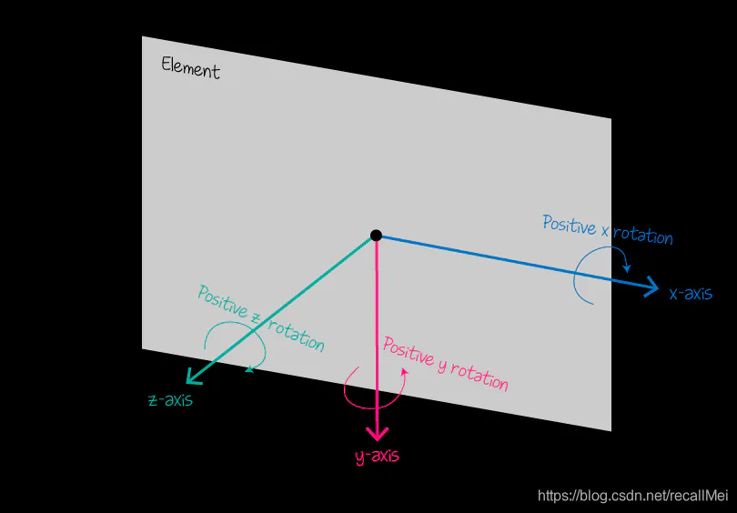

# 语法

## 目录

- [transform-origin](#transform-origin)
- [transform-style](#transform-style)
- [transform-box](#transform-box)
- [perspective](#perspective)
- [perspective-origin ](#perspective-origin-)
- [backface-visibility ](#backface-visibility-)



# transform-origin

transform-origin 设置一个元素变形的原点

```markdown 
/* 更改一个元素变形的基点 */
  - 属性可以使用一个，两个或三个值来指定，其中每个值都表示一个偏移量。 
    没有明确定义的偏移将重置为其对应的初始值。
   - 如果定义了两个或更多值并且没有值的关键字，或者唯一使用的关键字是center，
    则第一个值表示水平偏移量，第二个值表示垂直偏移量。
          一个值：
          必须是<length>，<percentage>，或 left, center, right, top, bottom关键字中的一个。
        两个值：
          其中一个必须是<length>，<percentage>，或left, center, right关键字中的一个。
          另一个必须是<length>，<percentage>，或top, center, bottom关键字中的一个。
        三个值：
          前两个值和只有两个值时的用法相同。
          第三个值必须是<length>。它始终代表Z轴偏移量。
```


```css 
transform-orgion: center/left/right  center/top/bottom ;
transform-origin: center; // 默认
transform-origin: top left;
transform-origin: 50px 50px;
transform-origin: bottom right 60px; // 60 -》 z

```


# transform-style

设置元素的子元素是位于 3D 空间中还是平面中。

```css 
transform-style: flat;
transform-style: preserve-3d;
```


# transform-box

```css 
transform-box: border-box; // 使用边框作为参考框。表的参考框是包裹着该表的边框，而不是其表框。
transform-box: fill-box; // 使用对象边界框作为参考框。
transform-box: view-box; // 使用最近的SVG视口作为参考框
transform-box: content-box;
transform-box: stroke-box;

```


# perspective

perspective 指定了**观察者与 z=0 平面的距离**，使具有三维位置变换的元素产生透视效果。\*\* z>0 的三维元素比正常大，而 z<0 时则比正常小\*\*，大小程度由该属性的值决定。

```css 
perspective: 800px;

```


# perspective-origin&#x20;

perspective-origin 指定**了观察者的位置，** 用作 perspective 属性的消失点。

```css 
perspective-origin: top left;
perspective-origin: 50% 50%;

```


# backface-visibility&#x20;

backface-visibility 指定当元素背面朝向观察者时是否可见

```css 
backface-visibility: visible;
backface-visibility: hidden;

```


[rotate](./rotate/index.md "rotate")

[translate](./translate/index.md "translate")

[skew](./skew/index.md "skew")

[scale](./scale/index.md "scale")
