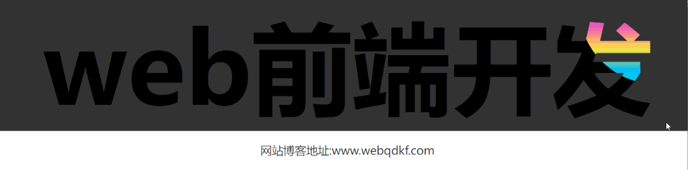

# 彩虹文字



```html 
<!doctype html>
<html lang="en">
<head>
    <meta charset="UTF-8">
    <meta name="viewport"
          content="width=device-width, user-scalable=no, initial-scale=1.0, maximum-scale=1.0, minimum-scale=1.0">
    <meta http-equiv="X-UA-Compatible" content="ie=edge">
    <title>Document</title>
    <style>
        h1{
            font-family:sans-serif;
            text-transform: lowercase;
            font-size: 12rem;
            text-align: center;
            display: flex;
            align-items: center;
            justify-content: center;
            margin: 0;
            position: relative;
            background: #333;
            color: #000;
        }

        h1:before{
            content: attr(data-text);
            position: absolute;
            background: linear-gradient( #9b5de5, #f15bb5, #fee440,#00bbf9, #00f5d4,#9b5de5);
            -webkit-background-clip: text;
            color: transparent;
            background-size: 100% 90%;
            line-height: 1.2;
            clip-path: ellipse(150px 150px at -2.54% -9.25%);
            animation: swing 3s infinite;
            animation-direction: alternate;
        }
        @keyframes swing{
            0%{
                -webkit-clip-path: ellipse(150px 150px at -2.54% -9.25%);
                clip-path: ellipse(150px 150px at -2.54% -9.25%)
            }
            50%{
                -webkit-clip-path: ellipse(150px 150px at 49.66% 64.36%);
                clip-path: ellipse(150px 150px at 49.66% 64.36%);

            }
            100%{
                -webkit-clip-path: ellipse(150px 150px at 102.62% -1.61%;);
                clip-path: ellipse(150px 150px at 102.62% -1.61%);
            }
        }
        p{
            color:#222;
            text-align:center;
            font-size:22px;

        }
    </style>
</head>
<body>
   <h1 data-text= "web前端开发">web前端开发</h1>
</body>
</html>
```
