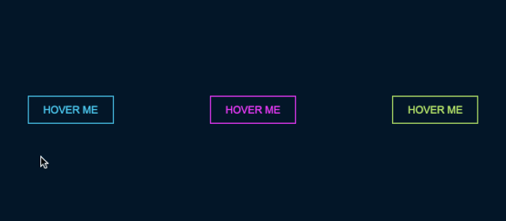
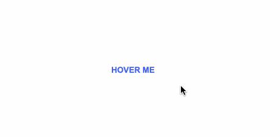
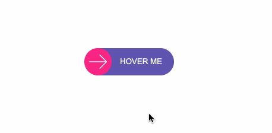
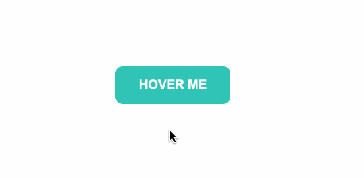
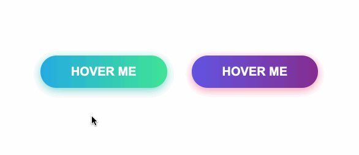
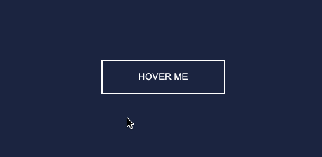
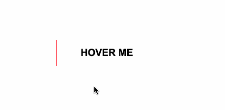

# 按钮特效

## 目录

- [霓虹效果hover ](#霓虹效果hover-)
- [边框效果](#边框效果)
- [圆形效果](#圆形效果)
- [圆角效果](#圆角效果)
- [冰冻效果](#冰冻效果)
- [闪亮效果](#闪亮效果)
- [加载效果](#加载效果)

## **霓虹效果hover**

```css 

<!doctype html>
<html lang="en">
<head>
    <meta charset="UTF-8">
    <meta name="viewport"
          content="width=device-width, user-scalable=no, initial-scale=1.0, maximum-scale=1.0, minimum-scale=1.0">
    <meta http-equiv="X-UA-Compatible" content="ie=edge">
    <title>Document</title>
    <style>
        #neon-btn {
            display: flex;
            align-items: center;
            justify-content: space-around;
            height: 100vh;
            background: #031628;
        }
        .btn {
            border: 1px solid;
            background-color: transparent;
            text-transform: uppercase;
            font-size: 14px;
            padding: 10px 20px;
            font-weight: 300;
        }
        .one {
            color: #4cc9f0;
        }
        .two {
            color: #f038ff;
        }
        .three {
            color: #b9e769;
        }
        .btn:hover {
            color: white;
            border: 0;
        }
        .one:hover {
            background-color: #4cc9f0;
            -webkit-box-shadow: 10px 10px 99px 6px rgba(76,201,240,1);
            -moz-box-shadow: 10px 10px 99px 6px rgba(76,201,240,1);
            box-shadow: 10px 10px 99px 6px rgba(76,201,240,1);
        }
        .two:hover {
            background-color: #f038ff;
            -webkit-box-shadow: 10px 10px 99px 6px rgba(240, 56, 255, 1);
            -moz-box-shadow: 10px 10px 99px 6px rgba(240, 56, 255, 1);
            box-shadow: 10px 10px 99px 6px rgba(240, 56, 255, 1);
        }
        .three:hover {
            background-color: #b9e769;
            -webkit-box-shadow: 10px 10px 99px 6px rgba(185, 231, 105, 1);
            -moz-box-shadow: 10px 10px 99px 6px rgba(185, 231, 105, 1);
            box-shadow: 10px 10px 99px 6px rgba(185, 231, 105, 1);
        }

    </style>
</head>
<body>
<div id="neon-btn">
    <button class="btn one">Hover me</button>
    <button  class="btn two">Hover me</button>
    <button  class="btn three">Hover me</button>
</div>
</body>
<script>

</script>
</html>


```




# **边框效果**

很巧妙的构思：利用border，position，transition，延时

```css 
<!doctype html>
<html lang="en">
<head>
    <meta charset="UTF-8">
    <meta name="viewport"
          content="width=device-width, user-scalable=no, initial-scale=1.0, maximum-scale=1.0, minimum-scale=1.0">
    <meta http-equiv="X-UA-Compatible" content="ie=edge">
    <title>Document</title>
    <style>
        #draw-border {
            display: flex;
            align-items: center;
            justify-content: center;
            height: 100vh;
        }
        button {
            border: 0;
            background: none;
            text-transform: uppercase;
            color: #4361ee;
            font-weight: bold;
            position: relative;
            outline: none;
            padding: 10px 20px;
            box-sizing: border-box;
        }
        button::before, button::after {
            box-sizing: inherit;
            position: absolute;
            content: '';
            border: 2px solid transparent;
            width: 0;
            height: 0;
        }
        button::after {
            bottom: 0;
            right: 0;
        }
        button::before {
            top: 0;
            left: 0;
        }
        button:hover::before,
        button:hover::after {
            width: 100%;
            height: 100%;
        }
        button:hover::before {
            border-top-color: #4361ee;
            border-right-color: #4361ee;
            transition: width 0.3s ease-out, height 0.3s ease-out 0.3s;
        }
        button:hover::after {
            border-bottom-color: #4361ee;
            border-left-color: #4361ee;
            transition: border-color 0s ease-out 0.6s, width 0.3s ease-out 0.6s, height 0.3s ease-out 1s;
        }


    </style>
</head>
<body>
<div id="draw-border">

<button>Hoverme</button>

</div>

</body>
<script>

</script>
</html>

```




# **圆形效果**

```css 
 <!doctype html>
<html lang="en">
<head>
    <meta charset="UTF-8">
    <meta name="viewport"
          content="width=device-width, user-scalable=no, initial-scale=1.0, maximum-scale=1.0, minimum-scale=1.0">
    <meta http-equiv="X-UA-Compatible" content="ie=edge">
    <title>Document</title>
    <style>
        #circle-btn {
            display: flex;
            align-items: center;
            justify-content: center;
            height: 100vh;
        }
        .btn-container {
            position: relative;
        }
        button {
            border: 0;
            border-radius: 50px;
            color: white;
            background: #5f55af;
            padding: 15px 20px 16px 60px;
            text-transform: uppercase;
            background: linear-gradient(to right, #f72585 50%, #5f55af 50%);
            background-size: 200% 100%;
            background-position: right bottom;
            transition: all 2s ease;
        }
        .svg {
            background: #f72585;
            padding: 8px;
            border-radius: 50%;
            position: absolute;
            left: 0;
            top: 0%;
        }
        button:hover {
            background-position: left bottom;
        }
    </style>
</head>
<body>
<div id="circle-btn">
    <div class="btn-container">
        <span class="svg">&#8603</span><button>Hoverme</button>
    </div>
</div>

</body>
<script>

</script>
</html>


```




# 圆角效果

```typescript 
<!doctype html>
<html lang="en">
<head>
    <meta charset="UTF-8">
    <meta name="viewport"
          content="width=device-width, user-scalable=no, initial-scale=1.0, maximum-scale=1.0, minimum-scale=1.0">
    <meta http-equiv="X-UA-Compatible" content="ie=edge">
    <title>Document</title>
    <style>
        #border-btn {
             display: flex;
             align-items: center;
             justify-content: center;
             height: 100vh;
        }
        button {
             border: 0;
             border-radius: 10px;
             background: #2ec4b6;
             text-transform: uppercase;
             color: white;
             font-size: 16px;
             font-weight: bold;
             padding: 15px 30px;
             outline: none;
             position: relative;
             transition: border-radius 3s;
             -webkit-transition: border-radius 3s;
        }
        button:hover {
             border-bottom-right-radius: 50px;
             border-top-left-radius: 50px;
             border-bottom-left-radius: 10px;
             border-top-right-radius: 10px;
        }
    </style>
</head>
<body>

<div id="border-btn">

    <button>Hover me</button>

</div>

</body>
<script>

</script>
</html>

```




# **冰冻效果**

```typescript 
<!doctype html>
<html lang="en">
<head>
    <meta charset="UTF-8">
    <meta name="viewport"
          content="width=device-width, user-scalable=no, initial-scale=1.0, maximum-scale=1.0, minimum-scale=1.0">
    <meta http-equiv="X-UA-Compatible" content="ie=edge">
    <title>Document</title>
    <style>
        #frozen-btn {
            display: flex;
            align-items: center;
            justify-content: center;
            height: 100vh;
        }

        button {
            border: 0;
            margin: 20px;
            text-transform: uppercase;
            font-size: 20px;
            font-weight: bold;
            padding: 15px 50px;
            border-radius: 50px;
            color: white;
            outline: none;
            position: relative;
        }

        button:before {
            content: '';
            display: block;
            background: linear-gradient(to left, rgba(255, 255, 255, 0) 50%, rgba(255, 255, 255, 0.4) 50%);
            background-size: 210% 100%;
            background-position: right bottom;
            height: 100%;
            width: 100%;
            position: absolute;
            top: 0;
            bottom: 0;
            right: 0;
            left: 0;
            border-radius: 50px;
            transition: all 1s;
            -webkit-transition: all 1s;
        }

        .green {
            background-image: linear-gradient(to right, #25aae1, #40e495);
            box-shadow: 0 4px 15px 0 rgba(49, 196, 190, 0.75);
        }

        .purple {
            background-image: linear-gradient(to right, #6253e1, #852D91);
            box-shadow: 0 4px 15px 0 rgba(236, 116, 149, 0.75);
        }

        .purple:hover:before {
            background-position: left bottom;
        }

        .green:hover:before {
            background-position: left bottom;
        }
    </style>
</head>
<body>

<div id="frozen-btn">
    <button class="green">Hover me</button>
    <button class="purple">Hover me</button>
</div>


</body>
<script>

</script>
</html>

```




# **闪亮效果**

```typescript 
<!doctype html>
<html lang="en">
<head>
    <meta charset="UTF-8">
    <meta name="viewport"
          content="width=device-width, user-scalable=no, initial-scale=1.0, maximum-scale=1.0, minimum-scale=1.0">
    <meta http-equiv="X-UA-Compatible" content="ie=edge">
    <title>Document</title>
    <style>
        #shiny-shadow {
            display: flex;
            align-items: center;
            justify-content: center;
            height: 100vh;
            background: #1c2541;
        }
        button {
            border: 2px solid white;
            background: transparent;
            text-transform: uppercase;
            color: white;
            padding: 15px 50px;
            outline: none;
            overflow: hidden;
            position: relative;
        }
        span {
            z-index: 20;
        }
        button:after {
            content: '';
            display: block;
            position: absolute;
            top: -36px;
            left: -100px;
            background: white;
            width: 50px;
            height: 125px;
            opacity: 20%;
            transform: rotate(-45deg);
        }

        button:hover:after {
            left: 120%;
            transition: all 600ms cubic-bezier(0.3, 1, 0.2, 1);
            -webkit-transition: all 600ms cubic-bezier(0.3, 1, 0.2, 1);
        }
    </style>
</head>
<body>

<div id="shiny-shadow">

    <button><span>Hover me</span></button>

</div>
</body>
<script>

</script>
</html>

```




# **加载效果**

```typescript 
<!doctype html>
<html lang="en">
<head>
    <meta charset="UTF-8">
    <meta name="viewport"
          content="width=device-width, user-scalable=no, initial-scale=1.0, maximum-scale=1.0, minimum-scale=1.0">
    <meta http-equiv="X-UA-Compatible" content="ie=edge">
    <title>Document</title>
    <style>
        #loading-btn {
             display: flex;
             align-items: center;
             justify-content: center;
             height: 100vh;
        }
        button {
             background: transparent;
             border: 0;
             border-radius: 0;
             text-transform: uppercase;
             font-weight: bold;
             font-size: 20px;
             padding: 15px 50px;
             position: relative;
        }
        button:before {
             transition: all 0.8s cubic-bezier(0.7, -0.5, 0.2, 2);
             content: '';
             width: 0;
             height: 100%;
             background: #ff5964;
             position: absolute;
             top: 0;
             left: 0;
        }
        button span {
             mix-blend-mode: darken;
        }
        button:hover:before {
             background: #ff5964;
             width: 100%;
        }
    </style>
</head>
<body>

<div id="loading-btn">

     <button><span>Hover me</span></button>

</div>
</body>
<script>

</script>
</html>
```



