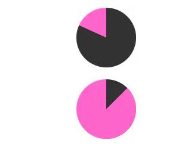
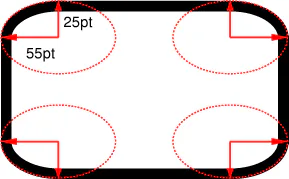

# 饼图动画border-radius

## 目录

- [纯css3实现饼图进度动画](#纯css3实现饼图进度动画)
- [少见的高级用法](#少见的高级用法)

[ CSS圆角（border-radius）完全解析 CSS使用border-radius属性来实现圆角效果。CSS圆角效果在网页制作过程中会经常使用，它会让网页变得更加美观和优雅。圆角效果是CSS3新增的功能，某些老式浏览器可能不支持。 http://c.biancheng.net/css3/border-radius.html](http://c.biancheng.net/css3/border-radius.html " CSS圆角（border-radius）完全解析 CSS使用border-radius属性来实现圆角效果。CSS圆角效果在网页制作过程中会经常使用，它会让网页变得更加美观和优雅。圆角效果是CSS3新增的功能，某些老式浏览器可能不支持。 http://c.biancheng.net/css3/border-radius.html")

# 纯css3实现饼图进度动画



```typescript 
<!doctype html>
<html lang="en">
<head>
    <meta charset="UTF-8">
    <meta content="width=device-width, user-scalable=no, initial-scale=1.0, maximum-scale=1.0, minimum-scale=1.0"
          name="viewport">
    <meta content="ie=edge" http-equiv="X-UA-Compatible">
    <title>Document</title>
    <style>
        .br-31 {
            width: 100px;
            height: 100px;
            border-radius: 50%;
            background: linear-gradient(to right, #f6c 50%, #333 0);
        }
        .br-31::before {
            content: '';
            display: block;
            margin-left: 50%;
            height: 100%;
            border-radius: 0 100% 100% 0 / 50%;
            background-color: #f6c;
            transform-origin: left;
            animation: skin 4s linear infinite, bg 8s step-end infinite;
        }
        @keyframes skin {
            to {
                transform: rotate(.5turn);
            }
        }
        @keyframes bg {
            50% {
                background: #333;
            }
        }
        .br-32::before {
            animation-play-state: paused;
            animation-delay: inherit;
        }

    </style>
    </style>
</head>
<body>
<div class="br-31 black-theme"></div>

<div class="br-31 br-32 black-theme" style="animation-delay:-1s"></div>
</body>
<script>

</script>
</html>

```


# 少见的高级用法

```typescript 
border-*-radius：[ <length> | <percentage> ]{1,2}
```


语法的含义为，需要为 border- \*-radius 属性提供 1\~2 个参数，参数之间使用空格进行分隔。其中第一个参数表示圆角水平方向的半径或半轴，第二个参数表示圆角垂直方向的半径或半轴，如果省略第二个参数，那么该参数将直接沿用第一个参数的值。



```typescript 
border-radius：[ <length> | <percentage> ]{1,4} [ / [ <length> | <percentage> ]{1,4} ]?
```


语法说明如下： &#x20;

- border-radius 属性可以接收两组参数，参数之间使用斜杠`/`进行分隔，每组参数都允许设置 1\~4 个参数值，其中第一组参数代表圆角水平方向上的半径或半轴，第二组参数代表圆角垂直方向上的半径或半轴，如果省略第二组参数的值，那么该组参数将直接沿用第一组参数的值。
- 第一组参数中，如果提供全部的四个参数，那么将按照上左 top-left、上右 top-right、下右 bottom-right、下左 bottom-left 的顺序作用于元素的四个角；如果提供三个参数，那么第一个参数将作用于元素的左上角 top-left，第二个参数将作用于元素的右上角 top-right 和左下角 bottom-left，第三个参数将作用于元素的右下角 bottom-right；如果提供两个参数，那么第一个参数将作用于元素的左上角 top-left 和右下角 bottom-right，第二个参数将作用于元素的右上角 top-right 和左下角 bottom-left；如果只提供一个参数，那么该参数将同时作用于元素的四个角。
- 第二组参数同样遵循第一组参数的规律，只是作用的方向不同。
