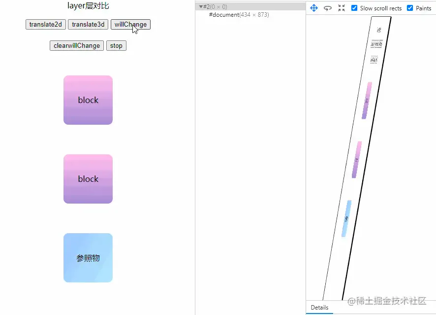
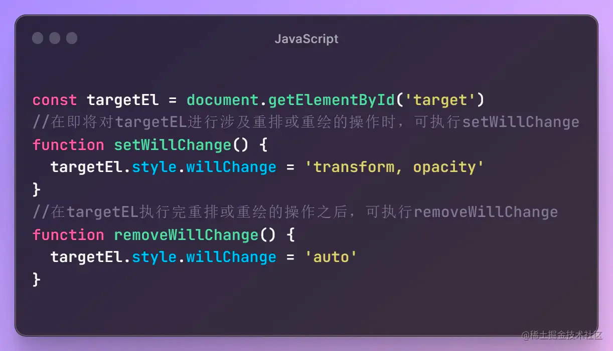
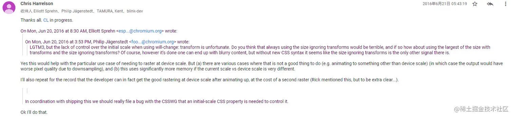

# will-change

## 目录

- [一、什么是will-change？](#一什么是will-change)
- [二、will-change的使用方法](#二will-change的使用方法)
- [三、will-change的原理](#三will-change的原理)
  - [1. 渲染流程简介](#1-渲染流程简介)
  - [2. will-change的作用](#2-will-change的作用)
  - [3. will-change的优化效果](#3-will-change的优化效果)
  - [4. will-change使用的时机](#4-will-change使用的时机)
- [四、iphone上使用will-change会导致图片模糊、文字模糊问题](#四iphone上使用will-change会导致图片模糊文字模糊问题)
- [五、什么操作会将元素提升到复合层](#五什么操作会将元素提升到复合层)
- [六、结论](#六结论)

will-change 一个既陌生又熟悉的属性，以前在使用这个属性的时候，**单纯是因为要做性能优化，加上will-change会使得动画变得流畅一些**，但是实际上到底是什么原因导致加上will-change就能使得动画流畅，它有什么弊端？

> 现代网页设计中，性能优化成为了一个重要的议题。一种关键的优化工具是CSS属性`will-change`，它可以告诉浏览器元素将要发生的变化，从而提前分配资源并优化渲染。本文将深入探讨`will-change`的使用和原理，以帮助开发者充分发挥其潜力，提升网页性能。

## 一、什么是`will-change`？

`will-change`是一个CSS属性，它可以告诉浏览器某个元素将要发生的变化。通过明确指定这些变化，浏览器可以事先分配和优化相应的资源，从而提升渲染的性能。

## 二、`will-change`的使用方法

要使用`will-change`，只需将它应用于你要进行性能优化的元素上。

```javascript 
.element {
  will-change: transform;
}

```


在上述示例中，我们告诉浏览器，该元素即将发生变换（`transform`），以便浏览器在渲染时提前分配所需的资源。

值得注意的是，因为`will-change`是**为了性能优化而设计的，滥用它可能会带来负面影响**。只在需要优化的元素上使用`will-change`，避免对所有元素都进行指定。

## 三、`will-change`的原理

要理解`will-change`的原理，我们需要了解浏览器渲染流程的基本概念。

### 1. 渲染流程简介

浏览器在渲染网页时，会经历一系列的步骤，如样式**计算、布局、绘制和合成**。为了提高性能，浏览器会尽量避免进行不必要的计算和操作。

### 2. `will-change`的作用

`will-change`的作用就是告诉浏览器某个元素**将要发生的变化**，从而使浏览器在渲染过程中提前分配和优化相应的资源。

例如，当我们设置了`will-change: transform`时，浏览器会为该元素创建一个独立的图层，将这个图层标记为“即将变换”。这样，在进行布局和绘制时，浏览器就可以更高效地处理这个元素，而无需重新计算整个渲染树。

加入will-change后，通过观察复合层，如图下



加入will-change后，元素会被提升到**单独的复合层**，动画（重绘、重排）的操作只会在单独复合层上进行，减少了原来的页面层重绘和重排的行为 注：每一个**元素单独加入will-change都会单独创建一个复合层**，如果给大量的元素加上will-change就会创建大量的复合层，反而会影响性能

### 3. `will-change`的优化效果

使用`will-change`可以带来以下优化效果：

- 减少渲染阻塞：浏览器可以**提前分配和优化资源，减少渲染阻塞时间**，提高页面的响应速度。
- 减少重绘和重排：浏览器可以更好地管理渲染过程，**避免不必要的重绘和重排**，从而提高渲染性能。
- 硬件加速：某些浏览器对`will-change`属性会**进行硬件加速，进一步提升性能。**

### 4. `will-change`使用的时机

在很多关于will-change的描述，都能够看到类似下面的一段话

在**实际更改的元素上将 will-change 设置为您将实际更改的属性**。 并**在他们停止时将其删除**。&#x20;

至于为什么？大部分的描述都是因为will-change\*\*会消耗浏览器GPU资源 &#x20;
\*\*当元素有 will-change 时，将元素提升到它们自己的“GPU 层”的浏览器。但有太多元素声明时，浏览器将忽略声明，以避免耗尽 GPU 内存

所以对于will-change的使用应该控制时机



```javascript 
const targetEl = document.getElementById('target')
//在即将对targetEL进行涉及重排或重绘的操作时，可执行setwiuichange
function setwiiichange(){
  targetEl.style.wiiichange ='transform,opacity
}
//在targetEL执行完重排或重绘的操作之后，可执行removewiichange
function removeWiiiChange(){
  targetEl.style.wiiichange ='auto'
}
```


在适当的时机移除will-change就是减少浏览器的复合层，避免过度使用will-change带来性能问题

## 四、iphone上使用will-change会导致图片模糊、文字模糊问题

在iphone上可以看到如果给元素加上will-change，可能出现模糊现象，分析一下问题

- 加入will-change，元素会提升到复合层，提升到复合层后，浏览器做了什么事？
- 安卓不会而iphone会，iphone上使用的是safari浏览器

解：

1. will-change加入后，元素提升到复合层，浏览器其实会进行 **光栅化** &#x20;

   关于光栅化的内容可以查看这篇文章 [zhuanlan.zhihu.com/p/450540827](https://link.juejin.cn?target=https://zhuanlan.zhihu.com/p/450540827 "zhuanlan.zhihu.com/p/450540827")
2. 至于为什么safari浏览器在元素提升到复合层后，进行光栅化会导致模糊问题，在我们翻阅了各家浏览器内核论坛后，找到一些资料 [groups.google.com/a/chromium.…](https://link.juejin.cn?target=https://groups.google.com/a/chromium.org/g/blink-dev/c/Ufwrhx_iZ7U "groups.google.com/a/chromium.…") （需要科学上网，才能查看）



大概的内容就是： &#x20;
在2016年之前，不止safari，谷歌浏览器也是存在模糊的问题，原因是提升复合层后，光栅化的时候，设备比例的变化，导致绘制 图像 的过程变模糊，谷歌是在2016年解决的这个问题，所以现在看来我们会在iphone上发现模糊问题，在安卓机上并不会 &#x20;
iphone上模糊的问题，可以通过在执行完重排重绘后在适当的时机移除will-change（让元素回到原来的页面层，不在单独一个复合层）就可以解决

## 五、什么操作会将元素提升到复合层

在CSS中，以下属性可以将元素提升到复合层:

- will-change 属性：通过使用 will-change 属性，告诉浏览器该元素即将发生某种变化，浏览器可以提前将其提升到复合层以进行优化
- transform 属性：当使用 3D 或 2D 变换时，浏览器会自动将 transform 属性应用的元素提升到复合层。常见的变换函数如 translate(), rotate(), scale() 等。
- backface-visibility 属性：当使用 backface-visibility: hidden 来隐藏元素的背面时，浏览器会将该元素提升到复合层。

需要注意的是，将元素提升到复合层也会增加内存的占用和渲染的复杂性，因此不应滥用。只有当元素需要频繁改变或有复杂的动画效果时，才建议将其提升到复合层。

## 六、结论

`will-change`是一种强大的性能优化工具，在现代网页设计中发挥着重要作用。通过明确指定元素将要发生的变化，浏览器可以提前分配和优化相应的 .

使用上也有需要注意的点：**1. 不要给大量的元素添加will-change，这会导致创建大量的复合层**

**2. 注意使用的时机，在需要进行重绘/重排行为的时候，才考虑加上will-change，使用完后需要再适当的时机移除，释放浏览器资源**

**3. 是否真的需要will-change，如果页面在性能方面没什么问题，没有必要放个will-change来换取那微乎其微的收益，如果收益客观，可加，如果加与不加，差别不大，没必要**
