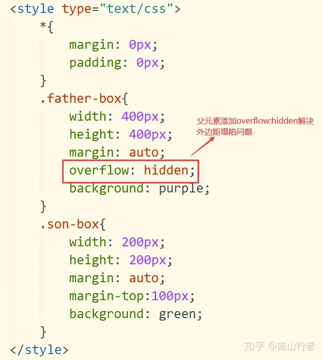
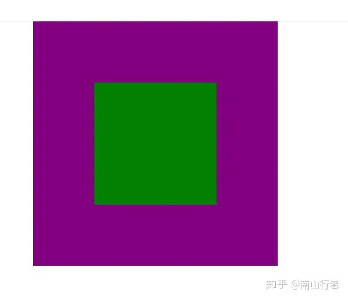

# 外边距塌陷

## 目录

- [外边距塌陷](#外边距塌陷)
  - [1、给父元素设置外边框（border）或者内边距（padding）(不建议)](#1给父元素设置外边框border或者内边距padding不建议)
  - [2、触发BFC（推荐）](#2触发BFC推荐)

## 外边距塌陷

两个嵌套关系的（父子关系）块元素，当父元素有上外边距或者没有上外边距（margin-top），子元素也有上外边距的时候。两个上外边距会合成一个上外边距，以值相对较大的上外边距值为准。如下图：

这种现象就是外边距的塌陷问题。这个时候你就会发现你给父元素设置的margin-top：50px是没有效果的。或者在你需要调整子元素的上边距相对于父元素产生一定的距离的时候也是没有效果的。这种外边距塌陷的问题可以说是css中的一个bug。因为这种现象我们通常是需要避免的，也是我们不需要的，因为在页面布局中，使用margin-top通常是希望子元素的顶部相对于父元素的顶部产生一定的距离。比如在使用margin调整子元素相对于父元素居中的时候。那么又应该如何去解决这个问题呢？

#### **1、给父元素设置外边框（border）或者内边距（padding）(不建议)**

这种方案虽然可以解决外边距塌陷的问题，但是border和padding毕竟会撑大盒子，处理不好也会出问题，所以推荐使用这种方式。

#### **2、触发BFC（推荐）**

`BFC：Block Formatting Context`，**块级格式化上下文**，`BFC`决定了元素对其内容定位，以及当前元素与其他元素之间的关系和相互作用。其目的就是形成一个独立的空间，让空间中的子元素不会影响到这个独立空间之外的布局。这样我们在写页面的时候就可以根据自己的需求，选择一些比较合适的解决方案，主要解决方案如下：

1. 子元素或者父元素的**float**不为**none**
2. 子元素或者父元素的**position**不为**relative**或**static**
3. 父元素的**overflow**为**auto**或**scroll**或**hidden**
4. 父元素的**display**的值为**table-cell**或**inline-block**

