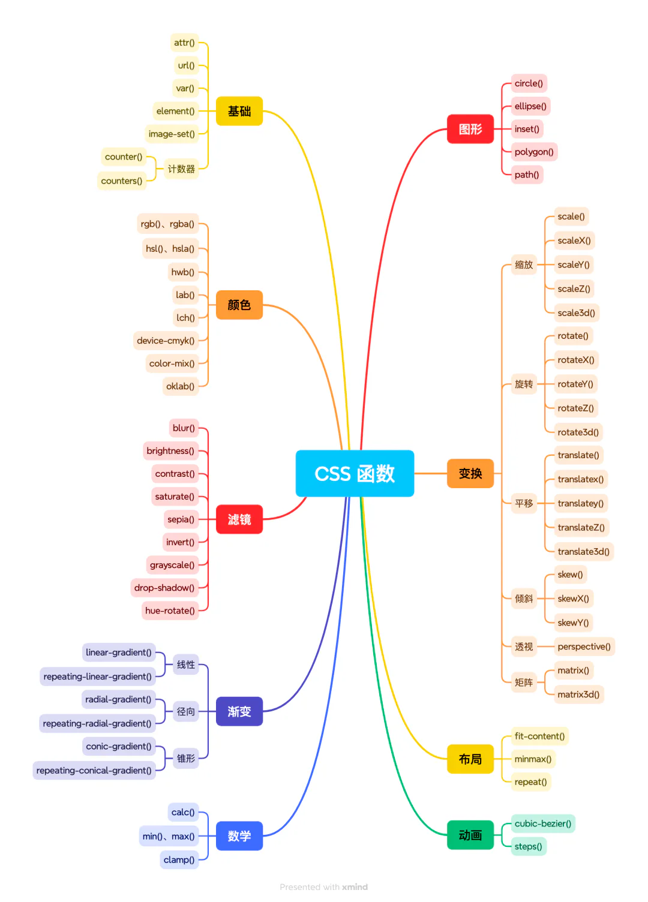

# css函数大全

[基础](./基础/index.md "基础")

[颜色](./颜色/index.md "颜色")

[滤镜](./滤镜/index.md "滤镜")

[渐变](./渐变/index.md "渐变")

[数学](./数学/index.md "数学")

[图形](./图形/index.md "图形")

[变换](./变换/index.md "变换")

[布局](./布局/index.md "布局")

[动画](./动画/index.md "动画")
