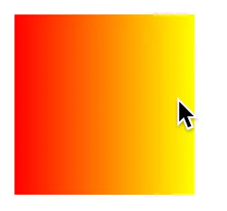
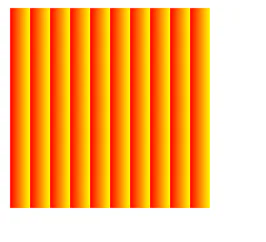
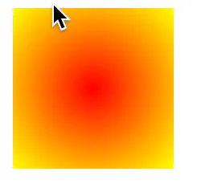
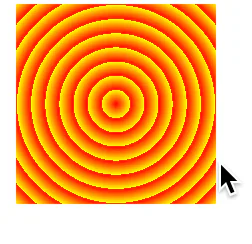
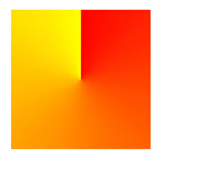
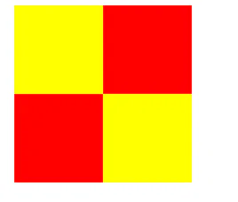

# 渐变

## 目录

- [linear-gradient()、repeating-linear-gradient()](#linear-gradientrepeating-linear-gradient)
- [radial-gradient()、repeating-radial-gradient()](#radial-gradientrepeating-radial-gradient)
- [conic-gradient()、repeating-conical-gradient()](#conic-gradientrepeating-conical-gradient)

### linear-gradient()、**repeating-linear-gradient()**

`linear-gradient()`和 `repeating-linear-gradient()` 用于创建**线性渐变**效果。它们都可以用来在两个或多个颜色之间创建平滑的过渡。

`linear-gradient()`函数用于生成线性渐变背景。它接受至少两种颜色作为参数，并且可以根据需要接受更多的参数来定义渐变的方向、颜色停止点等。其语法如下：

```javascript 
linear-gradient(angle | to direction, color-stop1, color-stop2, ...);

```


- `angle`：定义渐变线的角度。
- `to direction`：使用关键词定义渐变的方向（如 to top, to right 等）。
- `color-stop`：定义渐变中的颜色停止点。

```javascript 
background: linear-gradient(to right, red, yellow);

```


这将创建一个从左到右的红色到黄色的线性渐变背景。



`repeating-linear-gradient()`函数与 `linear-gradient()` 类似，但是它创建的渐变会无限地重复。这意味着渐变模式会在容器内重复填充，直到填满整个容器。参数与 `linear-gradient()` 相同，但效果是重复的。

```javascript 
background: repeating-linear-gradient(to right, red, yellow 10px);

```


这将创建一个从左到右的重复线性渐变，其中红色和黄色之间的过渡每10像素重复一次。



### radial-gradient()、**repeating-radial-gradient()**

`radial-gradient()` 和 `repeating-radial-gradient()` 用于创建**径向渐变**（也称为圆形渐变或镜像渐变）效果。这些渐变从一个中心点开始，向外扩散或重复。

`radial-gradient()` 函数用于生成径向渐变背景。它至少需要两种颜色作为参数，并可以指定渐变的中心、形状（圆形或椭圆形）以及大小。其语法如下：

```javascript 
radial-gradient(shape size at position, color-stop1, color-stop2, ...);

```


- `shape`：可以是 circle（圆形）或 ellipse（椭圆形）。
- `size`：定义渐变的大小，如 `closest-side,` `farthest-side`, `closest-corner`, `farthest-corner`，或者使用具体的长度值。
- `at position`：定义渐变中心的位置。
- `color-stop`：定义渐变中的颜色停止点。

```javascript 
background: radial-gradient(circle, red, yellow);

```


这将创建一个从中心开始的红色到黄色的圆形径向渐变背景。



`repeating-radial-gradient()` 函数与 `radial-gradient()` 类似，但它创建的渐变会无限地重复。这意味着渐变模式会在容器内重复填充，直到填满整个容器。其语法与 `radial-gradient()` 相同，但效果是重复的。

```javascript 
background: repeating-radial-gradient(circle, red, yellow 10%);

```


这将创建一个从中心开始的重复径向渐变，其中红色和黄色之间的过渡每`10%`的径向距离重复一次。



### conic-gradient()、repeating-conical-gradient()

`conic-gradient()` 和 `repeating-conic-gradient()` 用于创建锥形渐变和重复的锥形渐变效果。这些渐变从一个中心点开始，沿着辐射状的线条向外扩散。

`conic-gradient()` 函数用于生成锥形渐变背景。它接受多个颜色停止点作为参数，每个颜色停止点由一个颜色值和一个可选的角度（或百分比）组成，表示渐变中颜色变化的位置。其语法如下：

```javascript 
conic-gradient(color-stop1 angle1, color-stop2 angle2, ...);

```


- `color-stop`：定义渐变中的颜色停止点。
- `angle`：定义颜色停止点的位置，可以是度数（0到360之间）或百分比（0%到100%之间）。

```javascript 
background: conic-gradient(red 0%, yellow 100%);

```


这将创建一个从红色渐变到黄色的锥形渐变背景，其中红色位于渐变的起点（0度或0%），黄色位于渐变的终点（360度或100%）。



`repeating-conic-gradient()` 函数与 `conic-gradient()` 类似，但是它创建的渐变会无限地重复。这意味着锥形渐变模式会在容器内重复填充，直到填满整个容器。语法与 conic-gradient() 类似，但渐变会重复。

```javascript 
background: repeating-conic-gradient(red 0% 25%, yellow 25% 50%);

```


这将创建一个重复的锥形渐变，其中红色和黄色之间的过渡从0%到25%，然后从25%到50%重复这个过渡。


