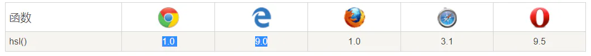
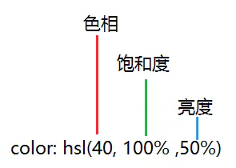

# hsl

## 目录

- [hsl() 函数](#hsl-函数)
  - [浏览器支持](#浏览器支持)
  - [CSS 语法](#CSS-语法)
  - [透明度](#透明度)

# hsl() 函数

```css 
#p1{background-color:hsl(120,100%,50%);}
/*
绿色
*/
#p2{background-color:hsl(120,100%,75%);}
/*
浅绿
*/
#p3{background-color:hsl(120,100%,25%);}
/*
暗绿
*/
#p4{background-color:hsl(120,60%,70%);}
/*
柔和的绿色
*/
```


hsl() 函数使用色相、饱和度、亮度来定义颜色。

HSL 即色相、饱和度、亮度（英语：Hue, Saturation, Lightness）。

- **色相（H）** 是色彩的基本属性，就是平常所说的颜色名称，如红色、黄色等。
- **饱和度（S）** 是指色彩的纯度，越高色彩越纯，低则逐渐变灰，取 0-100% 的数值。
- **亮度（L）**，取 0-100%，增加亮度，颜色会向白色变化；减少亮度，颜色会向黑色变化。

HSL 是一种将 RGB 色彩模型中的点在圆柱坐标系中的表示法。这两种表示法试图做到比基于笛卡尔坐标系的几何结构 RGB 更加直观。支持版本：CSS3

## 浏览器支持

表格中的数字表示支持该函数的第一个浏览器版本号。

## CSS 语法

hsl(hue, saturation, lightness)

| 值                  | 描述                                               |
| ------------------ | ------------------------------------------------ |
| *hue - 色相*         | 定义色相 (0 到 360) - 0 (或 360) 为红色, 120 为绿色, 240 为蓝色 |
| *saturation - 饱和度* | 定义饱和度; 0% 为灰色， 100% 全色                           |
| *lightness - 亮度*   | 定义亮度 0% 为暗, 50% 为普通, 100% 为白                     |

## 透明度

hsla(50, 0%, 0%, 0.6); &#x20;




