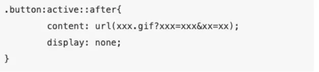

# **:active实现“数据上报”**

        其实网页中还有一个小问题：如果用户禁用了JavaScript/浏览器不支持JavaScript怎么办？当然，后一种情况现在基本不会出现，但是这确实是一种令人感到棘手的问题，并且吸引了大量前端开发者为之倾覆心血！

        关于这个问题在笔者其他文章中也有提及，这里我们只说下“数据上报”：如果没有form也不支持JavaScript（没法用ajax了啊）怎么将数据传给后端？幸好有伪类 

**:active —— 点击态！它原来是只对a的，现在也支持所有HTML标签了**。但是你可能会问了：

**这个伪类不是一般只用来改变链接的颜色什么的？单单只有这个元素当然不行，但是不知道你有没有想到【判断点击次数】这个经典demo！**

我们通常会将active和after结合使用：

即使你不相信，但它确实会向服务器发送一条请求，并将数据携带上传！这里为什么用url？如果不用图片格式的话，after-content的字符串格式中只能写固定值。
