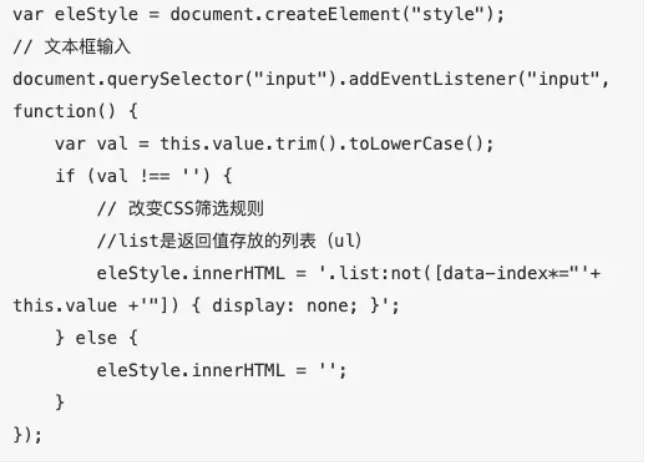
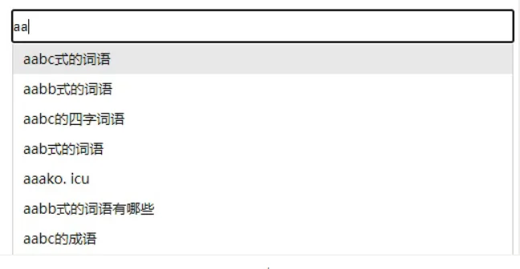

# **:not()判断显示元素**

在网页的【搜索】按钮中，有这样一种场景：根据输入的关键字显示列表。笔者曾写过一篇文章，用JavaScript阐述了其场景：（JavaScript）百度/Google 搜索的即时自动补全功能究竟是如何“工作”的？其实我们也可以用CSS的 :not()来优化显示 —— 判断不是xxx的符合条件的信息：

```纯文本 
 .list:not([class="show"]) { display: none; }
```


CSS3选择器中，有一个叫做属性选择器的东西，有：

\[attr]\(有该属性), 

\[attr=xxx]\(属性值是xxx), 

\[attr^=xxx]\(属性值是xxx开头), 

\[attr\$=xxx]\(属性值以xxx结尾), 

`[attr*=xxx]`（属性值包含 xxx）

 这些用法。

然后在筛选时根据“是不是符合条件”为返回列表的某些项动态加上show类名。甚至我们可以配合“自定义数据属性”：




