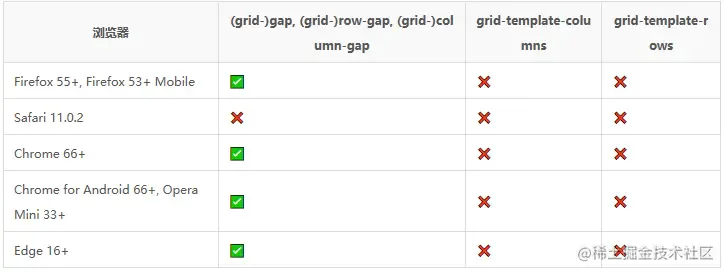

# Grid布局中的动画

根据 CSS Grid 布局模块 Level 1 规范，有 5 个可应用动画的网格属性：

- grid-gap， grid-row-gap，grid-column-gap 作为长度，百分比或 calc。
- grid-template-columns，grid-template-rows 作为长度，百分比或 calc 的简单列表，只要列表中长度、百分比或calc组件的值不同即可。

浏览器支持可设置动画的网格属性：



示例：

```typescript 
<!DOCTYPE html>
<html>
<head>
  <meta charset="utf-8">
    <meta name="viewport" content="width=device-width">
    <title>Grid布局</title>
    <style>
     .container {
            display: grid;
            grid-template-rows: 100px 100px 100px;
            grid-template-columns: 100px 100px 100px;
            grid-gap: 5px;
            transition: grid-gap 2s;
          -moz-transition: grid-gap 2s; /* Firefox 4 */
            -webkit-transition: grid-gap 2s; /* Safari 和 Chrome */
            -o-transition: grid-gap 2s; /* Opera */
      }
      .grid-full {
        grid-gap: 10px;
      }
        .item {
            text-align: center;
            color: #fff;
            border: 1px solid #fff;
            background: lightblue;
        } 
        .button {
            background-color: green;
            color: #ffffff;
            margin: 10px auto;
            border: none;
            border-radius: 5px;
      }
  </style>
</head>
<body>
  <button class="button">开始</button>
  <div class="container">
    <div class="item">1</div>
      <div class="item">2</div>
      <div class="item">3</div>
      <div class="item">4</div>
      <div class="item">5</div>
      <div class="item">6</div>
      <div class="item">7</div>
      <div class="item">8</div>
      <div class="item">9</div>
  </div>
</body>
<script>
   document.querySelector('.button').addEventListener('click', function() {
      document.querySelector('.container').classList.toggle('grid-full')
   })
</script>
</html>
```
