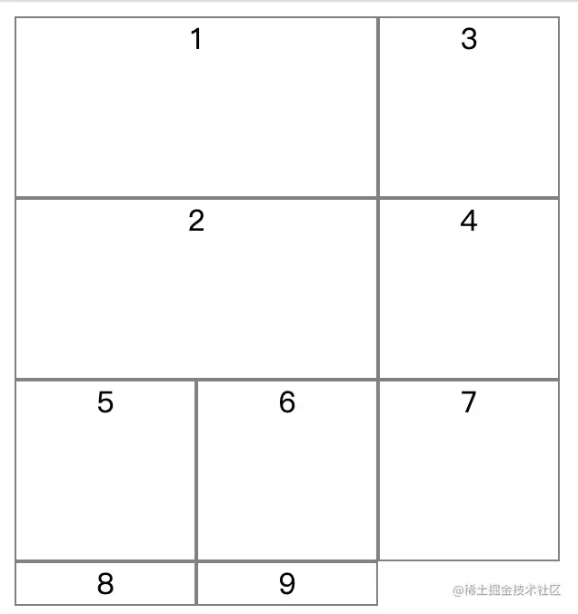
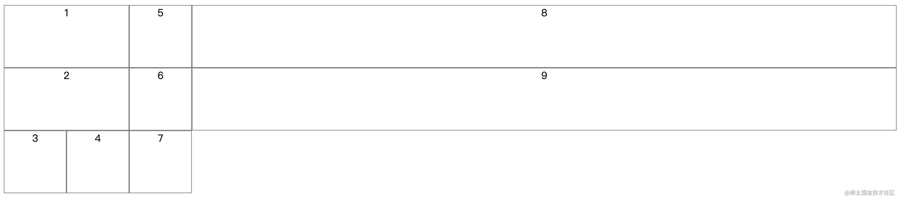

# grid-auto-flow 属性

定义网格容器中网格项目（即容器内直接子元素）的自动排列方式，划分网格以后，容器的子元素会按照顺序，自动放置在每一个单元格中，grid-auto-flow 属性用来定义这种放置顺序。 取值：

- row 默认值，按顺序先行后列，即先填满第一行，再开始放入第二行
- column 按顺序先列后行，即先填满第一列，再开始放入第二列
- row dense 先行后列，尽可能紧密填满，不出现空格，但可能不完全遵循顺序
- column dense 先列后行，尽可能紧密填满，不出现空格，但可能不完全遵循顺序

示例

```typescript 
.container {
    display: grid;
    grid-template-columns: 100px 100px 100px;
    grid-template-rows: 100px 100px 100px;
    grid-auto-flow: column
}
```


页面效果：


关于row-dense和column-dense属性我们看下面示例：

```typescript 
<!DOCTYPE html>
<html>
<head>
  <meta charset="utf-8">
  <meta name="viewport" content="width=device-width">
  <title>Grid布局</title>
  <style>
    .container {
      display: grid;
      grid-template-rows: 100px 100px 100px;
      grid-template-columns: 100px 100px 100px;
    }
    .item {
      text-align: center;
       border: 1px solid gray;
    }
    .item-1 {
      // grid-column-start 和 grid-column-end属性会在后面介绍
      grid-column-start: 1;
      grid-column-end: 3;  
    }
    .item-2 {
      grid-column-start: 1;
      grid-column-end: 3;
    }
  </style>
</head>
<body>
<div class="container">
  <div class="item item-1">1</div>
  <div class="item item-2">2</div>
  <div class="item">3</div>
  <div class="item">4</div>
  <div class="item">5</div>
  <div class="item">6</div>
  <div class="item">7</div>
  <div class="item">8</div>
  <div class="item">9</div>
</div>
</body>
```


页面效果：


从上图我们可以看到1号网格项目和2号网格项目各占据了2个单元格，由于3号项目默认跟着2号项目，因此1号项目后面空白，并且7、8、9号元素由于没有设置行高度，所以高度表现出“包裹性”，因此在默认的grid-auto-flow: row情况下页面布局如上图所示。

**现在给 container 元素添加**\*\*`grid-auto-flow: row dense;`\*\***则页面效果如下：**



**将 grid-auto-flow 属性修改为 column dense，则页面效果如下图所示：**



页面效果如上图所示，column dense 表示“先列后行”，先填满第一列，再填满第2列，所以3号项目在第一列，4号项目在第二列。8号项目和9号项目被挤到了第四列。因为没有指定第四列的宽度，所以第四列的宽度为最大宽度。
