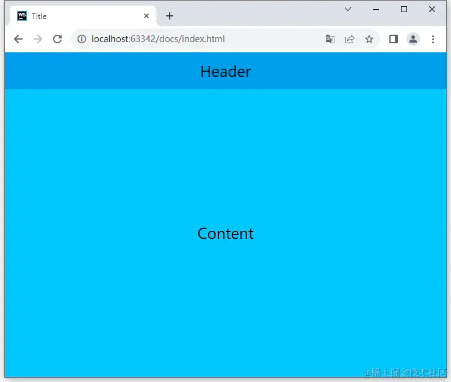
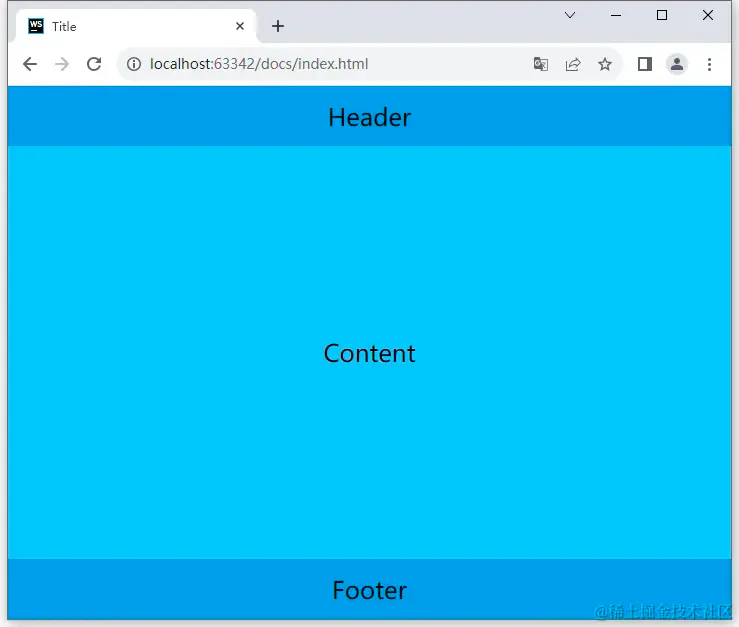
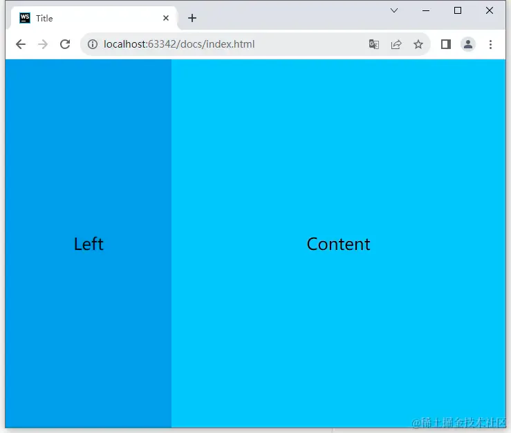
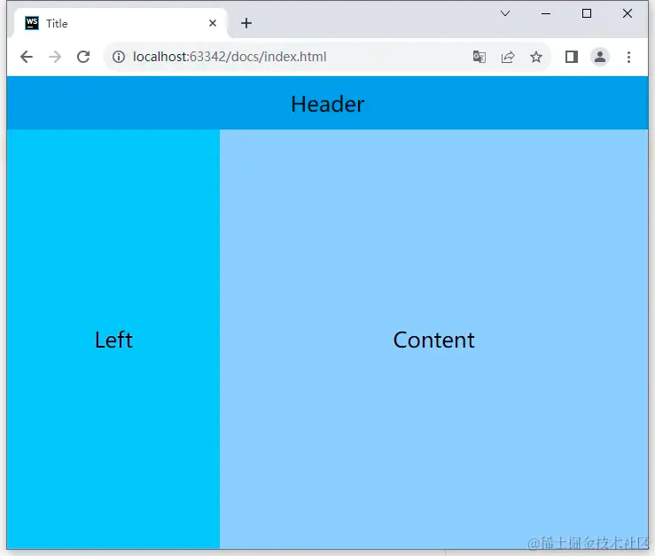
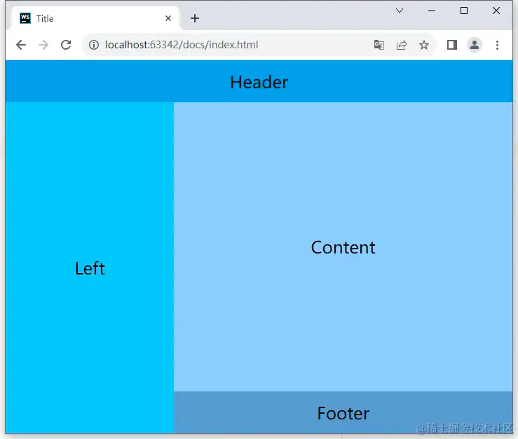
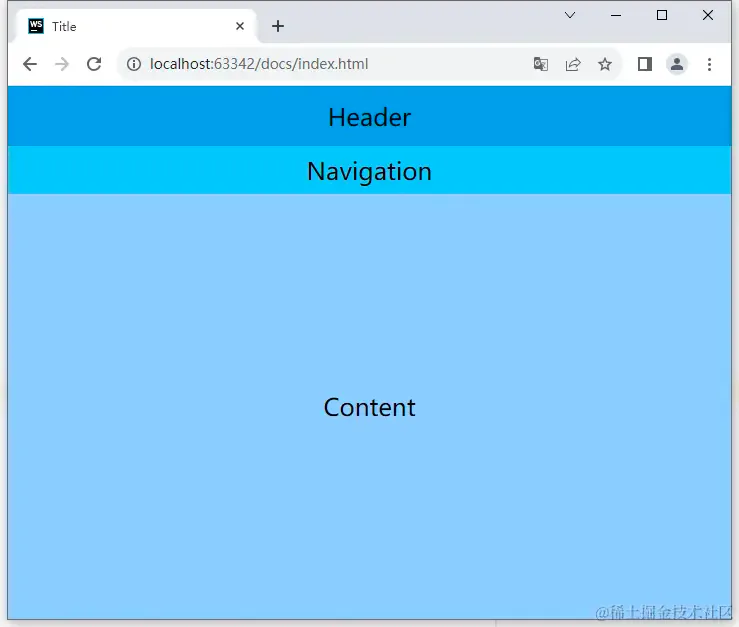
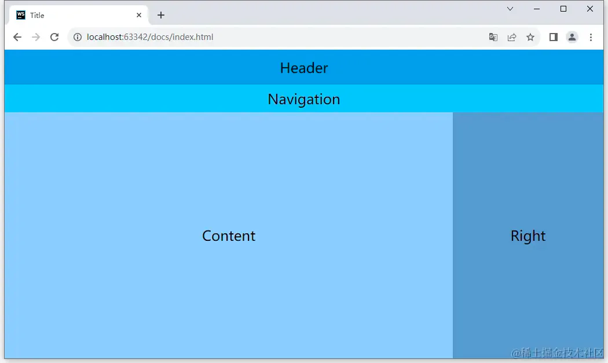
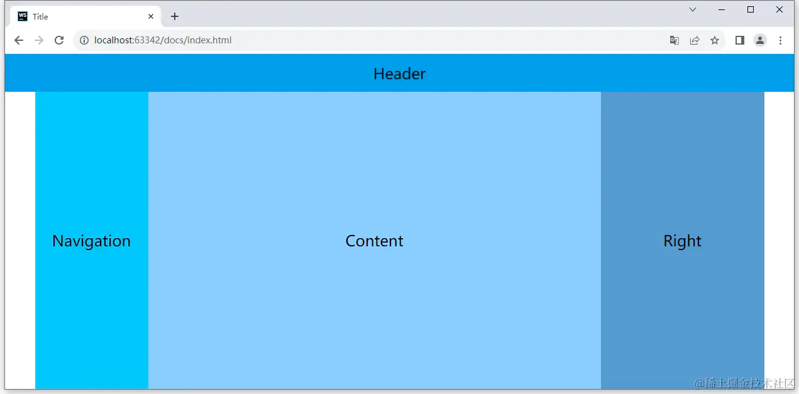
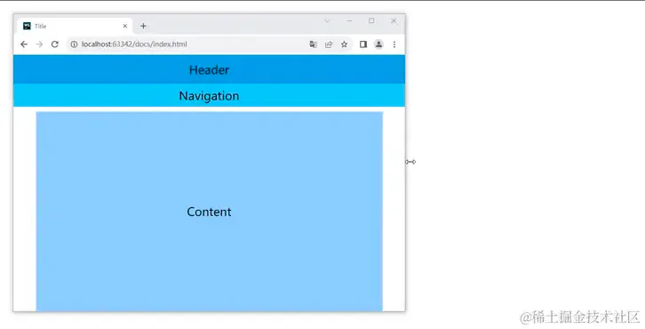

# 常见布局

## 目录

- [1. 顶部 + 内容](#1-顶部--内容)
- [2. 顶部 + 内容 + 底部](#2-顶部--内容--底部)
- [3. 左侧 + 内容](#3-左侧--内容)
- [4. 顶部 + 左侧 + 内容](#4-顶部--左侧--内容)
- [5. 顶部 + 左侧 + 内容 + 底部](#5-顶部--左侧--内容--底部)
- [响应式布局](#响应式布局)
  - [1. 基础布局实现](#1-基础布局实现)
    - [移动端布局](#移动端布局)
    - [iPad布局](#iPad布局)
    - [PC端布局](#PC端布局)
    - [完善一些细节](#完善一些细节)

### 1. 顶部 + 内容



```javascript 
<!DOCTYPE html>
<html lang="en">
<head>
    <meta charset="UTF-8">
    <title>Title</title>
    <style>
        html, body {
            margin: 0;
            padding: 0;
        }

        body {
            display: grid;
            grid-template-rows: 60px 1fr;
            height: 100vh;
        }

        .header {
            background-color: #039BE5;
        }

        .content {
            background-color: #4FC3F7;
        }

        .header,
        .content {
            display: flex;
            align-items: center;
            justify-content: center;
            font-size: 24px;
        }
    </style>
</head>
<body>
<div class="header">Header</div>
<div class="content">Content</div>
</body>
</html>

```


### 2. 顶部 + 内容 + 底部



```javascript 
<!DOCTYPE html>
<html lang="en">
<head>
    <meta charset="UTF-8">
    <title>Title</title>
    <style>
        html, body {
            margin: 0;
            padding: 0;
        }

        body {
            display: grid;
            grid-template-rows: 60px 1fr 60px;
            height: 100vh;
        }

        .header {
            background-color: #039BE5;
        }

        .content {
            background-color: #4FC3F7;
        }

        .footer {
            background-color: #039BE5;
        }

        .header,
        .content,
        .footer {
            display: flex;
            align-items: center;
            justify-content: center;
            font-size: 24px;
        }
    </style>
</head>
<body>
<div class="header">Header</div>
<div class="content">Content</div>
<div class="footer">Footer</div>
</body>
</html>

```


### 3. 左侧 + 内容



```javascript 
<!DOCTYPE html>
<html lang="en">
<head>
    <meta charset="UTF-8">
    <title>Title</title>
    <style>
        html, body {
            margin: 0;
            padding: 0;
        }

        body {
            display: grid;
            grid-template-columns: 240px 1fr;
            height: 100vh;
        }

        .left {
            background-color: #039BE5;
        }

        .content {
            background-color: #4FC3F7;
        }
        
        .left,
        .content {
            display: flex;
            align-items: center;
            justify-content: center;
            font-size: 24px;
        }


    </style>
</head>
<body>
<div class="left">Left</div>
<div class="content">Content</div>
</body>
</html>

```


### 4. 顶部 + 左侧 + 内容



```javascript 
<!DOCTYPE html>
<html lang="en">
<head>
    <meta charset="UTF-8">
    <title>Title</title>
    <style>
        html, body {
            margin: 0;
            padding: 0;
        }

        body {
            display: grid;
            grid-template-rows: 60px 1fr;
            grid-template-columns: 240px 1fr;
            height: 100vh;
        }

        .header {
            grid-column: 1 / 3;
            background-color: #039BE5;
        }

        .left {
            background-color: #4FC3F7;
        }

        .content {
            background-color:  #99CCFF;
        }

        .header,
        .left,
        .content {
            display: flex;
            align-items: center;
            justify-content: center;
            font-size: 24px;
        }
        
    </style>
</head>
<body>
<div class="header">Header</div>
<div class="left">Left</div>
<div class="content">Content</div>
</body>
</html>

```


> 这个示例不同点在于`header`占据了两列，这里我们可以使用`grid-column`来实现，`grid-column`的值是`start / end`，例如：`1 / 3`表示从第一列到第三列；
>
> 如果确定\*\*这一列是占满整行的，那么我们可以使用`1 / -1`\*\***来表示**，这样如果后续变成`顶部 + 左侧 + 内容 + 右侧`的布局，那么`header`就不需要修改了；

### 5. 顶部 + 左侧 + 内容 + 底部



```javascript 
<!DOCTYPE html>
<html lang="en">
<head>
    <meta charset="UTF-8">
    <title>Title</title>
    <style>
        html, body {
            margin: 0;
            padding: 0;
        }

        body {
            display: grid;
            grid-template-areas:
            "header header"
            "left content"
            "left footer";
            grid-template-rows: 60px 1fr 60px;
            grid-template-columns: 240px 1fr;
            height: 100vh;
        }

        .header {
            grid-area: header;
            background-color: #039BE5;
        }

        .left {
            grid-area: left;
            background-color: #4FC3F7;
        }

        .content {
            grid-area: content;
            background-color: #99CCFF;
        }

        .footer {
            grid-area: footer;
            background-color: #6699CC;
        }

        .header,
        .left,
        .content,
        .footer {
            display: flex;
            align-items: center;
            justify-content: center;
            font-size: 24px;
        }
    </style>
</head>
<body>
<div class="header">Header</div>
<div class="left">Left</div>
<div class="content">Content</div>
<div class="footer">Footer</div>
</body>
</html>

```


>

> 这个示例的小技巧是使用了`grid-template-areas`，使用这个属性可以让我们通过代码来直观的看到布局的样式；
>
> 这里的值是一个字符串，**每一行代表一行，每个字符代表一列，** 例如：`"header header"`表示第一行的两列都是`header`，这里的`header`是我们自己定义的，可以是任意值；
>
> 定义好了之后就可以在对应的元素上使用`grid-area`来指定对应的区域，这里的值就是我们在`grid-template-areas`中定义的值；

## 响应式布局

响应式布局指的是页面的布局会随着屏幕的大小而变化，这里的变化可以是内容区域大小可以自动调整，也可以是页面布局随着屏幕大小进行自动调整；

这里我就用掘金的页面来举例，这里只提供一个思路，所以不会像上面那样提供那么多示例；

### 1. 基础布局实现

#### 移动端布局



> 以移动端的效果开始，掘金的移动端的布局就是上面的效果，这里我简单的将页面分为了三个部分，分别是`header`、`navigation`、`content`；
>
> 注：这里不是要`100%`还原掘金的页面，只是为了演示`grid`布局，具体页面结构和最后实现的效果会有非常大的差异，这里只会实现一些基础的布局；

```javascript 
<!DOCTYPE html>
<html lang="en">
<head>
    <meta charset="UTF-8">
    <title>Title</title>
    <style>
        html, body {
            margin: 0;
            padding: 0;
        }

        body {
            display: grid;
            grid-template-areas:
            "header"
            "navigation"
            "content";
            grid-template-rows: 60px 48px 1fr;
            height: 100vh;
        }

        .header {
            grid-area: header;
            background-color: #039BE5;
        }

        .navigation {
            grid-area: navigation;
            background-color: #4FC3F7;
        }

        .content {
            grid-area: content;
            background-color: #99CCFF;
        }


        .header,
        .navigation,
        .content {
            display: flex;
            align-items: center;
            justify-content: center;
            font-size: 24px;
        }

    </style>
</head>
<body>
<div class="header">Header</div>
<div class="navigation">Navigation</div>
<div class="content">Content</div>
</body>
</html>

```


#### iPad布局



> 这里是需要借助媒体查询来实现的，在媒体查询中只需要调整一下`grid-template-rows`和`grid-template-columns`的值即可；
>
> 由于这里的效果是上面一个的延伸，为了阅读体验会移除上面相关的`css`代码，只保留需要修改的代码；

```javascript 
<!DOCTYPE html>
<html lang="en">
<head>
    <meta charset="UTF-8">
    <title>Title</title>
    <style>

        .right {
            display: none;
            background-color: #6699CC;
        }

        @media (min-width: 1000px) {
            body {
                grid-template-areas:
                  "header header"
                  "navigation navigation"
                  "content right";
                grid-template-columns: 1fr 260px;
            }

            .right {
                grid-area: right;

                display: flex;
                align-items: center;
                justify-content: center;
                font-size: 24px;
            }
        }
    </style>
</head>
<body>
<div class="header">Header</div>
<div class="navigation">Navigation</div>
<div class="content">Content</div>
<div class="right">Right</div>
</body>
</html>

```


#### PC端布局



> 和上面处理方式相同，由于`Navigation`移动到了左侧，所以还要额外的修改一下`grid-template-areas`的值；
>
> 这里就可以体现`grid`的强大之处了，我们可以简单的修改`grid-template-areas`就可以实现一个完全不同的布局，而且代码量非常少；
>
> 为了居中显示内容，我们需要在左右两侧加上一些空白区域，可以简单的使用`.`来实现，这里的`.`表示一个空白区域；
>
> 由于内容的宽度基本上是固定的，所以留白区域简单的使用`1fr`进行占位即可，这样就可以平均的分配剩余的空间；

```javascript 
<!DOCTYPE html>
<html lang="en">
<head>
    <meta charset="UTF-8">
    <title>Title</title>
    <style>
        @media (min-width: 1220px) {
            body {
                grid-template-areas:
                  "header header header header header"
                  ". navigation content right .";
                grid-template-columns: 1fr 180px minmax(0, 720px) 260px 1fr;
                grid-template-rows: 60px 1fr;
            }
        }
    </style>
</head>
<body>
<div class="header">Header</div>
<div class="navigation">Navigation</div>
<div class="content">Content</div>
<div class="right">Right</div>
</body>
</html>

```


#### 完善一些细节



> 最终的布局大概就是上图这样，这里主要处理的各个版块的间距和响应式内容区域的大小，这里的处理方式主要是使用`column-gap`和一个空的区域进行占位来实现的；
>
> 这里的`column-gap`表示列与列之间的间距，值可以是`px`、`em`、`rem`等基本的长度属性值，也可以使用计算函数，但是不能使用弹性值`fr`；
>
> 空区域进行占位留间距其实我并不推荐，这里只是演示`grid`布局可以实现的一些功能，具体的实现方式还是要根据实际情况来定，这里我更推荐使用`margin`来实现；
>
> 完整代码如下：

```javascript 
<!DOCTYPE html>
<html lang="en">
<head>
    <meta charset="UTF-8">
    <title>Title</title>
    <style>
        html, body {
            margin: 0;
            padding: 0;
        }

        body {
            display: grid;
            grid-template-areas:
            "header header header"
            "navigation navigation navigation"
            ". . ."
            ". content .";
            grid-template-columns: 1fr minmax(0, 720px) 1fr;
            grid-template-rows: 60px 48px 10px 1fr;
            column-gap: 10px;
            height: 100vh;
        }

        .header {
            grid-area: header;
            background-color: #039BE5;
        }

        .navigation {
            grid-area: navigation;
            background-color: #4FC3F7;
        }

        .content {
            grid-area: content;
            background-color: #99CCFF;
        }

        .right {
            display: none;
            background-color: #6699CC;
        }

        @media (min-width: 1000px) {
            body {
                grid-template-areas:
                  "header header header header"
                  "navigation navigation navigation navigation"
                  ". . . ."
                  ". content right .";
                grid-template-columns: 1fr minmax(0, 720px) 260px 1fr;
            }

            .right {
                grid-area: right;

                display: flex;
                align-items: center;
                justify-content: center;
                font-size: 24px;
            }
        }

        @media (min-width: 1220px) {
            body {
                grid-template-areas:
                  "header header header header header"
                  ". . . . ."
                  ". navigation content right .";
                grid-template-columns: 1fr 180px minmax(0, 720px) 260px 1fr;
                grid-template-rows: 60px 10px 1fr;
            }
        }

        .header,
        .navigation,
        .content {
            display: flex;
            align-items: center;
            justify-content: center;
            font-size: 24px;
        }

    </style>
</head>
<body>
<div class="header">Header</div>
<div class="navigation">Navigation</div>
<div class="content">Content</div>
<div class="right">Right</div>
</body>
</html>


```
