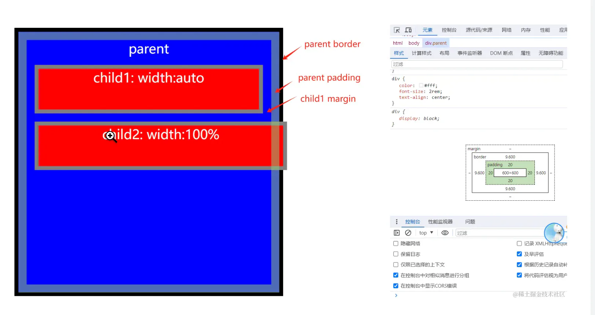
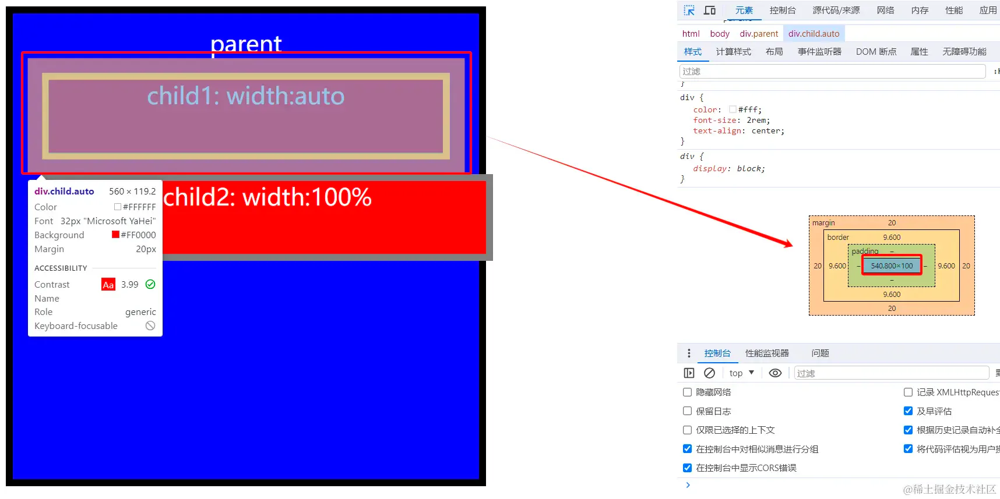

# 宽高

## 目录

- [自动撑满宽度](#自动撑满宽度)
  - [width: auto/100%](#width-auto100)
    - [结论](#结论)

# 自动撑满宽度

## width: auto/100%

1. 我们给**parent**设置了`padding:20px` 内边距，给两个**child**都设置了`margin:20px`的外边距。**child1**的**width**属性是`auto`,**child2**的**width**属性是`100%`。
2. 很明显地看到两个child的不同表现，child1的宽度是可以适应的，不会溢出其父元素。
3. child1最终的宽度值:540px=600px(父元素宽度)−20px(child1外边距)∗2−10px∗2(child1边框值)−0px(child1内边距)child1最终的宽度值: 540px = 600px(父元素宽度) - 20px (child1 外边距) \* 2 - 10px \*2 (child1 边框值) - 0px (child1 内边距) child1最终的宽度值:540px=600px(父元素宽度)−20px(child1外边距)∗2−10px∗2(child1边框值)−0px(child1内边距)

1. 而child2的宽度则是和父元素一样大最终溢出了其父元素。
2. child2最终的宽度值:600px=600px(父元素宽度)child2最终的宽度值: 600px = 600px(父元素宽度) child2最终的宽度值:600px=600px(父元素宽度)

### 结论

- `width:100%` : 子元素的 content 撑满父元素的content，如果子元素还有 padding、border等属性，或者是在父元素上设置了边距和填充，都有可能会造成子元素区域溢出显示;
- `width:auto` : 是子元素的 content+padding+border+margin 等撑满父元素的 content 区域。
- 所以，在开发中尽量还是选择 `width:auto` ,因为当从边距、填充或边框添加额外空间时，它将尽可能努力保持元素与其父容器的宽度相同。而`width：100%`将使元素与父容器一样宽。额外的间距将添加到元素的大小，而不考虑父元素。这通常会导致问题。
