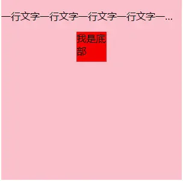
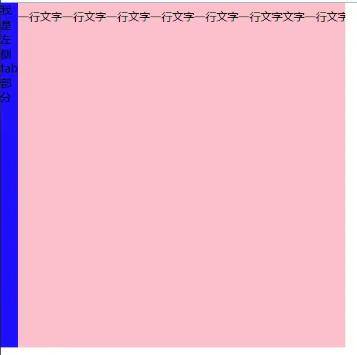
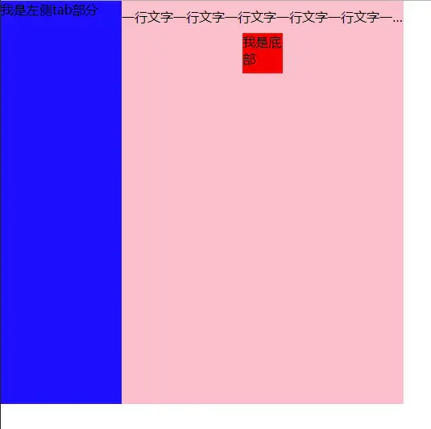

# flex:1 和width失效问题

- 当flex布局的时候，width：100%不生效，解决办法是给子元素设置为绝对定位。

**第一个问题**：**当一层flex布局的时候，设置子元素的width:100%就没有问题；**

```html 
 <!DOCTYPE html>
<html lang="en">
<head>
    <meta charset="UTF-8">
    <title>test</title>
    <style>
    .demo {
        width: 300px;
        height:300px;
        display: flex;
        background-color: pink;
        flex-direction: column;
        align-items: center;
    }
    .top {
        width: 100%;
        overflow: hidden;
        white-space: nowrap;
        text-overflow: ellipsis;
    }
    .bottom {
        width: 50px;
        height: 50px;
        background-color: red;
    }
    </style>
</head>
<body>
    <div class="demo">
        <p class="top">
            一行文字一行文字一行文字一行文字一行文字一行文字文字一行文字一行文字一行文字文字一行文字一行文字一行文字文字一行文字一行文字一行文字文字一行文字一行文字一行文字文字一行文字一行文字一行文字文字一行文字一行文字一行文字
        </p>
        <div class='bottom'>
            我是底部
        </div>
    </div>
</body>
</html>
```


效果如下：



2，当页面中多层flex布局**嵌套的**时候，设置其中**子元素的width：100%会不起作用**。

```html 
<!DOCTYPE html>
<html lang="en">
<head>
    <meta charset="UTF-8">
    <title>test</title>
    <style>
    * {
        padding: 0;
        margin: 0;
    }
    .box {
        width: 500px;
        height: 500px;
        background-color: yellow;
        display: flex;
        overflow: hidden;
    }
    .tab {
        width: 150px;
        height: 100%;
        background-color: blue;
    }
    .demo {
        flex: 1;
        display: flex;
        background-color: pink;
        flex-direction: column;
        align-items: center;
    }
    .top {
         width: 100%;
         overflow: hidden;
        white-space: nowrap;
        text-overflow: ellipsis;
        height: 40px;
        line-height: 40px;
    }
    .bottom {
        width: 50px;
        height: 50px;
        background-color: red;
    }
    </style>
</head>
<body>
    <div class='box'>
        <p class='tab'>我是左侧tab部分</p>
        <div class="demo">
            <p class="top">
                一行文字一行文字一行文字一行文字一行文字一行文字文字一行文字一行文字一行文字文字一行文字一行文字一行文字文字一行文字一行文字一行文字文字一行文字一行文字一行文字文字一行文字一行文字一行文字文字一行文字一行文字一行文字
            </p>
            <div class='bottom'>
                我是底部
            </div>
    </div>
    </div>
    
</body>
</html>
```


效果如下



3，**把元素设置为绝对定位：**

```html 
<!DOCTYPE html>
<html lang="en">
<head>
    <meta charset="UTF-8">
    <title>test</title>
    <style>
    * {
        padding: 0;
        margin: 0;
    }
    .box {
        width: 500px;
        height: 500px;
        background-color: yellow;
        display: flex;
        overflow: hidden;
    }
    .tab {
        width: 150px;
        height: 100%;
        background-color: blue;
    }
    .demo {
          flex: 1; 
        display: flex;
        background-color: pink;
        flex-direction: column;
        align-items: center;
         position: relative; 
    }
    .top {
          position: absolute; 
         width: 100%; 
        overflow: hidden;
        white-space: nowrap;
        text-overflow: ellipsis;
        height: 40px;
        line-height: 40px;
    }
    .bottom {
        margin-top: 40px;
        width: 50px;
        height: 50px;
        background-color: red;
    }
    </style>
</head>
<body>
    <div class='box'>
        <p class='tab'>我是左侧tab部分</p>
        <div class="demo">
            <p class="top">
                一行文字一行文字一行文字一行文字一行文字一行文字文字一行文字一行文字一行文字文字一行文字一行文字一行文字文字一行文字一行文字一行文字文字一行文字一行文字一行文字文字一行文字一行文字一行文字文字一行文字一行文字一行文字
            </p>
            <div class='bottom'>
                我是底部
            </div>
    </div>
    </div>
    
</body>
</html>
```


效果如下图：


