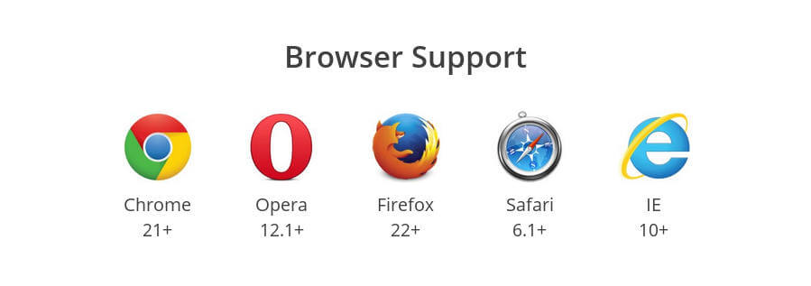

# 弹性盒布局

## 目录

- [父元素: ](#父元素-)
- [子元素:](#子元素)
- [样例：](#样例)
  - [没有超出；就等比列分配；超出就按照原来的长度出现滚动条](#没有超出就等比列分配超出就按照原来的长度出现滚动条)
  - [换行时自动适配](#换行时自动适配)
- [一、Flex布局是什么？](#一Flex布局是什么)
- [二、基本概念](#二基本概念)

> 弹性盒` display:flex`

## 父元素:&#x20;

- flex-wrap:
  - nowrap/wrap/wrap-reverse 换行
- flex-direction:
  - column/column-reverse/row/row-reverse  换轴
- 前两者缩写:flex-flow:direction/wrap
- justify-content:
  - center/flex-start/flex-end/space-between/space-around 主轴
- align-items:
  - flex-start/end/center/baseline/stretch  侧轴上只有一个时
- align-content:
  - flex-start/end/center/space-between/space-around  侧轴上有多个时
- gap
  - 是用来设置网格行与列之间的间隙（`gutters`），该属性是`row-gap` 和 `column-gap` 的简写形

(要想使用align-content,必须允许换行侧轴才能有多个)

## 子元素:

- flex-grow:1不足部分等比例划分,每个元素都要写
- flex-shrinl:1;超出部分不安等比例划分,而是按照各自的长短划分
- flex-basis:弹性盒元素的初始长度为 80 像素：
- order:0/-1/1 主轴上出现的顺序.小的在前面
- align-self:
  - flex-start/end/center/baseline/stretch
- flex:1 是以上的缩写,剩余的部分全部分配给他
  - flex: 1 1 auto ; 默认
  - flex-grow flex-shrinl flex-basis

space-evenly : 与space-around不同的是,他是真的均分;  ie11 暂时不支持

display: inline-flex;  当我们需要以为内联的方式显示元素，列入span，并且每个徽章都应该是一个flexbox元素，这时就需要 inline-flex 出场了。

## 样例：

### **没有超出；就等比列分配；超出就按照原来的长度出现滚动条**

```css 
width：50px;
flex-grow:1;
flex-shrink:0;
```


### **换行时自动适配**

```css 
.parent {
   display: flex;
   flex-wrap: wrap;
   justify-content: center;
}
.box {
    /* flex: 1 1 250px;  flex-grow: 1 ，表示自动延展到最大宽度 */
    flex: 0 1 150px; /* No stretching:*/
    margin: 5px;
    background: blue;
    height: 150px;
}
    
<div class="parent white">
    <div class="box green">1</div>
    <div class="box green">2</div>
    <div class="box green">3</div>
  </div>


```


2009年，W3C提出了一种新的方案--Flex布局，可以简便、完整、响应式地实现各种页面布局。目前已得到所有现在浏览器的支持。



flex浏览器支持

# **一、Flex布局是什么？**

Flex是Flexible Box的缩写，翻译成中文就是“弹性盒子”，用来为盒装模型提供最大的灵活性。**任何一个容器都可以指定为Flex布局。**

/\*在webkit内核的浏览器上使用要加前缀\*/

```javascript 
.box{
  display : flex; //将对象作为弹性伸缩盒显示
}
当然，行内元素也可以使用Flex布局。
.box{
    display:  inline-flex;//将对象作为内联块级弹性伸缩盒显示 
}

兼容性写法
.box{
    display: flex || inline-flex;
}
```


# **二、基本概念**

采用Flex布局的元素，被称为Flex容器(flex container)，简称“容器”。其所有子元素自动成为容器成员，成为Flex项目(Flex item)，简称“项目”。


结构示意图

容器默认存在两根主轴：水平方向主轴(main axis)和垂直方向交叉轴(cross axis)，默认项目按主轴排列。

- main start/main end：主轴开始位置/结束位置；
- cross start/cross end：交叉轴开始位置/结束位置；
- main size/cross size：单个项目占据主轴/交叉轴的空间；

[QA](./QA/index.md "QA")

[父元素属性](./父元素属性/index.md "父元素属性")

[子元素的属性](./子元素的属性/index.md "子元素的属性")
