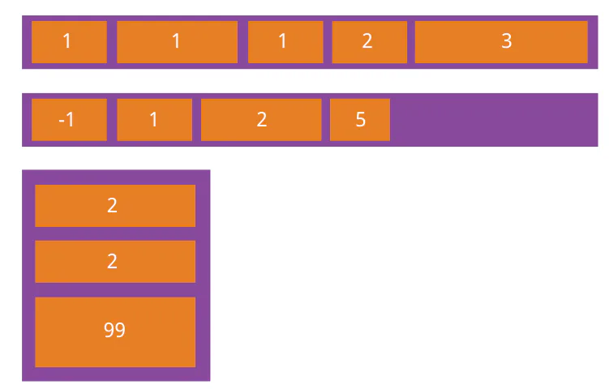
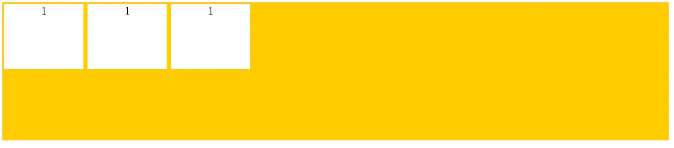
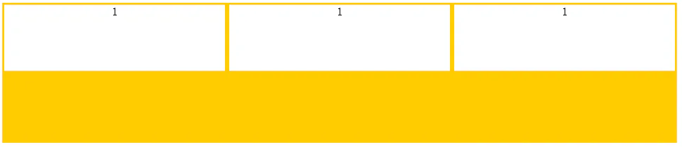
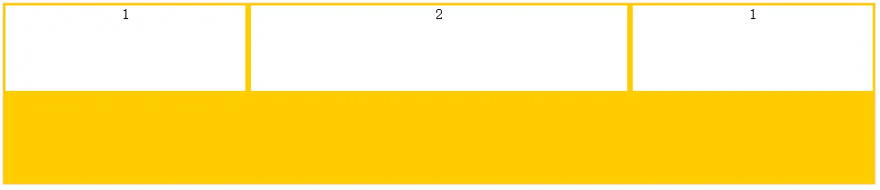
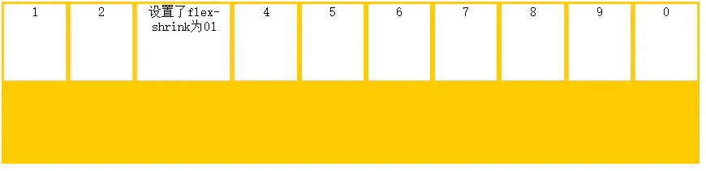
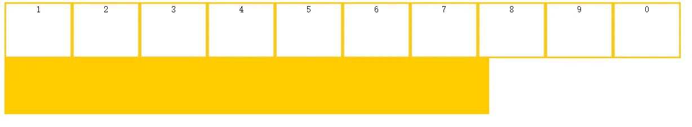
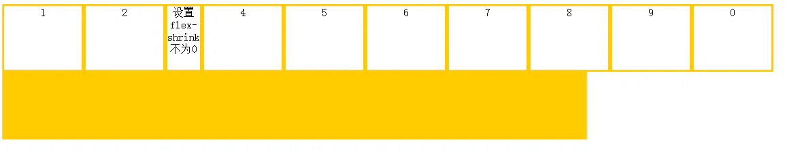
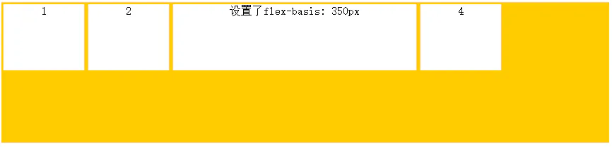
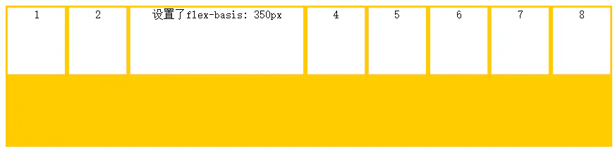

# **子元素的属性**

## 目录

- [order属性：定义项目的排列顺序。](#order属性定义项目的排列顺序)
- [flex-grow属性：定义项目的放大比例](#flex-grow属性定义项目的放大比例)
- [flex-shrink属性：定义项目的缩小比例](#flex-shrink属性定义项目的缩小比例)
- [flex-basis属性：定义在分配多余空间之前，项目占据的主轴空间。](#flex-basis属性定义在分配多余空间之前项目占据的主轴空间)
- [flex属性是flex-grow，flex-shrink和flex-basis的简写](#flex属性是flex-growflex-shrink和flex-basis的简写)

设置在项目上的属性也有6个。

- order
- flex-grow
- flex-shrink
- flex-basis
- flex
- align-self

#### **order属性：定义项目的排列顺序。**

数值越小，排列越靠前，默认为0，可以是负值。

```javascript 
.item{
    order: <整数>;
}
```




展示效果不明显，直接盗图

#### **flex-grow属性：定义项目的放大比例**

默认值为0，即如果空间有剩余，也不放大。可以是小数，按比例占据剩余空间。



默认情况

```javascript 
.item{
    flex-grow: <数字>;
}
```


*若所有项目的flex-grow的数值都相同，则等分剩余空间*



等分剩余空间

*若果有一个项目flex-grow为2，其余都为1，则该项目占据剩余空间是其余的2倍*



不等分占据

#### **flex-shrink属性：定义项目的缩小比例**

默认值都为1，即如果空间不足将等比例缩小。

**如果有一个项目的值为0，**

其他项目为1，当空间不足时，该项目不缩小。

负值对该属性无效，容器不应该设置flex-wrap。

```javascript 
.item{
   flex-shrink: <非负整数>;
}
```


如果一个项目设置

**flex-shrink为0；而其他项目都为1，则空间不足时，该项目不缩小**。



设置flex-shrink为0的项目不缩小

如果**所有项目都为0，则当空间不足时，** 项目撑破容器而溢出。



不缩小

如果设置项目的flex-shrink不为0的非负数效果同设置为1。



#### **flex-basis属性：定义在分配多余空间之前，项目占据的主轴空间。**

默认值为auto，浏览器根据此属性检查主轴是否有多余空间。

```javascript 
.item{
    flex-basis: <auto或者px>;
}
```


注意设置的flex-basis是分配多余空间之前项目占据的主轴空间，如果空间不足则默认情况下该项目也会缩小。



设置flex-basis为350px，但空间充足



空间不足，项目缩小，小于设定值

#### **flex属性是flex-grow，flex-shrink和flex-basis的简写**

默认值为0 1 auto，第一个属性必须，后两个属性可选。

```javascript 
.item{
    flex: none |[<flex-grow><flex-shrink><flex-basis>];
}
```


- 可以用 flex:auto; 代替 flex: 1 1 auto;；
- 可以用 flex: none;代替 flex: 0 0 auto；

align-self属性：允许单个项目与其他项目有不一样的对齐方式

默认值为auto，表示继承父元素的align-items属性，并可以覆盖align-items属性。

```javascript 
.item{

    align-self: auto | flex-start | flex-end | center | baseline | stretch;

}
```


[flex-basis](./flex-basis/index.md "flex-basis")

[flex](./flex/index.md "flex")
