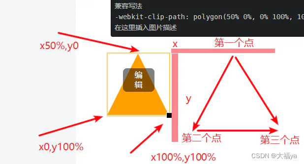
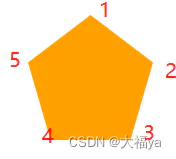

# clip-path 剪切

## 目录

- [属性定义及使用说明](#属性定义及使用说明)
- [语法](#语法)
  - [属性值](#属性值)
  - [介绍：](#介绍)
  - [语法：](#语法)
  - [详解：](#详解)
- [多边形裁剪](#多边形裁剪)
  - [三角形](#三角形)
  - [五边形](#五边形)
  - [border-radius](#border-radius)

## 属性定义及使用说明

clip-path 属性使用**裁剪方式创建元素的可显示区域**。区域内的部分显示，区域外的隐藏。可以指定一些特定形状。

## 语法

```css 
clip: clip-source|basic-shape|margin-box|border-box|padding-box|content-box|fill-box|stroke-box|view-box|none|initial|inherit;

```


### 属性值

| 值             | 描述                                                                                                                                              |
| ------------- | ----------------------------------------------------------------------------------------------------------------------------------------------- |
| *clip-source* | 用 URL 表示剪切元素的路径                                                                                                                                 |
| *basic-shape* | 将元素裁剪为基本形状：圆形、椭圆形、多边形或插图                                                                                                                        |
| margin-box    | 使用外边距框作为引用框                                                                                                                                     |
| border-box    | 使用边框作为引用框                                                                                                                                       |
| padding-box   | 使用内边距框作为引用框                                                                                                                                     |
| content-box   | 使用内容框作为引用框                                                                                                                                      |
| fill-box      | 使用对象边界框作为引用框                                                                                                                                    |
| stroke-box    | 使用笔触边界框（stroke bounding box）作为引用框                                                                                                               |
| view-box      | 使用最近的 SVG 视口（viewport）作为引用框。                                                                                                                    |
| none          | 这是默认设置。 没有剪辑                                                                                                                                    |
| initial       | 设置属性为默认值。 [阅读关于 ](https://www.runoob.com/cssref/css-initial.html "阅读关于 ")[*initial*](https://www.runoob.com/cssref/css-initial.html "initial")  |
| inherit       | 属性值从父元素继承。 [阅读关于 ](https://www.runoob.com/cssref/css-inherit.html "阅读关于 ")[*inherit*](https://www.runoob.com/cssref/css-inherit.html "inherit") |

### 介绍：

clip-path 属性指定为**下面列出的值的一个或多个值的组合**。

- \<clip-source>  用 url() 引用 SVG 的 \<clipPath> 元素
- \<basic-shape>  一种形状，其大小和位置由 \<geometry-box> 的值定义。如果没有指定 \<geometry-box>，则将使用 border-box 用为参考框。取值可为以下值中的任意一个：
  - inset() (en-US)  定义一个 inset 矩形。
  - circle() (en-US) 定义一个圆形（使用一个半径和一个圆心位置）。
  - ellipse() (en-US) 定义一个椭圆（使用两个半径和一个圆心位置）。
  - polygon() (en-US) 定义一个多边形（使用一个 SVG 填充规则和一组顶点）。
  - path() (en-US) 定义一个任意形状（使用一个可选的 SVG 填充规则和一个 SVG 路径定义）。
- \<geometry-box>  如果同 \<basic-shape> 一起声明，它将为基本形状提供相应的参考框盒。通过自定义，它将利用确定的盒子边缘包括任何形状边角（比如说，被 border-radius 定义的剪切路径）。几何框盒可以有以下的值中的一个：
  - &#x20;margin-box使用 margin box 作为引用框。
  - border-box使用 border box 作为引用框。
  - padding-box使用 padding box 作为引用框。
  - content-box 使用 content box 作为引用框。
  - fill-box利用对象边界框（object bounding box）作为引用框。
  - stroke-box使用笔触边界框（stroke bounding box）作为引用框。
  - view-box使用最近的 SVG 视口（viewport）作为引用框。如果 viewBox 属性被指定来为元素创建 SVG 视口，引用框将会被定位在坐标系的原点，引用框位于由 viewBox 属性建立的坐标系的原点，引用框的尺寸用来设置 viewBox 属性的宽高值。
  - none不创建剪切路径

### 语法：

```css 
/* Keyword values */
clip-path: none;

/* <clip-source> values */
clip-path: url(resources.svg#c1);

/* <geometry-box> values */
clip-path: margin-box;
clip-path: border-box;
clip-path: padding-box;
clip-path: content-box;
clip-path: fill-box;
clip-path: stroke-box;
clip-path: view-box;

/* <basic-shape> values */
clip-path: inset(100px 50px);
clip-path: circle(50px at 0 100px);
clip-path: ellipse(50px 60px at 0 10% 20%);
clip-path: polygon(50% 0%, 100% 50%, 50% 100%, 0% 50%);
clip-path: path('M0.5,1 C0.5,1,0,0.7,0,0.3 A0.25,0.25,1,1,1,0.5,0.3 A0.25,0.25,1,1,1,1,0.3 C1,0.7,0.5,1,0.5,1 Z');

/* Box and shape values combined */
clip-path: padding-box circle(50px at 0 100px);

/* Global values */
clip-path: inherit;
clip-path: initial;
clip-path: revert;
clip-path: revert-layer;
clip-path: unset;

```


### 详解：

## 多边形裁剪

### 三角形

下面我们用一个示例来做例子学会一个都会了。

1.假设是一个div 找点位三角形有3个点分别为 x =50% y=0, x=100%，y=100,x=0,y=100%

注意画任何图形都要**遵循从右向左找点位先写右边点位**

```css 
.box{
    width: 100px;
    height: 100px;
    background-color: orange;
    clip-path: polygon(50% 0%, 0% 100%, 100% 100%);
    -webkit-clip-path: polygon(50% 0%, 0% 100%, 100% 100%);
}

```




### 五边形

1.找从右向左找点位 5个点，从右开始写

```css 
.box{
            width: 100px;
            height: 100px;
            background-color: orange;
            -webkit-clip-path: polygon(50% 0%, 100% 38%, 82% 100%, 18% 100%, 0% 38%);
        }
```




### border-radius

```css 
clip-path: inset(4px 4px 4px 4px round var(--border-content-radius));
```
