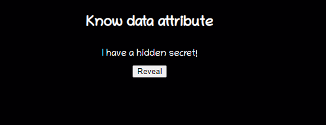
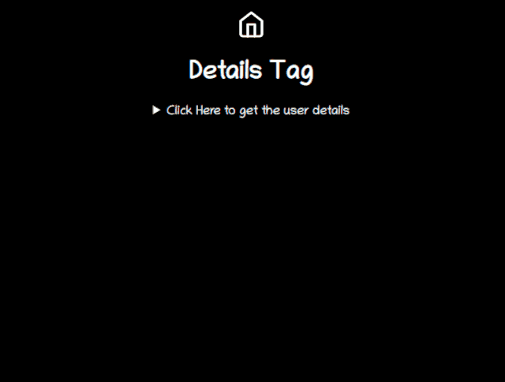
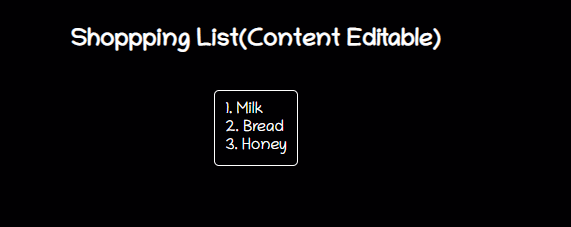

# 不常用标签

## 目录

- [select   下拉框](#select---下拉框)
- [datalist  input  自带输入 搜素](#datalist--input--自带输入-搜素)
- [data-set](#data-set)
- [不常见标签](#不常见标签)
- [个汉字加拼音ruby rt](#个汉字加拼音ruby-rt)
- [details summary展开收起组件](#details-summary展开收起组件)
- [progress meter原生进度条和进度](#progress-meter原生进度条和进度)
- [弹窗（dialog）](#弹窗dialog)
- [figcaption（包含的容器）](#figcaption包含的容器)
- [mark（标记）](#mark标记)
- [内容可编辑](#内容可编辑)

# **select   下拉框**

```javascript 
 <select>  
  <option value ="volvo">Volvo</option>  
<option value ="saab" selected>Saab</option>  
<option value="opel">Opel</option>  
<option value="audi">Audi</option>
</select>

```


# **datalist  input  自带输入 搜素**

```javascript 
 <input type="text" list='yuyan' placeholder='请选择语言'/>
     <datalist id='yuyan' >    
    <option value='中文' />    
    <option value='英文' />    
    <option value='日文' selected />    
    <option value='俄文'/>    
    <option value='法文' />
</datalist>

```


# **data-set**

data-\*属性用于存储页面或应用程序专用的自定义数据。可以在 JavaScript 代码中使用存储的数据来创建更多的用户体验。

data-\*属性由两部分组成

- 属性名不能包含任何大写字母，并且必须在前缀“data-”之后至少有一个字符
- 属性值可以是任何字符串

```javascript 
 <h2> Know data attribute </h2>
 <div 
       class="data-attribute" 
       id="data-attr" 
       data-custom-attr="You are just Awesome!"> 
   I have a hidden secret!  </div>
 <button onclick="reveal()">Reveal</button>

function reveal() {
let dataDiv = document.getElementById('data-attr');
    let value = dataDiv.dataset['customAttr'];
document.getElementById('msg').innerHTML = `<mark>${value}</mark>`;
}
```


**注意：** 要在 JS 中读取这些属性的值，可以通过getAttribute('data-custom-attr')g来获取，但是标准方式是用dataset来获取。



# **不常见标签**

```vue 
 <nav>
  <artical>
  <aside>
  <figure>
  <figcaption>
  <head>
  <footer>
  <section>
  <mark>
  <sup><sub>
  pre  代码块blockquote“blockquote”作为英文单词有“块引用”的意思<blockquote> 与 </blockquote> 
之间的所有文本都会从常规文本中分离出来，经常会在左、右两边进行缩进（增加外边距），而且有时会使用斜体。也就是说，块引用拥有它们自己的空间。
    <aside>定义页面内容之外的内容</aside> 
    <footer>定义文档或节的页脚</footer> 
    <header>定义文档或节的页眉</header> 
    <main>定义文档的主内容</main> 
    <nav>定义文档内的导航链接</nav>
```


# **个汉字加拼音ruby rt**

```javascript 
 <ruby>        做工程师不做码农          <rt>zuo gong cheng shi bu zuo ma nong</rt>      </ruby>
```


# **details summary展开收起组件**

```vue 
     <details>
        <summary>Click Here to get the user details</summary>
        <table>
          <tr>
            <th>#</th>
            <th>Name</th>
            <th>Location</th>
            <th>Job</th>
          </tr>
          <tr>
            <td>1</td>
            <td>Adam</td>
            <td>Huston</td>
            <td>UI/UX</td>
          </tr>
        </table>
</details>
```




# progress meter**原生进度条和进度**

```vue 
 IE 浏览器不支持 meter 标签。
  <meter value="3" min="0" max="10">
    </meter> 十分之三<meter value="0.6">
</meter> 
60%或者：
<progress>定义任务进度</progress>
<!-- 示例： -->
<style>
  progress {    
    -webkit-appearance: none;   
    width: 180px;    
    height: 18px;    
    background-color: transparent;
  }
  /* 表示总长度背景色 */
  progress::-webkit-progress-bar {    
    border-radius: 4px;   
    background-color: #efefef;    
    border: thin solid #efefef;
  }
  /* 表示已完成进度背景色 */
  progress::-webkit-progress-value {    
    border-top-left-radius: 4px;    
    border-bottom-left-radius: 4px;    
    background: teal;
  }
  progress::-moz-progress-bar {   
    background: #34538b;
  }
  progress::-ms-fill {    
    background: #34538b;
  }
</style>
<progress value="40" max="100"></progress>
```


\<meter>元素用来显示已知范围的标量值或者分数值。

不要将\<meter>用作进度条来使用，进度条对应的\<Progress> 标签。

# **弹窗（dialog）**

```vue 
 * close() 关闭
  * open() 打开（注意css样式的定位不变）
  * showModal() 打开（注意css样式的定位变为absolute，建议自定义样式）
  <dialog>定义对话框或窗口</dialog>
<!--  示例：  与form配合，这时点击两个按钮都会自动关闭  不与form配合，可手动调用close()关闭，从而避免自动关闭-->
<style>  
  dialog:not([open]) {   
    display: none; 
  }  
  dialog{
  }  
  dialog::backdrop{
  }
</style>
<dialog id="dialog">  
  <form method="dialog">    
    <p>      要关闭？    </p>    
    <button type="submit" value="false">取消</button>   
    <button type="submit" value="true">确定</button>  
  </form>
</dialog>
<script>  
  let d = document.getElementById("dialog"); 
  let s = d.showModal();  
  d.addEventListener("close", function() {   
    console.log(d.returnValue); //returnValue对应button上的value 
  });
</script>
```


# **figcaption（包含的容器）**

```vue 
 <figcaption>定义 
<figure> 元素的标题</figcaption>
<figure>定义自包含内容，比如图示、图表、照片、代码清单等等</figure>
<!-- 示例： -->
<figure>    
  <figcaption>我是图片的描述内容</figcaption>
</figure>
```


# **mark（标记）**

```vue 
 <mark>定义重要或强调的内容</mark>
/*示例：*/
<style>  
  mark {    
    background-color: red;    
    padding: 0 4px;    
    margin: 0 4px;    
    border-radius: 3px;    
    font-size: 15px;    
    color: #fff;  
  }
</style>
<p>今天加班了，下班时记得
  <mark>打卡</mark>
</p>
```


# 内容可编辑

contenteditable是可以在元素上设置以使内容可编辑的属性。它适用于DIV，P，UL等元素。

注意，当在元素上没有设置contenteditable属性时，它将从其父元素继承该属性。

```vue 
 <h2> Shoppping List(Content Editable) </h2>
 <ul class="content-editable" contenteditable="true">
     <li> 1. Milk </li>
     <li> 2. Bread </li>
     <li> 3. Honey </li>
</ul>
```




可以让span或div标签可编辑，并且可以使用css样式向其添加任何丰富的内容。这将比使用输入字段处理它更好。试试看！
