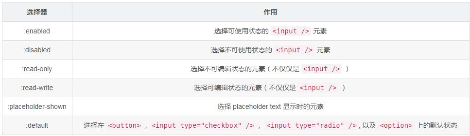
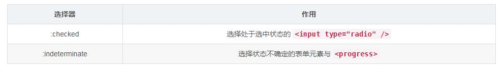
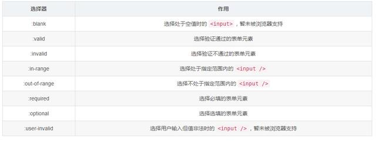
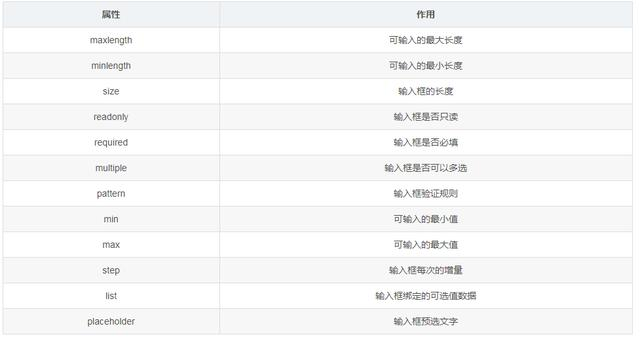
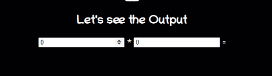
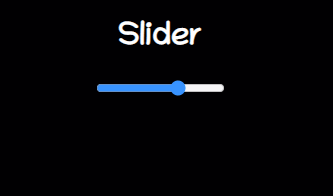
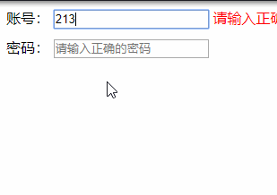
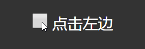
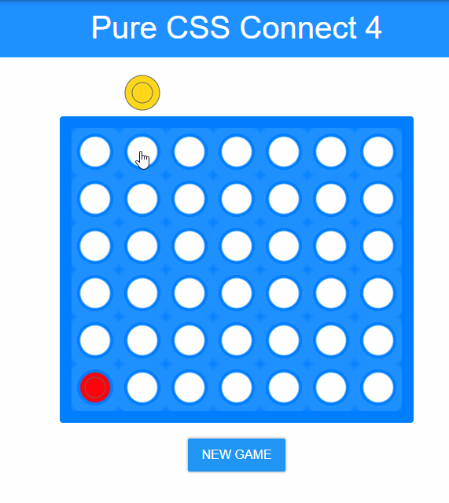
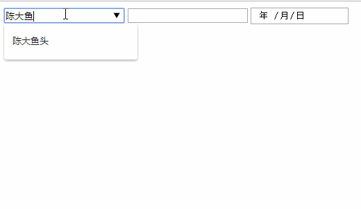

# input系列

## 目录

- [1.input(天秀）](#1input天秀)
  - [第一类：控制系（Input Control States）](#第一类控制系Input-Control-States)
  - [第二类：输出系（Input Value States）](#第二类输出系Input-Value-States)
  - [第三类：侦查系（Input Value-checking）](#第三类侦查系Input-Value-checking)
  - [type属性](#type属性)
  - [output](#output)
  - [Range(Slider)](#RangeSlider)
  - [Color picker](#Color-picker)
- [实例](#实例)
  - [1.表单验证invalid](#1表单验证invalid)
  - [2.状态切换:indeterminate](#2状态切换indeterminate)
  - [3.游戏 天秀 蒂花之秀](#3游戏-天秀-蒂花之秀)
  - [4.输入框绑定值](#4输入框绑定值)
  - [5.唤起键盘](#5唤起键盘)
  - [6唤起摄像头录像](#6唤起摄像头录像)

# **1.input(天秀）**

[HTML input 标签 | 菜鸟教程 HTML \&lt;input\&gt; 标签    实例 一个简单的 HTML 表单，包含两个文本输入框和一个提交按钮：  \[mycode3 type='html'\]    First name:    Last name:      \[/mycode3\]  尝试一下 » (本页底部可以查看更多实例)    浏览器支持         元素                               https://www.runoob.com/tags/tag-input.html](https://www.runoob.com/tags/tag-input.html "HTML input 标签 | 菜鸟教程 HTML \&lt;input\&gt; 标签    实例 一个简单的 HTML 表单，包含两个文本输入框和一个提交按钮：  \[mycode3 type='html']    First name:    Last name:      \[/mycode3]  尝试一下 » (本页底部可以查看更多实例)    浏览器支持         元素                               https://www.runoob.com/tags/tag-input.html")

## **第一类：控制系（Input Control States）**



## **第二类：输出系（Input Value States）**



## **第三类：侦查系（Input Value-checking）**



## **type属性**

\<input> 除了有很多相关的选择器，结合不同的type还有不同的属性可以供使用。他们的作用如下



## output

\<output> 标签表示计算或用户操作的结果。

```html 
<form oninput="x.value=parseInt(a.value) * parseInt(b.value)">
    <input type="number" id="a" value="0"> *
    <input type="number" id="b" value="0"> =
    <output name="x" for="a b"></output>
</form>
```




&#x20;   如果要在客户端 JS 中执行任何计算，并且希望结果反映在页面上，可以使用\<output>,这样就无需使用getElementById()获取元素的额外步骤。

## Range(Slider)

range是一种 input 类型，给定一个滑块类型的范围选择器。

```html 
<form method="post"> 
        <input 
          type="range" 
          name="range" 
          min="0" 
          max="100" 
          step="1" 
          value=""
          onchange="changeValue(event)" 
        />
</form>
<div class="range"> 
    <output id="output" name="result"> </output> 
</div>
```




## **Color picker**

一个简单的颜色选择器。

```html 
<input type="color" onchange="showColor(event)"> 

<p id="colorMe">Color Me!</p>
```


# **实例**

### **1.表单验证invalid**



```css 
    <style>

        :root {
             --error-color: red;
        }
        .form > input {
          margin-bottom: 10px;
        }
        .form > .f-tips {
          color: var(--error-color);
          display: none;
        }
**       /* 控制button的出现 */**
**        input[type="text"]:invalid ~ input[type="submit"],**
**        input[type="password"]:invalid ~ input[type="submit"] {**
**          display: none;**
**        }**
**        /* 聚焦但是验证不通过的 */**
**        input[required]:focus:invalid + span {**
**          display: inline;**
**        }**
**        /* 空的 */**
**        input[required]:empty + span {**
**          display: none;**
**        }**
**        /* 如哦placeholder 不存在且校验不通过的 */**
**        input[required]:invalid:not(:placeholder-shown) + span {**
**          display: inline;**
**        }**

    </style>
```


首先第一个class就是保证了在两个输入框不通过的时候隐藏，就是当输入框值为空或者不符合验证规则，则隐藏提交按钮。

第二个，第三个class则是控制当用户在输入框输入内容时，如果不符合验证规则，则显示错误信息，否则则隐藏。

第四个class则是用过 placeholder 是否存在来控制错误信息的显隐，如果 placeholder 不显示，则证明用户正在输入，错误信息则根据用户输入的值来判断是否显隐，否则则隐藏。

```html 
<form class="form" id="form" method="get" action="/api/form">
        账号： <input data-title="账号" placeholder="请输入正确的账号"  pattern="\w{6,10}" name="account" type="text" required /> 
        <span class="f-tips">请输入正确的账号</span> 
        <br />
    密码： <input data-title="密码" placeholder="请输入正确的密码" pattern="\w{6,10}" name="password" type="password"
        required /> 
        <span class="f-tips">请输入正确的密码</span>
            <br />
        <input name="button" type="submit" value="提交" />
</form>
```


### **2.状态切换**:indeterminate



上面我们有提到一个选择器 :indeterminate ，这个是用于选择状态不确定的表单元素与 \<progress> ，玩过扫雷的人都知道，右击除了可以选择红旗，还可以选择问号，就是选中，但不确定；又跟 promise 的 pending 状态类型，介于 resolve 与 reject 之间。

多了 :indeterminate 会给我们带来很多很有趣的体验。

```css 
<style>
    body {
        background: #333;
        color: #fff;
        padding: 20px;
        text-align: center;
    }
    input {
        margin-right: .25em;
        width: 30px;
        height: 30px;
    }
    label {
        position: relative;
        top: 1px;
        font-size: 30px;
    }
</style>
<body>
    <form> <input type="checkbox" id="checkbox"> <label for="option">点击左边</label> </form>
</body>

<script>

    'use strict';
    checkbox.addEventListener('click', ev => {
        if (ev.target.readOnly) {
            console.log(1) ev.target.checked = ev.target.readOnly = false;
        } else if (!ev.target.checked) {
            console.log(2) ev.target.readOnly = ev.target.indeterminate = true;
        };
    });
</script>
```


这里面其实没有什么复杂的实现，只是做了个中间态的判断，就非常轻松的实现了radio的三种状态切换。

### **3.游戏 天秀 蒂花之秀**



[input3.html](./assets/file/input3_8U5uFx5kH5.html "input3.html")

### **4.输入框绑定值**



```html 
<input type="text" list="names" multiple /> 
<datalist id="names">
    <option value="kris">
    <option value="陈大鱼头">
    <option value="深圳金城武">
</datalist> 
<input type="email" list="emails" multiple /> 
<datalist id="emails">
    <option value="chenjinwen77@foxmail.com" label="kris">
    <option value="chenjinwen77@gmail.com" label="kris">
</datalist> 
<input type="date" list="dates" /> 
<datalist id="dates">
    <option value="2019-09-03">
</datalist>
```


### **5.唤起键盘**

```javascript 
(/iphone|ipod|ipad/i.test(navigator.appVersion)) && document.addEventListener('blur',
        event => { // 当页面没出现滚动条时才执行，因为有滚动条时，不会出现这问题            
            // input textarea 标签才执行，因为 a 等标签也会触发 blur 事件        
            if (document.documentElement.offsetHeight <= document.documentElement.clientHeight && ['input',
                    'textarea'
                ].includes(event.target.localName)) {
                document.body.scrollIntoView() // 回顶部        
            }
        }, true)
```


### **6唤起摄像头录像**

[input\[type=file\]标签 本地文件、拍照、录像 上传的兼容性问题 - 吴飞ff - 博客园 移动端\&#160;input\[type=file\]标签 本地文件、拍照、录像 上传的兼容性问题：\&#160;https://blog.csdn.net/sinat\_35538827/article/d https://www.cnblogs.com/wfblog/p/12887737.html%A0](https://www.cnblogs.com/wfblog/p/12887737.html%A0 "input\[type=file]标签 本地文件、拍照、录像 上传的兼容性问题 - 吴飞ff - 博客园 移动端\&#160;input\[type=file]标签 本地文件、拍照、录像 上传的兼容性问题：\&#160;https://blog.csdn.net/sinat_35538827/article/d https://www.cnblogs.com/wfblog/p/12887737.html%A0")

****

当type为file

accept 属性并不会验证选中文件的类型，只是为开发者提供了一种引导用户做出期望行为的方式，用户还是有办法绕过浏览器的限制。

- audio/\* 表示所有音频文件 HTML5（支持）
- video/\* 表示视频文件 HTML5（支持）
- image/\* 表示图片文件 HTML5（支持）

支持逗号分隔的 MIME 类型字符串，写可以写成如下的方式：

- accept="image/png" 或者 accept=".png" ，只接受 png 图片。
- accept="image/png, image/jpeg" 或者 accept=".png, .jpg, .jpeg" ，接受 PNG 和 JPEG 文件。
- accept="image/ \*" ，接受任何图片文件类型。
- accept=".doc,.docx,.xml,application/msword,application/vnd.openxmlformats-officedocument.wordprocessingml.document" ，接受任何 MS Doc 文件类型。

capture（调用设备媒体）：

capture 属性：在webapp上使用 input 的 file 属性，指定 capture 属性可以调用系统默认相机、摄像和录音功能。

- capture="camera" 相机
- capture="camcorder" 摄像机
- capture="microphone" 录音
