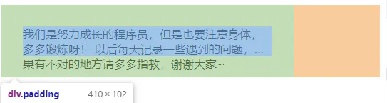

# 让overflow限制padding之内显示

[盒子模型](https://so.csdn.net/so/search?q=盒子模型\&spm=1001.2101.3001.7020 "盒子模型")的内容区域其实包括`content+padding`，即`padding box`，虽然正常情况下元素只在`content`内排布，但是当内容溢出到`padding`也是允许的，故`overflow:hidden`对此不做影响。

**如何隐藏溢出到padding的内容？**

- 如果是文字内容的话，暂时只能在父容器内在嵌套一个容器并在容器上 `overflow:hidden` 。
- 用 `margin` 或者 内部再嵌套一个容器
- 如果是背景图片的话，可以在父容器添加样式 `background-clip:content-box` 。
