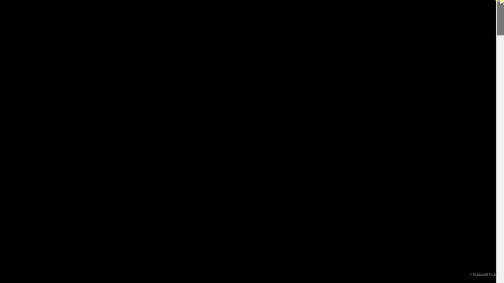

# 苹果官网滚动文字特效实现

## 目录

- [使用 background-clip 实现](#使用-background-clip-实现)
- [使用 mix-blend-mode 实现](#使用-mix-blend-mode-实现)
- [结合滚动实现动画](#结合滚动实现动画)

[ 超强的苹果官网滚动文字特效实现 - 掘金 每年的苹果新产品发布，其官网都会配套更新相应的单页滚动产品介绍页。其中的动画特效都非常有意思，今年 iPhone 14 Pro 的介绍页不例外。 最近，刚好有朋友问到，其对官网的一段文字特效特别感兴趣 https://juejin.cn/post/7156417273463799838](https://juejin.cn/post/7156417273463799838 " 超强的苹果官网滚动文字特效实现 - 掘金 每年的苹果新产品发布，其官网都会配套更新相应的单页滚动产品介绍页。其中的动画特效都非常有意思，今年 iPhone 14 Pro 的介绍页不例外。 最近，刚好有朋友问到，其对官网的一段文字特效特别感兴趣 https://juejin.cn/post/7156417273463799838")



## 使用 background-clip 实现

```html 
<!doctype html>
<html lang="en">
<head>
    <meta charset="UTF-8">
    <meta name="viewport"
          content="width=device-width, user-scalable=no, initial-scale=1.0, maximum-scale=1.0, minimum-scale=1.0">
    <meta http-equiv="X-UA-Compatible" content="ie=edge">
    <title>Document</title>
    <style>
        body, html {
            width: 100%;
            height: 100%;
            display: flex;
        }

        .g-wrap {
            margin: auto;
            display: flex;
            width: 100vw;
            height: 100vh;
            background: #000;
        }
        p {
            position: relative;
            width: 800px;
            font-size: 40px;
            color: transparent;
            margin: auto;
            line-height: 1.5;
            padding: 20px;
             background: linear-gradient(-4deg, transparent, transparent 25%, #ffb6ff, #b344ff,transparent 75%, transparent);
            -webkit-background-clip: text;
             background-size: 100% 400%;
             background-position: center 0;
            animation: textScroll 6s infinite linear alternate;
         }


         @keyframes textScroll {
            100% {
                background-position: center 100%;
            }
        }

 

    </style>
</head>
<body>
<div class="g-wrap">
    <p>灵动的 iPhone 新玩法，迎面而来。重大的安全新功能，为拯救生命而设计。创新的 4800 万像素主摄，让细节纤毫毕现。更有 iPhone 芯片中的速度之王，为一切提供强大原动力。
    </p>
</div>
</body>
</html>
```


我们这里核心的就是借助了 `linear-gradient(-4deg, transparent, transparent 25%, #ffb6ff, #b344ff,transparent 75%, transparent)` 这个渐变背景，实现一个**从透明到渐变色到透明**的渐变背景，配合了 `background-clip: text`。

再利用动画，控制背景的 `background-position`，这样一个文字渐现再渐隐的文字动画就实现了：

## 使用 mix-blend-mode 实现

```html 
<!doctype html>
<html lang="en">
<head>
    <meta charset="UTF-8">
    <meta name="viewport"
          content="width=device-width, user-scalable=no, initial-scale=1.0, maximum-scale=1.0, minimum-scale=1.0">
    <meta http-equiv="X-UA-Compatible" content="ie=edge">
    <title>Document</title>
    <style>
        .g-wrap {
            width: 100vw;
            height: 100vh;
            background: #000;
        }
        .text {
            position: relative;
            color: transparent;
            color: #fff;
            background: #000;
            overflow: hidden;
        }

        .bg {
            position: absolute;
            top: 0;
            left: 0;
            right: 0;
            width: 100%;
            height: 400%;
             background: linear-gradient(-3deg, #000, #000 25%, #ffb6ff 30%, #ffb6ff, #b344ff, #b344ff 70%, #000 75%, #000);
            mix-blend-mode: darken;
            animation: textScroll 6s infinite linear alternate;
        }
        @keyframes textScroll {
            100% {
                transform: translate(0, -75%);
            }
        }
 


    </style>
</head>
<body>

<div class="g-wrap">
    <div class="text">灵动的 iPhone 新玩法，迎面而来。重大的安全新功能，为拯救生命而设计。创新的 4800 万像素主摄，让细节纤毫毕现。更有 iPhone 芯片中的速度之王，为一切提供强大原动力。
        <div class="bg"></div>
    </div>
</div>

</body>
</html>
```


这里 `mix-blend-mode: darken` 的作用是，只有白色文字部分会显现出上层的 `.bg` 的颜色，而黑色背景部分与上层背景叠加的颜色仍旧为黑色，与 `background-clip: text` 有异曲同工之妙。

再简单的借助 `overflow: hidden`，裁剪掉 `.text` 元素外的背景移动，整个动画就实现了。

## 结合滚动实现动画

对于页面滚动配合动画时间轴，我们通常会使用 **GSAP。**

我们结合上述的混合模式的方法，很容易得到结合页面滚动的完整代码：

```html 
<div class="g-wrap">
    <div class="text">灵动的 iPhone 新玩法，迎面而来。重大的安全新功能，为拯救生命而设计。创新的 4800 万像素主摄，让细节纤毫毕现。更有 iPhone 芯片中的速度之王，为一切提供强大原动力。
        <div class="bg"></div>
    </div>
</div>
<div class="g-scroll"></div>

<style>
body, html {
    width: 100%;
    height: 100%;
}

.g-wrap {
    position: fixed;
    top: 0;
    left: 0;
    display: flex;
    width: 100vw;
    height: 100vh;
    background: #000;
    
    .text {
        position: relative;
        width: 800px;
        font-size: 40px;
        margin: auto;
        line-height: 1.5;
        padding: 20px;
        color: #fff;
        background: #000;
        overflow: hidden;
    }    
    
    .bg {
        position: absolute;
        top: 0;
        left: 0;
        right: 0;
        width: 100%;
        height: 400%;
        background: linear-gradient(-3deg, #000, #000 25%, #ffb6ff, #b344ff, #000 75%, #000);
        z-index: 1;
        mix-blend-mode: darken;
    }
}

.g-scroll {
    position: relative;
    width: 100vw;
    height: 400vw;
}


</style>
<script>

gsap.timeline({
    scrollTrigger: {
        trigger: ".g-scroll",
        start: "top top",
        end: "bottom bottom",
        scrub: 1
    }
}).fromTo(".bg", { y: 0 }, { y: "-75%" }, 0);
</script>
```
