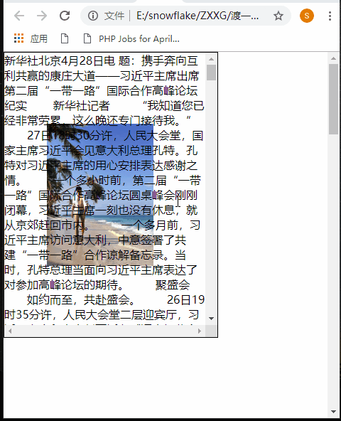
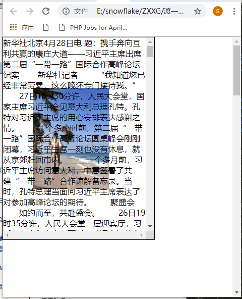
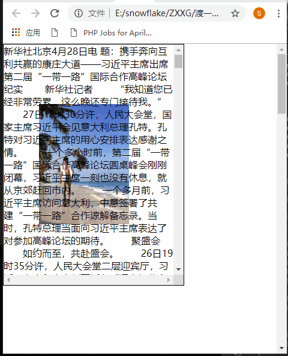

# background

## 目录

- [background](#background)
  - [color](#color)
  - [image](#image)
    - [url](#url)
  - [size](#size)
  - [position](#position)
  - [repeat](#repeat)
  - [attachment](#attachment)

# background

[https://www.cnblogs.com/ZheOneAndOnly/p/10786375.html](https://www.cnblogs.com/ZheOneAndOnly/p/10786375.html "https://www.cnblogs.com/ZheOneAndOnly/p/10786375.html")

```typescript 
background:bg-color bg-image position/bg-size bg-repeat bg-origin bg-clip bg-attachment initial|inherit;
```


| 值           | 描述            |
| ----------- | ------------- |
| padding-box | 背景图像填充框的相对位置  |
| border-box  | 背景图像边界框的相对位置  |
| content-box | 背景图像的相对位置的内容框 |

## color

背景颜色；没啥好说的；

## image

### url

\*\*多url的渲染原理是盒模型的背景叠层渲染，**按照rul的引入**顺序从上至下叠层。\*\*url的位置要错开


```typescript 
.new{
            width: 1000px;
            height: 500px;
            border: 20px solid rgba(0, 0, 0,0.5);
            margin-left: 20px;
            padding: 30px;
            background: url("./girl.jpg") no-repeat, url("./girl.jpg") no-repeat;
            background-size: 100px 120px,100px 120px;
            background-position: 0px 0px,100px 0px;
 }
```


## size

简单说一下背景图的大小： 数值、百分比、cover/contain

background-size:width height cover/contain &#x20;

- cover的效果是用一张图片将元素背景全部填充满，背景图片比例较大的那个方向会被切割一部分。
- contain的效果是用一种图片尽可能的填充元素的全部背景，背景图片比例较小的那个方向在元素上会出现留白

## position

```typescript 
/* Keyword values */
background-position: top;
background-position: bottom;
background-position: left;
background-position: right;
background-position: center;

/* <percentage> values */
background-position: 25% 75%;

/* <length> values */
background-position: 0 0;
background-position: 1cm 2cm;
background-position: 10ch 8em;

/* Multiple images */
background-position:
  0 0,
  center;

/* Edge offsets values */
background-position: bottom 10px right 20px;
background-position: right 3em bottom 10px;
background-position: bottom 10px right;
background-position: top right 10px;

/* Global values */
background-position: inherit;
background-position: initial;
background-position: revert;
background-position: unset;

```


## repeat

```typescript 
background-repeat: repeat;/*同等于*/background-repeat: repeat-x repeat-y;/*但是实质上不能出现这种写法*/
background-repeat: repeat-x;/*同等于*/background-repeat: repeat-x no-repeat;/*但是实质上不能出现这种写法*/
background-repeat: repeat-y;/* 同等于*/background-repeat: no-repeat repeat-y;/*但是实质上不能出现这种写法*/
background-repeat: round;/* 不能以整数次平铺时适度缩放背景图片* /background-repeat: round round;/*这两种写法一样*/
background-repeat: space;/*  不能整数平铺时均匀留白  */background-repeat: space space;/*这两种写法一样*/
background-repeat: round space;/*  表示不能整数次平铺时横向适度缩放 纵向均匀留白 x y */
```


round


space


## attachment

当滚动时，背景图片相对谁定位

- fixed：背景图片相对于视口固定
- scroll：背景图片相对于元素固定
- local：背景图片相对于元素内容固定

先来看background-attachment的默认值scroll的效果图：



local的效果



fixed的效果图



[background-origin/clip](./background-origin-clip/index.md "background-origin/clip")

[background-repeat](./background-repeat/index.md "background-repeat")
