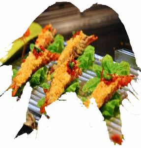

# mask

## 目录

- [mask](#mask)
  - [image](#image)
  - [mode](#mode)
  - [repeat](#repeat)
  - [position](#position)
  - [clip](#clip)
  - [origin](#origin)
  - [size](#size)
  - [type](#type)
  - [composite](#composite)

# mask

[ CSS mask遮罩\_巧克力很苦的博客-CSDN博客\_css mask 一、CSS mask遮罩的过往和现状CSS mask遮罩属性的历史非常久远了，远到比CSS3 border-radius等属性还要久远，最早是出现在Safari浏览器上的，差不多可以追溯到09年。不过那个时候，遮罩只能作为实验性的属性，做一些特效使用。毕竟那个年代还是IE浏览器的时代，属性虽好，但价值有限。但是如今情况却大有变化，除了IE和Edge浏览器不支持，Firefox，Chrome以... https://blog.csdn.net/qq\_44607694/article/details/90551133](https://blog.csdn.net/qq_44607694/article/details/90551133 " CSS mask遮罩_巧克力很苦的博客-CSDN博客_css mask 一、CSS mask遮罩的过往和现状CSS mask遮罩属性的历史非常久远了，远到比CSS3 border-radius等属性还要久远，最早是出现在Safari浏览器上的，差不多可以追溯到09年。不过那个时候，遮罩只能作为实验性的属性，做一些特效使用。毕竟那个年代还是IE浏览器的时代，属性虽好，但价值有限。但是如今情况却大有变化，除了IE和Edge浏览器不支持，Firefox，Chrome以... https://blog.csdn.net/qq_44607694/article/details/90551133")

mask 属性允许使用者**通过遮罩或者裁切特定区域的图片**的方式来隐藏一个元素的部分或者全部可见区域。

**常用属性**

- mask-image
- mask-mode
- mask-repeat
- mask-position
- mask-clip
- mask-origin
- mask-size
- mask-type
- mask-composite

所谓遮罩，就是**原始图片只显示遮罩图片非透明的部分**

### image

mask-image遮罩所支持的图片类型非常的广泛，可以是url()静态图片资源，格式包括JPG，PNG以及SVG等都是支持的；也可以是动态生成的图片，例如使用各种CSS3渐变绘制的图片。语法上支持CSS3各类渐变，以及url()功能符，image()功能符，甚至element()功能符。同时还支持多背景，因此理论上，使用mask-image我们可以遮罩出任意我们想要的图形，非常强大。

```typescript 
</img>
 .Xia{
     width:300px;
     height:300px;
     -webkit-mask-image: url(Xia.png);
     mask-image: url(Xia.png);
    }


```




**如果Xia.png加载失败，则Firefox，Chrome浏览器下直接原始图不显示**。

### mode

`mask-mode`属性的默认值是`match-source`，意思是根据资源的类型自动采用合适的遮罩模式。

因此，mask-mode支持下面3个属性值：

- mask-mode: alpha;此关键字指示应使用掩码层图像的透明度（阿尔法通道）值作为掩码值。
- mask-mode: luminance;此关键字指示掩膜层图像的亮度值应用作掩码值。
- mask-mode: match-source;（默认值）根据资源的类型自动采用合适的遮罩模式。

**因为**mask-image**支持多图片，因此**mask-mode**也支持多属性值，例如：**

```typescript 
mask-mode: alpha, match-source;

```


> 目前，`mask-mode`仅`Firefox`浏览器支持，因此，`Chrome`浏览器是看到的依然是基于alpha遮罩的效果，颜色不像上图那样淡。

### repeat

类似于`background-repeat`属性;不在重复

```typescript 
mask-repeat: repeat-x;
mask-repeat: repeat-y;
mask-repeat: repeat;
mask-repeat: no-repeat;
mask-repeat: space;
mask-repeat: round;

```


```typescript 
//mask-repeat也支持多属性值
mask-repeat: round repeat, space, repeat-x;
```


### position

\*\*`mask-position`****和****`background-position`\*\***支持的属性值和表现基本上都是一模一样的。**

```typescript 
mask-position: top;
mask-position: bottom;
mask-position: left;
mask-position: right;
mask-position: center;

mask-position: right top;
mask-position: 30% 50%;
mask-position: 10px 5rem;
mask-position: 0 0, center;

```


### clip

`mask-clip`属性性质上和`background-clip`类似，但是`mask-clip`支持的属性值要多一点，主要是多了个SVG元素的`mask-clip`支持。

```typescript 
mask-clip: content-box;
mask-clip: padding-box;
mask-clip: border-box;
mask-clip: fill-box;
mask-clip: stroke-box;
mask-clip: view-box;
mask-clip: no-clip;

```


> `fill-box`，`stroke-box`，`view-box`要与SVG元素关联才有效果，目前还没有任何浏览器对其进行支持。

## origin

`mask-origin`属性性质上和`background-origin`类似，但是`mask-origin`支持的属性值要多一点，主要是多了个SVG元素的`mask-origin`支持。

```typescript 
mask-origin: content-box;
mask-origin: padding-box;
mask-origin: border-box;
mask-origin: fill-box;
mask-origin: stroke-box;
mask-origin: view-box;

```


> `fill-box`，`stroke-box`，`view-box`要与SVG元素关联才有效果，目前还没有任何浏览器对其进行支持。

## size

`mask-size`属性性质上和`background-size`类似，支持的属性值也类似，作用是控制遮罩图片尺寸

```typescript 
mask-size: 50%;
mask-size: 3em;
mask-size: 12px;

mask-size: 50% auto;
mask-size: 3em 25%;
mask-size: auto 6px;

mask-size: cover;
mask-size: contain;
mask-size: 50%, 25%, 25%;
mask-size: 6px, auto, contain;


```


## type

&#x20;        mask-type属性功能上和mask-mode类似，都是设置不同的遮罩模式。但还是有个很大的区别，那就是**mask-type只能作用在SVG元素**上，本质上是由SVG属性演变而来，因此，Chrome等浏览器都是支持的。但是**mask-mode是一个针对所有元素的CSS3属性**，Chrome等浏览器并不支持，目前仅Firefox浏览器支持。

&#x20;      由于只能作用在SVG元素上，因此默认值表现为SVG元素默认遮罩模式，也就是默认值是`luminance`，亮度遮罩模式。如果需要支持透明度遮罩模式，可以这么设置：

```typescript 
mask-type: alpha;

```


## composite

- add;**遮罩累加。**
- subtract;**遮罩相减。也就是遮罩图片重合的地方不显示。意味着遮罩图片越多，遮罩区域越小。**
- intersect;**遮罩相交。也就是遮罩图片重合的地方才显示遮罩，。**
- exclude;**遮罩排除。也就是后面遮罩图片重合的地方排除，当作透明处理。**

> 以上属性值，目前仅`Firefox`浏览器支持，`Chrome`默认`mask-composite`计算值是`source-over`，和标准默认值`add`有些差异，作用是一样的，表示多个图片遮罩效果是累加。
