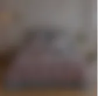
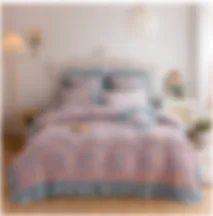

# backdrop-filter 滤镜

## 目录

- [介绍](#介绍)
- [区别
  ](#区别)
- [效果](#效果)
- [代码](#代码)

# 介绍

使用\*\* backdrop-filter 与 filter 都可以写出高斯模糊\*\*的效果，但是两者使用起来还是有区别的，而且使用的目标也不同，具体介绍如下：

区别

- backdrop-filter： 使背景模糊，不会影响到背景下面的图片
- filter ： 通常是定义 img的可视效果 ，修改图片的模糊效果，值越大越模糊

# 效果

两者的使用效果如下：

1. backdrop-filter：



1. filter ：



# 代码

1. `backdrop-filter：`

```react 
div {
  position: absolute;
  left: 0;
  top: 0;
  background: #FFCA7B;
  /* backdrop-filter  让背景模糊 */
  backdrop-filter: blur(5px);
}

```


1. `filter ：`

```react 
img {
  height: 320px;
  width: 100%;
  /* filter滤镜属性： blur 给图像设置高斯模糊 值越大越模糊，不接受百分比值*/
  filter: blur(5px);  
}

```
