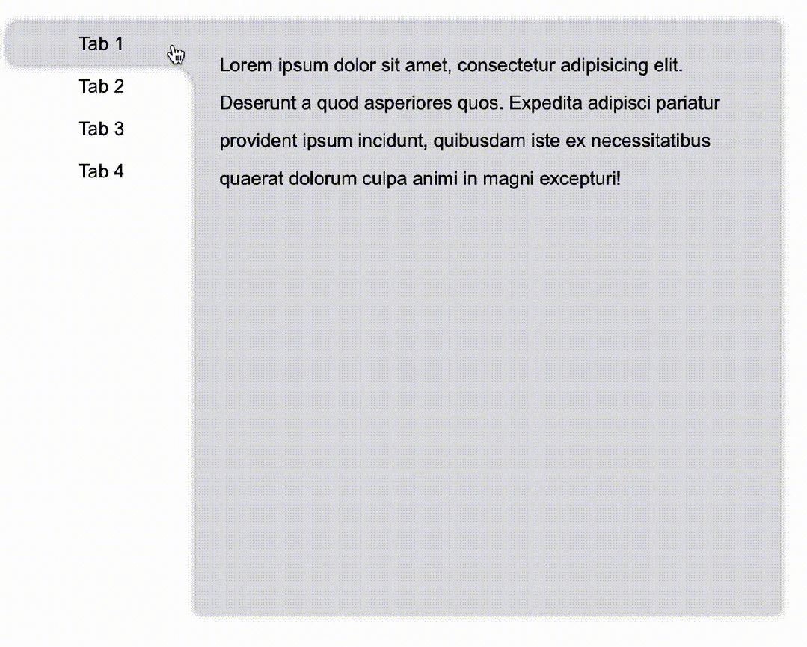
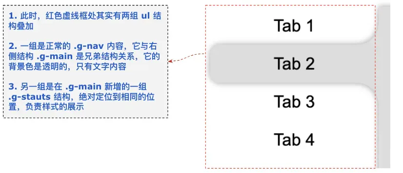

# drop-shadow

## 目录

- [借助伪元素实现不规则按钮](#借助伪元素实现不规则按钮)
- [利用 drop-shadow 实现按钮阴影](#利用-drop-shadow-实现按钮阴影)
- [修改布局结构，再借助利用 drop-shadow 实现统一阴影](#修改布局结构再借助利用-drop-shadow-实现统一阴影)
- [参考资料](#参考资料)
- [代码](#代码)



对于 Hover 导航 Tab 时候的内容切换，暂且不谈。本文，我们核心想探讨的是两个点：

1. 一是对于如下所示的不规则布局，应该如何实现：


并且，这里我们可能还需要给它加上阴影效果：


1. 如何配合 Hover 动作，实现整个切换效果

带着这两个问题，我们一起来尝试慢慢把这个效果实现。

## 借助伪元素实现不规则按钮

首先，我们需要实现这个效果：


这个，其实在很多篇文章都有提及过：

- 由小见大！不规则造型按钮解决方案\[1]
- 使用 CSS 轻松实现高频出现的各类奇形怪状按钮\[2]

想一想，这里其实就是竖向的 Chrome 分 Tab 的效果：

像是这样：


我们对这个按钮形状拆解一下，这里其实是 3 块的叠加：


只需要想清楚如何实现两侧的弧形三角即可。这里还是借助了渐变 -- **径向渐变**，其实他是这样，如下图所示，我们只需要把黑色部分替换为透明即可，使用两个伪元素即可：

代码如下：

```javascript 
<div class="outside-circle"></div>
.outside-circle {
    position: relative;
    background: #e91e63;
    border-radius: 10px 10px 0 0;

    &::before {
        content: "";
        position: absolute;
        width: 20px;
        height: 20px;
        left: -20px;
        bottom: 0;
        background: #000;
         background:radial-gradient(circle at 0 0, transparent 20px, #e91e63 21px); 
    }
    &::after {
        content: "";
        position: absolute;
        width: 20px;
        height: 20px;
        right: -20px;
        bottom: 0;
        background: #000;
         background:radial-gradient(circle at 100% 0, transparent 20px, #e91e63 21px);
     }
}


```


即可得到：


我们照葫芦画瓢，即可非常轻松的实现竖向的相同的效果，示意图如下：


## 利用 drop-shadow 实现按钮阴影

好，接下来，我们需要给按钮添加上阴影效果，像是这样：


因为使用了两个伪元素，当前单个按钮在 Hover 状态下的大致代码如下：

```sass (scss)  
li {
    position: relative;
    width: 160px;
    height: 36px;
    border-radius: 10px 0 0 10px;
    background: #ddd;

    &::before,
    &::after {
        content: "";
        position: absolute;
        right: 0;
        border-radius: unset;
    }

    &::before {
        width: 20px;
        height: 20px;
        top: -20px;
        background: radial-gradient(circle at 0 0, transparent, transparent 19.5px, #ddd 20px, #ddd);
    }
    &::after {
        width: 20px;
        height: 20px;
        bottom: -20px;
        background: radial-gradient(circle at 0 100%, transparent, transparent 19.5px, #ddd 20px, #ddd);
    }
}


```


如果使用 `box-shadow` 肯定是不行的，整个效果就会露馅：

尝试给按钮添加一个 `box-shadow: 0 0 5px 0 #333`：


弯曲的连接处，明显没有阴影效果，怎么解决呢？

嗯哼，老读者一定也知道，这里我们需要**对整个可见部分添加阴影，需要使用 ****`filter:drop-shadow()`****。**

`drop-shadow()` 滤镜的作用用于**创建一个符合元素（图像）本身形状（alpha 通道）的阴影。其中，最为常见的技巧，就是利用它生成不规则图形的阴影。**

因此，我们把上述的 `box-shadow` 替换成：`filter: drop-shadow(0 0 5px #ddd)`：


这样，我们就实现了基于单个不规则按钮的阴影效果。

但是，显然事情还没有结束。

## 修改布局结构，再借助利用 drop-shadow 实现统一阴影

记得我们上面提到过的 HTML 的布局吗？正常而言，右侧的主体内容和左侧的导航，结构是分离的：

```sass (scss)  
<div class="g-container">
    <div class="g-nav">
        <ul>
            <li>Tab 1</li>
            // ...
        </ul>
    </div>
    <div class="g-main">
        <ul class="g-content">
            <li>...</li>
            // ...
        </ul>
    </div>
</div>
```


因此，这里最为麻烦的地方在于，**左侧按钮的阴影，需要和右侧的主体内容连在一起！**，所以当我们给右侧的 `.g-main` 也添加上相同的 `filter:drop-shadow()` 时，整个效果会变得非常奇怪：

```sass (scss)  
// 当前被 Hover 的 li
.g-nav li {
    filter: drop-shadow(0 0 5px #ddd)
}
// 右侧的主体
.g-main {
    filter: drop-shadow(0 0 5px #ddd)
}

```


无论层级谁在上，整体阴影的展示都会瑕疵：


所以，如果想要实现整个元素的阴影是一整个的整体的效果，我们就不得不另辟蹊径。

这里，我们的思路如下：

1. 可以尝试在 `.g-main` 中，添加一组与 `.g-nav` 相同的结构，负责样式层面的展示
2. 把新增的结构，利用绝对定位，让其与实际的导航位置重叠
3. 在原本的 `.g-nav` 中，通过 `:has()` 伪类，传递实时的 Hover 状态

基于此，我们需要改造一下我们的结构：

```sass (scss)  
<div class="g-container">
    <div class="g-nav">
        <ul>
            <li>Tab 1</li>
            <li>Tab 2</li>
            <li>Tab 3</li>
            <li>Tab 4</li>
        </ul>
    </div>
    <div class="g-main">
        <ul class="g-status">
            <li></li>
            <li></li>
            <li></li>
            <li></li>
        </ul>
        <ul class="g-content">
            <li>...</li>
            // ...
        </ul>
    </div>
</div>

```


仔细看上面的结构，我们多了一组 `.g-stauts` 结构，放置在了 `.g-main` 之下。其 li 个数与实际的导航 `.g-nav` 保持一致，并且高宽大小都是一模一样的。

并且，可以利用绝对定位，让其完全叠加在 `.g-nav` 的位置上。

然后，我们把上述类 Chrome Tab 样式的不规则按钮结构的 CSS 代码结构，都赋给 `.g-status` 下的 li。

此时，由于不规则按钮结构和右侧的主体内容结构，其实是在一个父 div 之下，所以，我们只需要给 `.g-main` 元素添加 `filter: drop-shadow()`，就可以实现一整个整体的阴影效果：



最后，我们利用 :has() 伪类，传递实时的 Hover 状态，把内外的结构连接起来。

最后，我们利用 `:has()` 伪类，传递实时的 Hover 状态，把内外的结构连接起来。

最为核心的代码如下：

```sass (scss)  
.g-main {
    background: #ddd;
    filter: drop-shadow(0 0 3px #999);
}
.g-status {
    position:absolute;
    left: -160px;
    top: 0;
    width: 160px;

    li {
        width: 160px;
        height: 36px;
        position: relative;
        background: #ddd;
        opacity:0;

        &::before,
        &::after {
            content: "";
            position: absolute;
            right: 0;
            border-radius: unset;
        }
        &::before {
            width: 20px;
            height: 20px;
            top: -20px;
            background: radial-gradient(circle at 0 0, transparent, transparent 19.5px, #ddd 20px, #ddd);
        }
        &::after {
            width: 20px;
            height: 20px;
            bottom: -20px;
            background: radial-gradient(circle at 0 100%, transparent, transparent 19.5px, #ddd 20px, #ddd);
        }
    }
}
.g-status li {
    opacity: 0;
}
.g-nav:has(li:nth-child(1):hover) + .g-main {
    .g-status li:nth-child(1) {
        opacity: 1;
    }
}
.g-nav:has(li:nth-child(2):hover) + .g-main {
    .g-status li:nth-child(2) {
        opacity: 1;
    }
}
.g-nav:has(li:nth-child(3):hover) + .g-main {
    .g-status li:nth-child(3) {
        opacity: 1;
    }
}
.g-nav:has(li:nth-child(4):hover) + .g-main {
    .g-status li:nth-child(4) {
        opacity: 1;
    }
}


```


什么意思呢？解释一下：

1. 事先把每一个 Tab 被 Hover 时的样式，都写在了 `.g-stauts` 中，并且再提醒一下，这个结构是在 `.g-main` 之下的。然后，默认设置隐藏即可；
2. 实际触发 Hover 动画效果，是正常的 `.g-nav` 下的一个一个的 li 结构；
3. 当 `.g-nav` 下的一个一个的 li 被 Hover 时，我们通过 `:has()` 伪类，能够拿到此事件，并且根据当前是第几个元素被 hover，对应的控制实际在 `.g-main` 下的结构进行样式的展示；

> 不太了解的 `:has()` 伪类的小伙伴，可以先读一读这篇文章 -- 浅谈逻辑选择器 is、where、not、has\[3]，此伪类的诞生，填补了在之前 CSS 选择器中，没有父选择器的空缺。**让我们能够在父元素节点上，根据子元素的状态变化，做出样式的调整。**

这样，我们就最终实现了我们文章一开始的效果：


文章可能有部分内容没有阐述的很清晰，完整的代码其实行数非常之少，对文章内容还不太理解的建议戳进 DEMO 中看看。

完整的 DEMO 效果：CodePen Demo -- Tab Hover Effect\[4]

有小伙伴会有疑问，为什么不直接在 `.g-nav` 导航结构和 `.g-main` 结构的父节点直接添加 `drop-shadow()`，不是也可以实现一样的效果吗？

是的，对于本文贴出的代码效果，是可以实现一样的效果。但是，实际业务中，`.g-nav` 会更复杂，它们的共同父元素下也可能还有其他元素，实际情况远比本文贴出来的结构复杂，因此借助多一层虚拟 ul，实际上是更好的解法。

# 参考资料

\[1]由小见大！不规则造型按钮解决方案: [*https://github.com/chokcoco/iCSS/issues/224*](https://github.com/chokcoco/iCSS/issues/224 "https://github.com/chokcoco/iCSS/issues/224")

\[2]使用 CSS 轻松实现高频出现的各类奇形怪状按钮: [*https://github.com/chokcoco/iCSS/issues/152*](https://github.com/chokcoco/iCSS/issues/152 "https://github.com/chokcoco/iCSS/issues/152")

\[3]浅谈逻辑选择器 is、where、not、has: [*https://github.com/chokcoco/iCSS/issues/181*](https://github.com/chokcoco/iCSS/issues/181 "https://github.com/chokcoco/iCSS/issues/181")

\[4]CodePen Demo -- Tab Hover Effect: [*https://codepen.io/Chokcoco/pen/oNONwdM?editors=0100*](https://codepen.io/Chokcoco/pen/oNONwdM?editors=0100 "https://codepen.io/Chokcoco/pen/oNONwdM?editors=0100")

\[5]Github -- iCSS: [*https://github.com/chokcoco/iCSS*](https://github.com/chokcoco/iCSS "https://github.com/chokcoco/iCSS")

# 代码

```html 
<div class="g-container">
    <div class="g-nav">
        <ul>
            <li>Tab 1</li>
            <li>Tab 2</li>
            <li>Tab 3</li>
            <li>Tab 4</li>
        </ul>
    </div>
    <div class="g-main">
        <ul class="g-status">
            <li></li>
            <li></li>
            <li></li>
            <li></li>
        </ul>
        <ul class="g-content">
            <li>
                <p>Lorem ipsum dolor sit amet, consectetur adipisicing elit. Deserunt a quod asperiores quos. Expedita adipisci pariatur provident ipsum incidunt, quibusdam iste ex necessitatibus quaerat dolorum culpa animi in magni excepturi!</p>
            </li>
            <li>
                <p>Lorem ipsum dolor sit amet, consectetur adipisicing elit. Deserunt a quod asperiores quos. Expedita adipisci pariatur provident ipsum incidunt, quibusdam iste ex necessitatibus quaerat dolorum culpa animi in magni excepturi!</p>
                <p>Lorem ipsum dolor sit amet, consectetur adipisicing elit. Deserunt a quod asperiores quos. Expedita adipisci pariatur provident ipsum incidunt, quibusdam iste ex necessitatibus quaerat dolorum culpa animi in magni excepturi!</p>
            </li>
            <li>
                <p>Lorem ipsum dolor sit amet, consectetur adipisicing elit. Deserunt a quod asperiores quos. Expedita adipisci pariatur provident ipsum incidunt, quibusdam iste ex necessitatibus quaerat dolorum culpa animi in magni excepturi!</p>
                <p>Lorem ipsum dolor sit amet, consectetur adipisicing elit. Deserunt a quod asperiores quos. Expedita adipisci pariatur provident ipsum incidunt, quibusdam iste ex necessitatibus quaerat dolorum culpa animi in magni excepturi!</p>
                <p>Lorem ipsum dolor sit amet, consectetur adipisicing elit. Deserunt a quod asperiores quos. Expedita adipisci pariatur provident ipsum incidunt, quibusdam iste ex necessitatibus quaerat dolorum culpa animi in magni excepturi!</p>
            </li>
            <li>
                <p>Lorem ipsum dolor sit amet, consectetur adipisicing elit. Deserunt a quod asperiores quos. Expedita adipisci pariatur provident ipsum incidunt, quibusdam iste ex necessitatibus quaerat dolorum culpa animi in magni excepturi!</p>
            </li>
        </ul>
    </div>
</div>
```


```sass (scss)  
body, html {
    width: 100%;
    height: 100%;
    display: flex;
    background: #fff;
    padding: 10px;
}

* {
    box-sizing: border-box;
}

.g-container {
    position: absolute;
    display: flex;
    flex-direction: row;
    margin: auto;
    width: 90%;
    height: 80vh;
    bottom: 0;
}
.g-nav {
    width: 160px;
    flex-shrink: 0;
    z-index: 1;
    
    ul {
        width: 100%;
        display: flex;
        flex-direction: column;
    }
    
    li {
        text-align: center;
        line-height: 36px;
        cursor: pointer;
    }
}
 .g-nav:has(li:nth-child(1):hover) +  .g-main {
    .g-status li:nth-child(1) {
        opacity: 1;
    }
    .g-content li {
        display: none;
    }
    .g-content li:nth-child(1) {
        display: block;
    }
}
 .g-nav:has(li:nth-child(2):hover) +  .g-main {
    .g-status li:nth-child(2) {
        opacity: 1;
    }
    .g-content li {
        display: none;
    }
    .g-content li:nth-child(2) {
        display: block;
    }
}
 .g-nav:has(li:nth-child(3):hover)  + .g-main {
    .g-status li:nth-child(3) {
        opacity: 1;
    }
    .g-content li {
        display: none;
    }
    .g-content li:nth-child(3) {
        display: block;
    }
}

.g-nav:has(li:nth-child(4):hover) + .g-main {
    .g-status li:nth-child(4) {
        opacity: 1;
    }
    .g-content li {
        display: none;
    }
    .g-content li:nth-child(4) {
        display: block;
    }
}

.g-main {
    position: relative;
    flex-grow: 1;
    line-height: 2;
    height: 500px;
    padding: 20px;
    background: #ddd;
     filter: drop-shadow(0 0 3px #999);
     
    .g-content {
        position: relative;
        
        li {
            position: absolute;
            left: 0;
            top: 0;
            display: none;
        }
        
        li:nth-child(1) {
            display: block;
        }
    }
}

.g-status {
    position:absolute;
    left: -160px;
    top: 0;
    width: 160px;

    li {
        width: 160px;
        height: 36px;
    }

    li {
        position: relative;
        border-radius: 10px 0 0 10px;
        background: #ddd;
        opacity:0;

        &::before,
        &::after {
            content: "";
            position: absolute;
            right: 0;
            border-radius: unset;
        }

        &::before {
            width: 20px;
            height: 20px;
            top: -20px;
             background: radial-gradient(circle at 0 0, transparent, transparent 19.5px, #ddd 20px, #ddd); 
        }
        &::after {
            width: 20px;
            height: 20px;
            bottom: -20px;
             background: radial-gradient(circle at 0 100%, transparent, transparent 19.5px, #ddd 20px, #ddd);
         }
    }

    li:nth-child(1) {
        &::before {
            content:unset;
        }
    }
}
```
