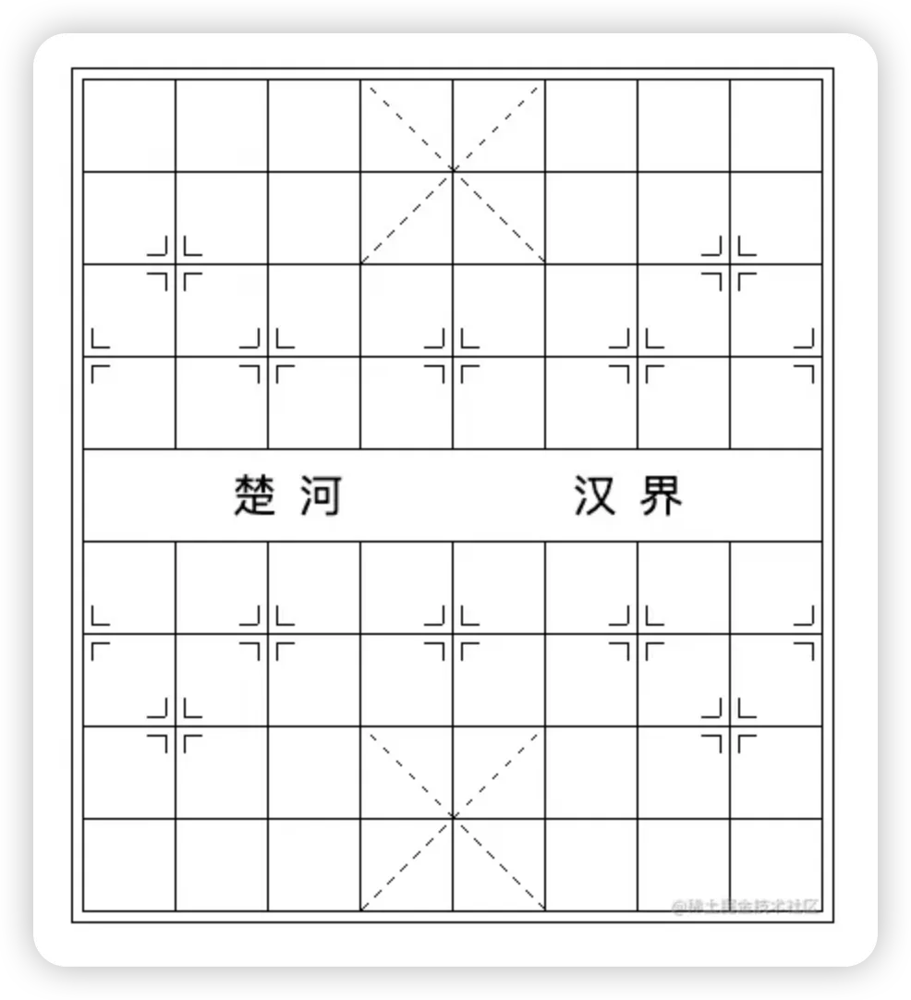

# repeating-linear-gradient

[ 单标签实现复杂的棋盘布局 - 掘金 最近，有群友问我，他们的一个作业，尽量使用少的标签去实现这样一个象棋布局： 他用了 60 多个标签，而他的同学，只用了 6 个，问我有没有办法尽可能的做到利用更少的标签去完成这个布局效果。 其实，对于 https://juejin.cn/post/7145282619834368013?share\_token=d58e7e20-c44d-4705-8d8c-9db8f655716c#comment](https://juejin.cn/post/7145282619834368013?share_token=d58e7e20-c44d-4705-8d8c-9db8f655716c#comment " 单标签实现复杂的棋盘布局 - 掘金 最近，有群友问我，他们的一个作业，尽量使用少的标签去实现这样一个象棋布局： 他用了 60 多个标签，而他的同学，只用了 6 个，问我有没有办法尽可能的做到利用更少的标签去完成这个布局效果。 其实，对于 https://juejin.cn/post/7145282619834368013?share_token=d58e7e20-c44d-4705-8d8c-9db8f655716c#comment")

```html 
<!doctype html>
<html lang="en">
<head>
    <meta charset="UTF-8">
    <meta name="viewport"
          content="width=device-width, user-scalable=no, initial-scale=1.0, maximum-scale=1.0, minimum-scale=1.0">
    <meta http-equiv="X-UA-Compatible" content="ie=edge">
    <title>Document</title>
    <style>
        html, body {
            width: 100%;
            height: 100%;
        }
        body {
            display: flex;
        }
        .g-grid {
            position: relative;
            margin: auto;
            width: 401px;
            height: 451px;
            outline: 1px solid #000;
            outline-offset: 5px;
            background:
            /*// 最上层的白色块，挡住中间的网格*/
            linear-gradient(#fff, #fff),
            /*// 实现网格布局*/
            repeating-linear-gradient(#000, #000 1px, transparent 1px, transparent 50px),
            repeating-linear-gradient(90deg, #000, #000 1px, transparent 1px, transparent 50px),
            /*// 棋盘上方的虚线1*/
            repeating-linear-gradient(-45deg, transparent 0, transparent 5px, #fff 5px, #fff 10px),
            linear-gradient(45deg, transparent,
            transparent calc(50% - 0.5px),
            #000 calc(50% - 0.5px),
            #000 calc(50% + 0.5px),
            transparent calc(50% + 0.5px),
            transparent 0),
            /*// 棋盘上方的虚线2*/
            repeating-linear-gradient(45deg, transparent 0, transparent 5px, #fff 5px, #fff 10px),
            linear-gradient(-45deg, transparent,
            transparent calc(50% - 0.5px),
            #000 calc(50% - 0.5px),
            #000 calc(50% + 0.5px),
            transparent calc(50% + 0.5px),
            transparent 0),
            /*// 棋盘下方的虚线1*/
            repeating-linear-gradient(-45deg, transparent 0, transparent 5px, #fff 5px, #fff 10px),
            linear-gradient(45deg, transparent,
            transparent calc(50% - 0.5px),
            #000 calc(50% - 0.5px),
            #000 calc(50% + 0.5px),
            transparent calc(50% + 0.5px),
            transparent 0),
            /*// 棋盘下方的虚线2*/
            repeating-linear-gradient(45deg, transparent 0, transparent 5px, #fff 5px, #fff 10px),
            linear-gradient(-45deg, transparent,
            transparent calc(50% - 0.5px),
            #000 calc(50% - 0.5px),
            #000 calc(50% + 0.5px),
            transparent calc(50% + 0.5px),
            transparent 0);
            background-repeat: no-repeat;
            background-size:
            calc(100% - 2px) 49px, 100% 100%, 100% 100%,
            /*// 交叉虚线 1*/
            100px 100px, 100px 100px, 100px 100px, 100px 100px,
            /*// 交叉虚线 2*/
            100px 100px, 100px 100px, 100px 100px, 100px 100px;
            background-position:
            1px 201px, 0 0, 0 0,
            /*// 交叉虚线 1*/
            151px 0, 151px 0, 151px 0, 151px 0,
            /*// 交叉虚线 2*/
            151px 350px, 151px 350px, 151px 350px, 151px 350px;
            line-height: 451px;
            font-size: 24px;
            text-align: center;
            letter-spacing: 12px;
            white-space: pre-wrap;
        }
        .g-grid::before {
            content: "";
            position: absolute;
            top: 95px;
            left: 35px;
            width: 10px;
            height: 1px;
            background: #000;
            color: #000;
            box-shadow:
                    20px 0, 0 10px, 20px 10px,
                    300px 0, 320px 0, 300px 10px, 320px 10px,
                    -30px 50px, -30px 60px,
                    50px 50px, 50px 60px, 70px 50px, 70px 60px,
                    150px 50px, 150px 60px, 170px 50px, 170px 60px,
                    250px 50px, 250px 60px, 270px 50px, 270px 60px,
                    350px 50px, 350px 60px;
            -webkit-box-reflect: below 259px;
        }
        .g-grid::after{
            content: "";
            position: absolute;
            top: 85px;
            left: 45px;
            width: 1px;
            height: 10px;
            background: #000;
            color: #000;
            box-shadow:
                    10px 0, 0 20px, 10px 20px,
                    300px 0px, 300px 20px, 310px 0, 310px 20px,
                    -40px 50px, -40px 70px,
                    50px 50px, 50px 70px, 60px 50px, 60px 70px,
                    150px 50px, 150px 70px, 160px 50px, 160px 70px,
                    250px 50px, 250px 70px, 260px 50px, 260px 70px,
                    350px 50px, 350px 70px;
            -webkit-box-reflect: below 260px;
        }
    </style>
</head>
<body>
<div class="g-grid">楚河       汉界</div>
</body>
<script>


</script>
</html>
```



