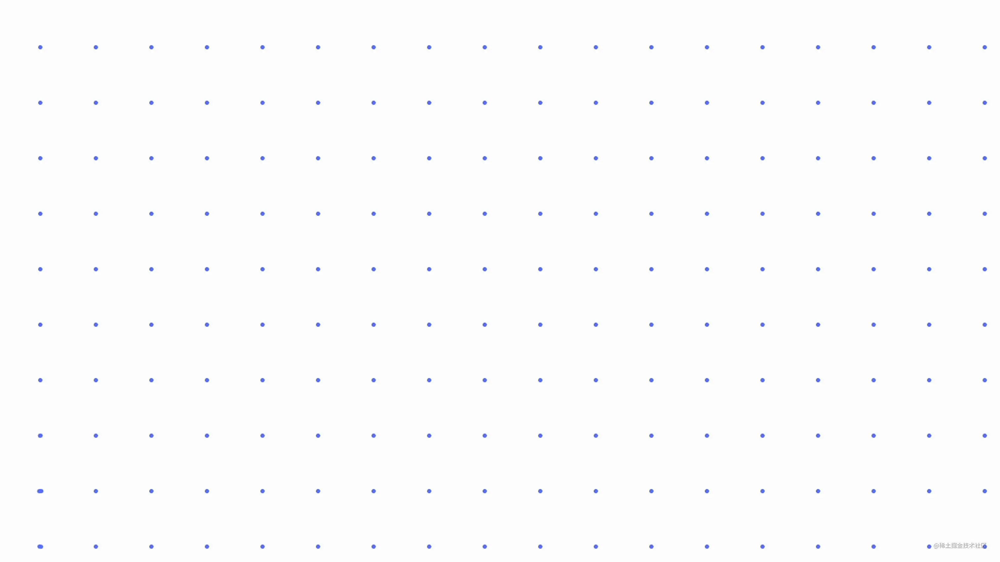

# 磁吸 Houdini-Painting

## 目录

- [CSS Paint API](#CSS-Paint-API)
- [磁吸 🧲 效果](#磁吸--效果)



鼠标在画布上移动的时候，吸铁石们会被吸引，旋转。使用 `Canvas` 实现这个效果并不难。恰好最近看了一点 `Houdini` 的文档。

看十遍文档不如写一篇文章掌握来得快，所以这篇文章，将使用 [Houdini](https://link.juejin.cn/?target=https://developer.mozilla.org/en-US/docs/Web/Guide/Houdini "Houdini") 的 [Paint API](https://link.juejin.cn/?target=https://developer.chrome.com/blog/paintapi/ "Paint API") 来复刻这个磁吸效果。

```html 
<!doctype html>
<html lang="en">
<head>
    <meta charset="UTF-8">
    <meta name="viewport"
          content="width=device-width, user-scalable=no, initial-scale=1.0, maximum-scale=1.0, minimum-scale=1.0">
    <meta http-equiv="X-UA-Compatible" content="ie=edge">
    <title>Document</title>
    <style>
        * {
            box-sizing: border-box;
            padding: 0;
            margin: 0;
        }

        div {
            width: 100vw;
            height: 100vh;
            padding: 80px;
            --magnet-color: rgb(97, 123, 255);
            --magnet-size: 4;
            --magnet-gap: 40;
            --magnet-radius: 200;
            background: paint(magnet-matrix);
        }
    </style>
</head>
<body>
<div></div>
</body>
<script>
    document.getElementsByTagName('div')[0].addEventListener('mouseenter', function (e) {
        this.style.setProperty('--mouse-x', e.clientX);
        this.style.setProperty('--mouse-y', e.clientY);
    })
    document.getElementsByTagName('div')[0].addEventListener('mousemove', function (e) {
        this.style.setProperty('--mouse-x', e.clientX);
        this.style.setProperty('--mouse-y', e.clientY);
    })
    document.getElementsByTagName('div')[0].addEventListener('mouseleave', function (e) {
        this.style.setProperty('--mouse-x', -999);
        this.style.setProperty('--mouse-y', -999);
    })

    CSS.paintWorklet.addModule(`data:application/javascript;charset=utf8,${encodeURIComponent(`
  class MagnetMatrixPaintWorklet {
    static get inputProperties() { return ['--mouse-x', '--mouse-y', '--magnet-color', '--magnet-size', '--magnet-gap', '--magnet-radius']; }

    paint(ctx, size, props) {
      const mouseX = parseInt(props.get('--mouse-x'))
      const mouseY = parseInt(props.get('--mouse-y'))
      const color = props.get('--magnet-color')
      const lineWidth = parseInt(props.get('--magnet-size'))
      const gap = parseInt(props.get('--magnet-gap'))
      const radius = parseInt(props.get('--magnet-radius'))
      ctx.lineCap = "round";
      for (let i = 0; i * gap < size.width; i++) {
        for (let j = 0; j * gap < size.height; j++) {
          const posX = i * gap
          const posY = j * gap
          const distance = Math.sqrt(Math.pow(posX - mouseX, 2) + Math.pow(posY - mouseY, 2))
          const width = distance < radius ? (1 - distance / radius * distance / radius) * gap * 0.4 : 0
          const startPosX = posX - width * 0.5
          const endPosX = posX + width * 0.5
          const rotate = Math.atan2(mouseY - posY, mouseX - posX)

          ctx.save()
          ctx.beginPath();
          ctx.translate(posX, posY);
          ctx.rotate(rotate);
          ctx.translate(-posX, -posY);
          ctx.moveTo(startPosX, posY);
          ctx.strokeStyle = color
          ctx.lineWidth = lineWidth;
          ctx.lineCap = "round";
          ctx.lineTo(endPosX, posY);
          ctx.stroke()
          ctx.closePath()
          ctx.restore()
        }
      }
    }
  }

  registerPaint('magnet-matrix', MagnetMatrixPaintWorklet);
`)}`)
</script>
</html>
```


## CSS Paint API

Houdini 提供了 [**Paint API**](https://link.juejin.cn?target=https://developer.mozilla.org/en-US/docs/Web/API/CSS_Painting_API "Paint API")**，** 基于这个 API 提供的 2D 渲染 context([CanvasRenderingContext2D](https://link.juejin.cn?target=https://developer.mozilla.org/en-US/docs/Web/API/CanvasRenderingContext2D "CanvasRenderingContext2D") 的子集)，开发者就可以通过编写 JS 代码来为元素提供 background-image/border-image/mask-image 等。

要创建这样的渲染上下文，需要先创建一个 PaintWorklet，和 Worker 类似，**Worklet 可以让绘制的代码脱离 JS 主线程去执行。**

首先创建一个最基础的 Worklet 类，**这个类需要提供 ****`paint`****，浏览器在合适的时候调用这个方法**，\*\*并传入 ****`ctx`**** (类似 Canvas 上下文) 以及 ****`size`**** 元素的尺寸信息。\*\*调用 `ctx` 的绘制方法，就可以绘制任何你希望绘制的内容了，以下面的自定义背景色绘制器为例：

```javascript 
class CustomBackgroundPainter {
    paint(ctx, size) {
      const color = '#2ecc71';
      const margin = 30
      // 设置填充色
      ctx.fillStyle = color;
      // 画一个矩形覆盖整个元素
      ctx.rect(margin, margin, size.width - margin * 2, size.height - margin * 2);
      // 颜色填充
      ctx.fill();
    }
  }

// 注册绘制器
registerPaint('custom-background', CustomBackgroundPainter);
```


接着还需要加载 Painter

```html 
CSS.paintWorklet.addModule('./custom-background.js')
```


除了以文件 url 的形式加载，也可以直接使用 base64 的模式：

```javascript 
CSS.paintWorklet.addModule(`data:application/javascript;charset=utf8,${encodeURIComponent(`
  class CustomBackgroundPainter {
    paint(ctx, size) {
      const color = '#2ecc71';
      const margin = 30
      // 设置填充色
      ctx.fillStyle = color;
      // 画一个矩形覆盖整个元素
      ctx.rect(margin, margin, size.width - margin * 2, size.height - margin * 2);
      // 颜色填充
      ctx.fill();
    }
  }

  // Register our class under a specific name
  registerPaint('custom-background', CustomBackgroundPainter);
`)}`)
```


完成之后，在需要使用自定义 Painter 的元素 CSS 中应用即可。

```css 
background-image: paint(custom-background);
```


如下图所示，**我们通过 Painter API 实现了一个支持 background margin 的效果。**


当前是写死了 `color` 和 `margin`，难以扩展，`PaintAPI` 可以支持 `CSS Variables`，我们可以将这两个元素出来。

```javascript 
class CustomBackgroundPainter {
    // 申明依赖
    static get inputProperties() { return ['--backgroundColor', '--backgroundMargin']; }

    paint(ctx, size, props) {
      // 从 CSS Variables 中获取
      const color = props.get('--backgroundColor');
      const margin = props.get('--backgroundMargin');

      // 设置填充色
      ctx.fillStyle = color;
      // 画一个矩形覆盖整个元素
      ctx.rect(margin, margin, size.width - margin * 2, size.height - margin * 2);
      // 颜色填充
      ctx.fill();
    }
}
```


声**明静态方法 ****`inputProperties`****，这个方法返回需要监听的 ****`CSS Variables`**** 列表，在这些变量发生变更的时候，浏览器就会重新调用 paint 方法进行绘制。**

`paint` 方法的第三个参数会返回一个 [StylePropertyMap](https://link.juejin.cn/?target=https://drafts.css-houdini.org/css-typed-om-1/#stylepropertymap "StylePropertyMap")，调用 `get` 方法就可以读取到最新的值。

现在就可以通过 `CSS Variables` 自定义每个元素 `custom-background` 的 `margin` 和 `color` 了。

```css 
  --backgroundColor: #ff4c4b;
  --backgroundMargin: 60;
  background-image: paint(custom-background);
```


## 磁吸 🧲 效果

通过上面的示例，相信大家对 `Paint API` 有比较基础的认识了，回到磁吸矩阵的效果实现。

背景需要感知鼠标的位置，我们可以给元素绑定鼠标事件，将鼠标位置通过 `CSS Variables` 的形式传给 `Worklet`。

```javascript 
element.addEventListener('mouseenter', function (e) {
  this.style.setProperty('--mouse-x', e.clientX);
  this.style.setProperty('--mouse-y', e.clientY);
})
element.addEventListener('mousemove', function (e) {
  this.style.setProperty('--mouse-x', e.clientX);
  this.style.setProperty('--mouse-y', e.clientY);
})
```


除此之外可能还需要配置每个 🧲 点的颜色，大小，间隔以及影响半径，全都定义好，在 `paint` 方法中读取出来。

```javascript 
static get inputProperties() { return ['--mouse-x', '--mouse-y', '--magnet-color', '--magnet-size', '--magnet-gap', '--magnet-radius']; }


const mouseX = parseInt(props.get('--mouse-x'))
const mouseY = parseInt(props.get('--mouse-y'))
const color = props.get('--magnet-color')
const lineWidth = parseInt(props.get('--magnet-size'))
const gap = parseInt(props.get('--magnet-gap'))
const radius = parseInt(props.get('--magnet-radius'))
```


接着就可以计算每个点和鼠标位置的距离 distance，通过这个距离推导出它的宽度（距离约小宽度越大）和角度，超出受力范围的点就不受影响。

还是熟悉的 `Canvas` 代码的味道\~

```javascript 
class MagnetMatrixPaintWorklet {
    //...

    paint(ctx, size, props) {
      //...
      ctx.lineCap = "round";
      for (let i = 0; i * gap < size.width; i++) {
        for (let j = 0; j * gap < size.height; j++) {
          const posX = i * gap
          const posY = j * gap
          const distance = Math.sqrt(Math.pow(posX - mouseX, 2) + Math.pow(posY - mouseY, 2))
          const width = distance < radius ? (1 - distance / radius * distance / radius) * gap * 0.4 : 0
          const startPosX = posX - width * 0.5
          const endPosX = posX + width * 0.5
          const rotate = Math.atan2(mouseY - posY, mouseX - posX)

          ctx.save()
          ctx.beginPath();
          ctx.translate(posX, posY);
          ctx.rotate(rotate);
          ctx.translate(-posX, -posY);
          ctx.moveTo(startPosX, posY);
          ctx.strokeStyle = color
          ctx.lineWidth = lineWidth;
          ctx.lineCap = "round";
          ctx.lineTo(endPosX, posY);
          ctx.stroke()
          ctx.closePath()
          ctx.restore()
        }
      }
    }
}
```


距离越近力越大，而且按照现象来看不是线性的，我用 `(1 - distance / radius * distance / radius)` 来模拟这个效果。

已知绘制线的中点，长度和旋转角度，要绘制这条线可以先 `translate` 到中心点的位置，进行 `rotate` 之后，再将 `translate` revert 回去，相当于整个画板以中心点为圆心旋转。

```javascript 
ctx.translate(posX, posY);
ctx.rotate(rotate);
ctx.translate(-posX, -posY);
```
