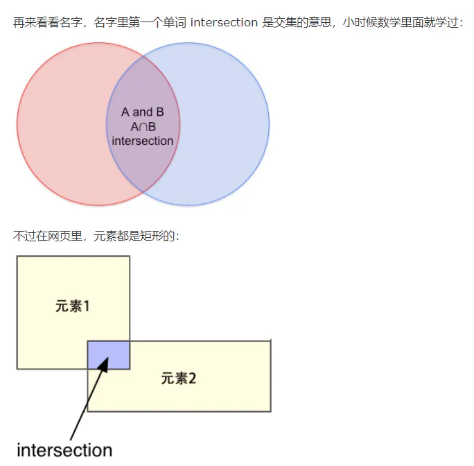
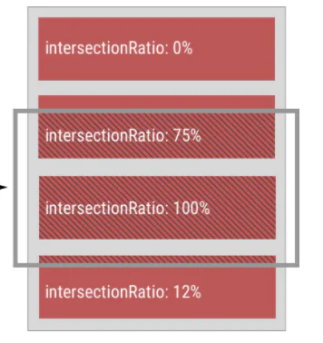
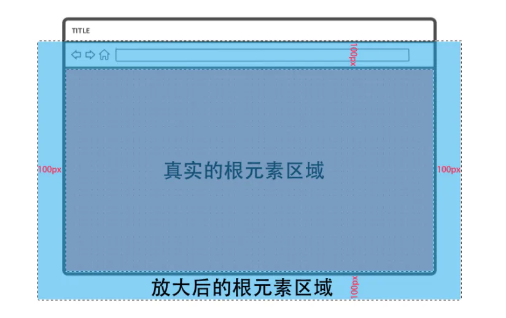

# api讲解

## 目录

- [API讲解](#API讲解)
  - [构造函数](#构造函数)
    - [root](#root)
    - [threshold](#threshold)
    - [rootMagin](#rootMagin)
  - [实例](#实例)
    - [root](#root)
    - [rootMargin](#rootMargin)
    - [thresholds](#thresholds)
    - [observe()](#observe)
    - [unobserve()](#unobserve)
    - [disconnect()](#disconnect)
    - [takeRecords()](#takeRecords)
  - [回调函数](#回调函数)
    - [time](#time)
    - [target](#target)
    - [rootBounds](#rootBounds)
    - [boundingClientRect](#boundingClientRect)
    - [intersectionRect](#intersectionRect)
    - [intersectionRatio](#intersectionRatio)

# API讲解

[I](https://www.cnblogs.com/ziyunfei/p/5558712.html "I")[ntersectionObserver API](https://www.cnblogs.com/ziyunfei/p/5558712.html "ntersectionObserver API")



## 构造函数

```javascript 
new IntersectionObserver(callback, options)

```


- **callback 是个**必选**参数，当有相交发生时，浏览器便会调用它，** 后面会详细介绍；
- **options 整个参数对象以及它的三个属性都是****可选****的：**

### root

            IntersectionObserver API 的适用场景主要是这样的：**一个可以滚动的元素，我们叫它根元素**，它有很多后代元素，想要做的就是判断它的某个后代元素是否滚动进了自己的可视区域范围。**这个 root 参数就是用来指定根元素的**，默认值是 null。**如果它的值是 null，根元素就不是个真正意义上的元素了**，而是这个浏览器窗口了，可以理解成 window，但 window 也不是元素（甚至不是节点）。

&#x20;     **这时当前窗口里的所有元素，都可以理解成是 null 根元素的后代元素，都是可以被观察的。**   需要注意的一点是，**如果 root 不是 null，那么****相交区域就不一定在视口内了，因为 root 和 target 的相交也可能发生在视口下方****，**

总结一下：这一小节我们讲了根元素的两种类型，null 和任意的祖先元素，其中 null 值表示根元素为当前窗口（的视口）。 

### threshold

&#x20;     当目标元素和根元素相交时，用相交的面积除以目标元素的面积会得到一个 0 到 1（0% 到 100%）的数值：



&#x20;      下面这句话很重要，`IntersectionObserver `API 的基本工作原理就是：**当目标元素和根元素****相交的面积占目标元素面积****的百分比到达或****跨过某些指定的临界值****时就会触发回调函数**。

&#x20;      **`threshold `****参数就是用来指定那个临界值的**，默认值是 0，表示俩元素刚刚挨上就触发回调。有效的临界值可以是在 0 到 1 闭区间内的任意数值，比如 0.5 表示当相交面积占目标元素面积的一半时触发回调。而且可以**指定多个临界值**，用**数组形式**，**比如 \[0, 0.5, 1]，表示在两个矩形开始相交，相交一半，完全相交这三个时刻都要触发一次回调函数。**

&#x20;    如果你传了个空数组，它会给你自动插入 0，变成 \[0]，也等效于默认值 0。**不仅当目标元素从视口外移动到视口内时会触发回调，从视口内移动到视口外也会：**

### rootMagin

&#x20;          本文一开始就说了，这个 **API 的主要用途之一就是用来实现延迟加载**，那么真正的延迟加载会等 img 标签或者其它类型的目标区块进入视口才执行加载动作吗？显然，那就太迟了。我\*\*们通常都会****提前几百像素预先加载****，\*\*rootMargin 就是用来干这个的。

&#x20;       \*\*`rootMargin `\*\***可以给根元素添加一个假想的 margin**，从而对真实的根元素区域进行缩放。比如当 root 为 null 时设置 rootMargin: "100px"，实际的根元素矩形四条边都会被放大 100px，像这样：



## 实例

### root

该观察者实例的根元素（默认值为 null）：

### rootMargin

rootMargin 参数（默认值为 "0px"）经过序列化后的值：

### thresholds

threshold 参数（默认值为 0）经过序列化后的值，即便你传入的是一个数字，序列化后也是个数组，目前 Chrome 的实现里数字的精度会有丢失，但无碍：

### observe()

&#x20;      观察某个目标元素，一个观察者实例可以观察任意多个目标元素。注意，这里可能有同学会问：能不能 delegate？能不能只调用一次 observe 方法就能观察一个页面里的所有 img 元素，甚至那些未产生的？答案是不能，这不是事件，没有冒泡。

### unobserve()

取消对某个目标元素的观察，延迟加载通常都是一次性的，observe 的回调里应该直接调用 unobserve() 那个元素.

### disconnect()

取消观察所有已观察的目标元素

### takeRecords()

              理解这个方法需要讲点底层的东西：在浏览器内部，\*\*当一个观察者实例在某一时刻观察到了若干个相交动作时，它不会立即执行回调，它会调用 window\.requestIdleCallback() \*\*（目前只有 Chrome 支持）来异步的执行我们指定的回调函数，**而且还规定了最大的延迟时间是 100 毫秒**，相当于浏览器会执行：

```javascript 
requestIdleCallback(() => {
  if (entries.length > 0) {
    callback(entries, observer)
  }
}, {
  timeout: 100
})
```


\*\*     你的回调可能在随后 1 毫秒内就执行，也可能在第 100 毫秒才执行，这是不确定的。**在这不确定的 100 毫秒之间的某一刻，假如**你迫切需要知道这个观察者实例有没有观察到相交动作，****你就得调用 takeRecords() 方法，它会同步返回包含若干个****`IntersectionObserverEntry `****对象的数组（****`IntersectionObserverEntry `对象包含每次相交的信息，\*\*在下节讲），如果该观察者实例此刻并没有观察到相交动作，那它就返回个空数组。

&#x20;              注意，对于**同一个相交信息**来说，同步的 `takeRecords`() 和**异步的回调函数**是**互斥**的，如果回调先执行了，那么你手动调用 takeRecords() 就必然会拿到空数组，如果你已经通过 takeRecords() 拿到那个相交信息了，那么你指定的回调就不会被执行了（entries.length > 0 是 false）。

## 回调函数

```javascript 
new IntersectionObserver(function(entries, observer) {
  for (let entry of entries) {
    console.log(entry.time)
    console.log(entry.target)
    console.log(entry.rootBounds)
    console.log(entry.boundingClientRect
    console.log(entry.intersectionRect)
    console.log(entry.intersectionRatio)
  }
})
```


           回调函数共有两个参数，第二个参数就**是观察者实例本身**，一般没用，因为实例通常我们已经赋值给一个变量了，而且回调函数里的 this 也是那个实例。第一个参数是个包含有若干个 `IntersectionObserverEntry `对象的数组，也就是和 takeRecords() 方法的返回值一样。

&#x20;    **每个**\*\* ****`IntersectionObserverEntry`**** \*\***对象都代表一次相交**，它的属性们就包含了那次相交的各种信息。\*\*entries 数组中 IntersectionObserverEntry 对象的排列顺序是按照它所属的目标元素当初被 observe() \*\*的顺序排列的。

### time

           相交发生时**距离页面打开时的毫秒数**（有小数），也就是相交发生时 performance.now() 的返回值，比如 60000.560000000005，表示是在页面打开后大概 1 分钟发生的相交。在回调函数里用 performance.now() 减去这个值，就能算出回调函数被 requestIdleCallback 延迟了多少毫秒：

```javascript 
<script>
  let observer = new IntersectionObserver(([entry]) => {
    document.body.textContent += `相交发生在 ${performance.now() - entry.time} 毫秒前`
  })
  observer.observe(document.documentElement)
</script>
```


### target

&#x20;     相交发生时的目标元素，因为**一个根元素可以观察多个目标元素**，所以这个 target 不一定是哪个元素。

### rootBounds

一个对象值，表示发**生相交时根元素可见区域**的矩形信息，像这样：

```javascript 
{
  "top": 0,
  "bottom": 600,
  "left": 0,
  "right": 1280,
  "width": 1280,
  "height": 600
}
```


### boundingClientRect

&#x20;   发生**相交时目标元素**的矩形信息，等价于 `target`.`getBoundingClientRect`()。

### intersectionRect

**根元素和目标元素相交区域的矩形信息**。

### intersectionRatio

0 到 1 的数值，表示**相交区域占目标元素区域的百分比**，也就是 intersectionRect 的面积除以 boundingClientRect 的面积得到的值。
