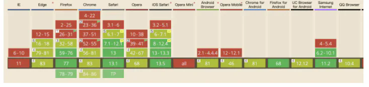
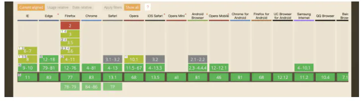

# 滚动吸顶

## 目录

- [positon: sticky](#positon-sticky)
- [监听滚动事件——offset](#监听滚动事件offset)
- [监听滚动事件——obj.getBoundingClientRect().top](#监听滚动事件objgetBoundingClientRecttop)

滑动吸顶效果的常见实现方式有以下几种：

1. positon: sticky
2. 监听元素的滚动事件，使用offset判断
3. obj.getBoundingClientRect().top

下面依次介绍

### positon: sticky

postion: sticky 属性值是css3新加入的属性，近似于relative和fixed的结合体

- sticky被称为粘性定位元素，postion属性值为sticky的元素在目标区域内时表现的和position: relative时无异。
- 当元素满足粘性定位的要求时（如top: 100px），他的表现与position: fixed无异
- 元素固定的相对偏移是相对于离它**最近**的具有滚动框的祖先元素，如果祖先元素都不可以滚动，那么是相对于viewport来计算元素的偏移量。

使用条件：

- 父元素不能设置为 overflow:hidden/auto
- 如果要实现fixed的效果,必须要指定 top，bottom，right，left之一，不然其表现与relative无异
- 父元素的高度不能低于skicky元素的高度

&#x20;坑：

- sticky元素是容齐相关的，它只在自己的符合条件的祖先容器内生效。
- sticky元素虽然在满足粘性条件时表现position: fixed 无异，但是并不会触发BFC
- sticky元素对于写在样式表中的z-index是无效的，如果想用z-index属性可以写在行内样式中

兼容性：兼容性不太友善，ios虽然支持度还行但是刘海屏的表现暂时待定

使用方式：

```javascript 
.sticky{   
  positon: sticky;     
  top: 10px 
}
```


### 监听滚动事件——offset

首先来复习以下offset值的含义：

距离拥有相对定位的父级元素的顶部偏移量

那么offset并不一定表示元素距离页面顶部的距离，也可能是与拥有相对定位的父级元素的顶部距离

假设我们需要的吸顶效果是在body的顶部，我们可以如下改造一个方法

```javascript 
getOffset(obj,direction) {
    let offsetL = 0;
    let offsetT = 0;
    // 依次获取父级元素的offsetLeft/offsetTop
    while( obj!== window.document.body && obj !== null ){
        offsetL += obj.offsetLeft;
        offsetT += obj.offsetTop;
        obj = obj.offsetParent;
    }

    if(direction === 'left'){
        return offsetL;
    }else {
        return offsetT;
    }
}

handleScroll(e) {
    let scrollTop = window.pageYOffset || document.documentElement.scrollTop || document.body.scrollTop;
    let offsetTop = getOffset(e.target,'top');
    if(scrollTop > offsetTop){
        // fixed
    }
}
```


优势：兼容性优秀

劣势：存在性能问题，最好搭配节流函数使用

### 监听滚动事件——obj.getBoundingClientRect().top

定义：返回某个元素相对浏览器视窗上下左右的距离

也就是说,这个api完全可以取代上面那个函数...

兼容性：

优势：简 洁 ， 兼 容 性 极 佳

劣势：没有解决reflow过多的性能问题




